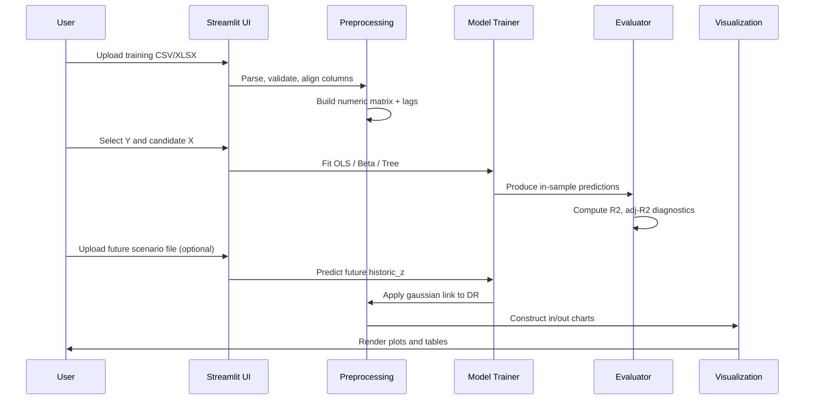

# Forward-Looking Credit Risk (IFRS 9) — DR Projection with Macroeconomic Scenarios

[]()
[]()
[]()
[]()

This repository contains a **forward-looking (prospective)** credit-risk project aligned with **IFRS 9** principles.  
It demonstrates how to integrate **macroeconomic scenarios** (GDP growth, unemployment, interest rates, inflation, credit spread, and their lags) into **Probability of Default (PD)** / **Default Rate (DR)** projections.

The project is designed as a practical template for:
- building scenario-driven credit-risk forecasts,
- testing several statistical / machine-learning approaches,
- comparing model performance on historical data,
- and presenting results through a simple **Streamlit** interface.

> **Used Models**: **OLS** (with automatic subset selection), **Beta regression**, and **Decision Tree** (two-step importance selection).

> **Best Model**: **Decision Tree** with an **Adjusted R² of 0.943** on the training set.

---

## Table of Contents

- [Project Overview](#project-overview)
- [Business Context](#business-context)
- [Key Features](#key-features)
- [Repository Structure](#repository-structure)
- [Architecture & Design](#architecture--design)
- [Methodology](#methodology)
- [Data Requirements](#data-requirements)
- [Technical Stack](#technical-stack)
- [How to Run the Project](#how-to-run-the-project)
- [How the Streamlit App Works](#how-the-streamlit-app-works)
- [Model Details](#model-details)
- [Outputs and Expected Artifacts](#outputs-and-expected-artifacts)
- [Model Evaluation](#model-evaluation)
- [Assumptions and Limitations](#assumptions-and-limitations)
- [Reproducibility Notes](#reproducibility-notes)
- [Development & Contribution](#development--contribution)
- [Performance & Scaling](#performance--scaling)
- [FAQ & Troubleshooting](#faq--troubleshooting)
- [License](#license)
- [Acknowledgements](#acknowledgements)
- [Model Card](#model-card)

---

## Project Overview

The goal of this project is to project credit default rates using a **forward-looking framework** inspired by **IFRS 9 expected credit loss** methodology. Rather than relying only on historical averages, this approach integrates **macroeconomic drivers** to generate **scenario-based projections** that reflect current and expected economic conditions.

In practice, the workflow is:

1. **Collect** historical default / DR data and macroeconomic indicators,
2. **Align** both datasets on a common time axis,
3. **Engineer** lagged and transformed features,
4. **Train** candidate models (OLS, Beta, Decision Tree),
5. **Compare** their predictive performance,
6. **Generate** scenario-based projections for future periods,
7. **Validate** and document results for governance and reporting.

### Why Forward-Looking?

Under **IFRS 9**, credit-risk measurements should reflect **reasonable and supportable forward-looking information**. This means:
- Projections should not be purely backward-looking.
- They should incorporate expected changes in macroeconomic conditions.
- Multiple scenarios should be considered (baseline, adverse, optimistic).
- Results should be explainable to auditors and regulators.

---

## Business Context

Under **IFRS 9**, credit-risk measurements should reflect **reasonable and supportable forward-looking information**. This means that projections should not be purely backward-looking; they should incorporate expected changes in macroeconomic conditions.

This repository demonstrates a simplified but realistic version of that idea by linking Default Rate (DR) dynamics to macroeconomic drivers such as:

- **GDP growth** — overall economic activity and employment capacity,
- **Unemployment rate** — household income stability and defaults,
- **Policy rate** — cost of credit and refinancing ability,
- **Inflation (CPI)** — purchasing power and pricing dynamics,
- **Credit spread** — risk premium and borrowing costs,
- **Lagged versions** of the above — momentum and delayed effects.

The result is a **transparent** and **explainable** framework that can be adapted to:
- Different portfolios (corporate, retail, mortgage),
- Rating segments (AAA, BBB, high-yield),
- Geographic regions or sectors,
- Internal risk policies and governance requirements.

---

## Key Features

- **Scenario-based forecasting**: Baseline, adverse, and optimistic macro paths with customizable assumptions.
- **Multiple model families**: 
  - **Linear (OLS)** with automatic subset selection and p-value filtering,
  - **Bounded-response (Beta regression)** for 0–1 bounded targets,
  - **Tree-based (Decision Tree)** with two-step variable importance selection.
- **Feature engineering**: Lagging, scaling, transformation of macroeconomic inputs; automatic lag detection.
- **Backtesting support**: Evaluate forecasts against historical observations; in-sample and out-of-sample metrics.
- **Interactive dashboard**: Explore assumptions, adjust scenarios, visualize projected DR paths in real time.
- **Exportable results**: Save projected outputs, model coefficients, and diagnostics for downstream analysis.
- **Gaussian link transformation**: Convert model outputs (historic_z) to DR proxy via inverse-normal mapping.
- **Automatic model selection**: OLS with p-value filtering and adjusted R² ranking.
- **Robustness checks**: Cross-validate on time-series splits; check residual stability.

---

## Repository Structure

```
IFRS9-DR-PROJECTION/
├── README.md                    # This file — comprehensive documentation
├── MODEL_CARD.md                # Detailed model documentation and governance
├── LICENSE                      # MIT license
├── pyproject.toml               # Project metadata and dependencies (uv)
├── uv.lock                      # Pinned dependencies (uv lock file)
│
├── main.ipynb                   # Main Jupyter notebook for exploration, training, validation
├── streamlit_app.py             # Interactive Streamlit dashboard
│
├── notebook data/               # Data directory for notebook-based analysis
│   └── (place your training data here)
│
└── streamlit data/              # Data directory for Streamlit app
    └── (place your app data here)
```

### Future Structure (Recommended)

As the project grows, consider organizing code into modules:

```
IFRS9-DR-PROJECTION/
├── src/
│   ├── __init__.py
│   ├── data/
│   │   ├── __init__.py
│   │   ├── loader.py            # Data loading and validation
│   │   ├── preprocessor.py      # Cleaning, alignment, imputation
│   │   └── feature_engineering.py
│   ├── models/
│   │   ├── __init__.py
│   │   ├── ols_model.py          # OLS with subset selection
│   │   ├── beta_model.py         # Beta regression
│   │   ├── tree_model.py         # Decision tree with importance selection
│   │   └── base.py               # Abstract model class
│   ├── utils/
│   │   ├── __init__.py
│   │   ├── metrics.py            # Evaluation metrics (MAE, RMSE, R², calibration)
│   │   ├── plotting.py           # Visualization helpers
│   │   └── config.py             # Global configuration
│   └── validation/
│       ├── __init__.py
│       ├── backtesting.py        # Time-series cross-validation
│       └── diagnostics.py        # Residual analysis, stability checks
├── tests/
│   ├── __init__.py
│   ├── test_preprocessing.py
│   ├── test_models.py
│   └── test_metrics.py
├── artifacts/                    # Model exports, scalers, checkpoints
│   └── (generated at runtime)
├── data/                         # Input datasets
│   ├── macroeconomic_indicators.xlsx
│   └── historical_pd.xlsx
└── notebooks/
    └── exploration.ipynb
```

---

## Architecture & Design

### Data Flow

```
Raw Data (Excel/CSV)
    ↓
[Data Loader] → Validation & Type Checking
    ↓
[Preprocessor] → Alignment, Imputation, Lag Generation
    ↓
[Feature Engineering] → Scaling, Transformation
    ↓
[Train/Test Split] (chronological)
    ↓
┌─────────────────────────────────────┐
│  Model Selection & Training        │
├─────────────────────────────────────┤
│ • OLS (with automatic subset)       │
│ • Beta Regression (rescaled Y)      │
│ • Decision Tree (Top-5 importance)  │
└─────────────────────────────────────┘
    ↓
[Evaluation] → R², MAE, RMSE, Calibration
    ↓
[Projection] → Apply to future scenarios
    ↓
[Visualization] → Streamlit Dashboard
    ↓
[Export] → CSV, JSON, or artifacts
```

### Model Pipeline

Each model follows a standardized pipeline:

1. **Fit**: Train on selected features and target,
2. **Predict (train)**: Generate in-sample predictions,
3. **Predict (future)**: Project on out-of-sample data,
4. **Transform**: Convert `historic_z` → `DR` via Gaussian link,
5. **Evaluate**: Compute metrics, residuals, stability.

---

## Methodology

### 1) Data Preparation

The model starts by preparing historical macroeconomic and credit-risk series:

- **Handling missing values** → interpolation, forward-fill, or drop (configurable),
- **Aligning frequencies** → resample monthly, quarterly, or annual data to common granularity,
- **Lag generation** → create L1, L2, L3, ... versions of macro variables,
- **Scaling** → standardize numeric inputs (optional StandardScaler),
- **Feature engineering** → compute changes, spreads, rolling averages, trend indicators,
- **Look-ahead bias prevention** → shift macro variables forward to avoid leakage.

### 2) Estimation

Several candidate models are fitted to the prepared dataset:

#### OLS with Automatic Subset Selection

- **Candidate pool**: All numeric features (excluding target and DR),
- **Algorithm**: Enumerate all subsets (2^k combinations),
- **Filter**: Retain subsets with **all p-values ≤ 0.05**,
- **Selection**: Choose highest **Adjusted R²** among filtered subsets,
- **Fallback**: If no subset passes p-value filter, fit full model,
- **Output**: Coefficients, p-values, Adjusted R², fitted predictions.

**Rationale**: Automatic subset selection reduces overfitting and identifies only statistically significant drivers. Manual alternative: use domain expertise or penalized regression (LASSO/Ridge).

#### Beta Regression

- **Data prep**: Rescale target Y to (0, 1) using min/max normalization with ε-clipping,
- **Model**: GLM with **Beta family** (if available) or standalone **betareg** module,
- **Features**: Same as OLS-selected subset (for consistency),
- **Bounded output**: Naturally constrains predictions to [0, 1] → mimics DR bounds,
- **Back-transform**: Rescale predictions back to original Y scale,
- **Metric**: R² and Adjusted R² on back-transformed predictions.

**Rationale**: Default Rates are naturally bounded [0, 1]. Beta regression respects this constraint, improving calibration.

#### Decision Tree (Two-Step)

1. **Shallow tree (exploration)**: 
   - Fit DecisionTree with `max_depth=3` on **all** candidate features,
   - Extract feature importances (Gini / variance reduction),
2. **Top-5 selection**: 
   - Retain the **5 most important** features,
   - If fewer than 5 features have positive importance, keep all or default to top available,
3. **Compact tree (final model)**:
   - Fit final DecisionTree (`max_depth=3`) on Top-5 only,
   - Extract final importances, predictions, and R² (train).

**Rationale**: Reduces overfitting by focusing on key interactions; interpretable through feature importance and tree structure.

### 3) Scenario Generation

Future macroeconomic paths are provided under different scenarios:

- **Baseline**: Central economic view (e.g., IMF or central bank forecast),
- **Adverse**: Stressed / deteriorating conditions (e.g., recession, unemployment spike),
- **Optimistic**: Favorable conditions (e.g., strong recovery, rate cuts).

Macro variables are propagated through each fitted model to obtain projected DR values. Scenarios can be:
- **Predefined** (loaded from files or config),
- **Ad-hoc** (user adjusts sliders in Streamlit dashboard),
- **Probabilistic** (draw from distributions, then average).

### 4) Validation & Backtesting

Model performance is assessed using multiple approaches:

- **In-sample metrics**: Adjusted R², MAE, RMSE on training data,
- **Out-of-sample evaluation** (if future data available): Predict on hold-out periods,
- **Time-series cross-validation**: Rolling / expanding windows to account for time dependency,
- **Directional accuracy**: Pct of time model correctly predicts direction (increase/decrease),
- **Stability checks**: PSI (Population Stability Index), CSI (Characteristic Stability Index) across time,
- **Residual diagnostics**: Plot residuals, check normality (Shapiro-Wilk), autocorrelation (Durbin-Watson).

### 5) Decisioning & Reporting

Resulting projections support:

- **Expected Credit Loss (ECL)** calculations under multiple scenarios,
- **Sensitivity analysis** → how do results change with 1% GDP shock?
- **Scenario comparison** → which scenario poses highest risk?
- **Portfolio monitoring** → track vs. forecast; flag deviations,
- **Management reporting** → Board, audit, and regulator communications.

---

## Data Requirements

The repository expects two broad data categories:

### 1) Macroeconomic Indicators

**Example file**: `data/macroeconomic_indicators.xlsx`

**Possible columns**:
- `date` (or `Period`, `Trimestre`, `Quarter`) — date index,
- `gdp_growth` — YoY or QoQ growth rate (%),
- `unemployment_rate` — unemployment rate (%),
- `policy_rate` — central bank policy rate (%),
- `cpi_inflation` — year-on-year inflation (%),
- `credit_spread` — sovereign or corporate spread (bps),
- Additional: employment, real estate indices, commodity prices, etc.

**Frequency**: Monthly, quarterly, or annual. Recommend **quarterly** for default rate alignment.

**Data quality**:
- No extreme outliers (check for data entry errors),
- Sufficient history (minimum 3–5 years recommended),
- Current and forecast versions (for scenario projection).

### 2) Historical Default / DR Data

**Example file**: `data/historical_pd.xlsx`

**Possible columns**:
- `date` (or `Period`, `Trimestre`) — date index,
- `segment` (optional) — portfolio, rating, or product segment,
- `pd_obs` or `default_rate_obs` — observed PD / DR (0–1),
- `historic_z` — latent or intermediate credit risk metric (not strictly 0–1),
- `volume` — count of obligors in segment (optional).

**Frequency**: Align with macro indicators (typically quarterly).

**Data quality**:
- Ensure consistent segment definitions over time,
- Handle portfolio transitions (new obligors, maturities),
- Validate against source systems (core data warehouse, rating model outputs).

### Important Notes

- **Ensure time frequency is consistent** or properly converted (use resampling if needed),
- **Check for look-ahead bias** → shift macro variables forward by 1+ periods to avoid leakage,
- **If multiple segments exist** → align data by portfolio, vintage, or rating band,
- **Validate data types** before training (numeric vs. categorical, date parsing),
- **Document data lineage** → source, extraction query, refresh frequency, assumptions.

### Example Data Format

```csv
Trimestre,gdp_growth,unemployment_rate,policy_rate,cpi_inflation,credit_spread,historic_z,DR
2022-Q1,2.5,3.8,0.25,1.8,50,0.15,0.08
2022-Q2,1.8,3.9,0.5,2.3,60,0.18,0.09
2022-Q3,1.2,3.7,1.5,3.1,75,0.22,0.11
2022-Q4,0.5,3.6,2.0,3.5,100,0.28,0.14
2023-Q1,-0.2,4.1,2.5,4.0,120,0.35,0.18
...
```

---

## Technical Stack

### Core Dependencies

- **Python 3.11+** — language runtime,
- **pandas 3.0.3+** — data manipulation and alignment,
- **numpy 2.4.6+** — numerical operations,
- **scipy 1.17.1+** — statistical functions (norm.ppf, norm.cdf),
- **scikit-learn 1.9.0+** — DecisionTreeRegressor, preprocessing,
- **statsmodels 0.14.6+** — OLS, GLM (Beta family), diagnostics,
- **streamlit 1.59.0+** — interactive dashboard,
- **plotly 6.8.0+** — interactive charts.

### Optional / Advanced

- **jupyter** — for notebook-based exploration,
- **openpyxl** — for reading `.xlsx` files (included via pandas),
- **pytest** — for unit tests,
- **black**, **flake8** — for code formatting and linting,
- **mypy** — for type checking.

### Environment Management

- **uv** — fast Python package manager (recommended),
- Alternative: `pip` with `requirements.txt` or `poetry`.

---

## How to Run the Project

### Prerequisites

- **Python 3.11+** installed,
- **uv** installed (or equivalent: `pip`, `poetry`, `conda`),
- Access to required input data files (CSV/XLSX format).

### Setup

#### Option 1: Using `uv` (Recommended)

```bash
# Clone the repository
git clone https://github.com/eskenderayadi/IFRS9-DR-PROJECTION.git
cd IFRS9-DR-PROJECTION

# Sync dependencies (creates .venv)
uv sync

# Activate virtual environment
source .venv/bin/activate          # macOS / Linux
# or
.venv\Scripts\activate             # Windows

# Place input data in ./streamlit\ data/ or ./notebook\ data/
```

#### Option 2: Using `pip`

```bash
# Clone repository
git clone https://github.com/eskenderayadi/IFRS9-DR-PROJECTION.git
cd IFRS9-DR-PROJECTION

# Create virtual environment
python -m venv venv
source venv/bin/activate          # macOS / Linux
# or
venv\Scripts\activate             # Windows

# Install dependencies
pip install -r requirements.txt   # (create from pyproject.toml if needed)
```

### Launch the Streamlit App

```bash
streamlit run streamlit_app.py
```

This opens a browser window at `http://localhost:8501/`.

**Typical user flow**:
1. Upload **training data** (CSV/XLSX with macro + DR variables),
2. Optionally upload **future data** for projections,
3. Select features (X) and target (Y, default: `historic_z`),
4. Choose models (OLS, Beta, Decision Tree),
5. Click **"Lancer l'estimation"** (Launch estimation),
6. Inspect results, plots, and exported files.

### Notebook Workflow

For step-by-step analysis and exploration:

```bash
jupyter notebook main.ipynb
```

Then:
1. Open `main.ipynb`,
2. Run cells in order,
3. Inspect preprocessing outputs, model diagnostics, feature importance,
4. Save final artifacts to `artifacts/` (model.joblib, scaler.joblib, etc.),
5. Later, launch Streamlit app to visualize interactively.

### Configuration

Edit these sections in **`streamlit_app.py`** to customize:

```python
# Default target variable
target_var = st.sidebar.selectbox("Variable cible (Y)", num_cols,
                                   index=num_cols.index("historic_z") if "historic_z" in num_cols else 0)

# Default models to run
methods = st.sidebar.multiselect("Modèles",
                                  ["OLS", "BetaRegression", "DecisionTree"],
                                  default=["OLS", "BetaRegression", "DecisionTree"])

# Enable/disable automatic OLS subset selection
auto = st.sidebar.checkbox("Sous-ensemble OLS automatique", True)

# Default mean_abs_DR (if not in data)
mean_abs_DR = st.sidebar.number_input("mean_abs_DR (si DR absent)", value=0.05, step=0.001)
```

---

## How the Streamlit App Works

The **Streamlit application** is a lightweight interactive risk dashboard. It allows you to:

### 1) Data Upload
- **Training data** (required): CSV or XLSX with macro indicators, target, and optional DR,
- **Future data** (optional): Same columns for out-of-sample projection.

### 2) Variable Selection
- **Target (Y)**: Default to `historic_z`; change via sidebar,
- **Features (X)**: Multi-select from numeric columns,
- **Exclude**: Target, DR (automatically excluded).

### 3) Model Selection
- **OLS**: With or without automatic subset selection,
- **Beta Regression**: If statsmodels BetaFamily available (gracefully skipped if not),
- **Decision Tree**: Two-step importance selection (explore all → Top-5 → compact tree).

### 4) Training & Inference
- Click **"Lancer l'estimation"** to fit all selected models,
- Displays coefficient tables, p-values, Adjusted R², feature importances,
- Generates predictions (train + future if available).

### 5) Time Axis Selection
- Choose a column (e.g., `Trimestre`, `Quarter`, `date`) as x-axis,
- Or use row index `(index)`.

### 6) Visualization (4 Charts)
- **In-sample historic_z**: Real vs. predicted (OLS, Beta, Tree),
- **Out-of-sample historic_z** (if future data provided),
- **In-sample DR**: Real vs. predicted (transformed via Gaussian link),
- **Out-of-sample DR** (if future data provided).

### 7) Export & Download
- Charts are interactive (hover, zoom, pan, download as PNG),
- Models are printed to console / app log,
- Consider adding CSV export of predictions (future enhancement).

### User Experience Flow

```
Launch Streamlit
    ↓
[1] Upload training file (CSV/XLSX)
    ↓
[2] (Optional) Upload future file
    ↓
[3] View data preview
    ↓
[4] Select features (X) and target (Y)
    ↓
[5] Select models (OLS/Beta/Tree)
    ↓
[6] Choose time axis column
    ↓
[7] Click "Lancer l'estimation"
    ↓
[8] View results:
    • Model coefficients & p-values
    • Feature importances (Tree)
    • R² metrics
    ↓
[9] Inspect 4 interactive charts
    ↓
[10] Adjust parameters & re-run
    ↓
[11] Export results (download, screenshot, or manual copy)
```

---

## Model Details

### OLS with Automatic Subset Selection

**Objective**: Find the minimal set of significant predictors (highest Adjusted R²).

**Algorithm**:
```
for k in range(1, num_features + 1):
    for each combination of k features:
        fit OLS(X_subset, y)
        if all p-values <= 0.05:
            candidate = (Adjusted R², X_subset, model)
            if better than previous best:
                best = candidate
if best found:
    return best model & selected features
else:
    return full OLS model
```

**Pros**:
- Automatic variable selection,
- Removes insignificant variables,
- Interpretable coefficients,
- Good for small feature sets (<15 features).

**Cons**:
- Computationally expensive for large feature sets (2^k subsets),
- Risk of data snooping / multiple testing bias,
- Unstable on high-correlation features.

**Hyperparameters** (in code):
- P-value threshold: `0.05` (hardcoded; consider making configurable),
- Metric: `Adjusted R²` (penalizes added variables).

### Beta Regression

**Objective**: Model bounded responses (0, 1) with Beta distribution.

**Data prep**:
```python
y_min, y_max = y_train.min(), y_train.max()
y_beta = ((y_train - y_min) / (y_max - y_min)).clip(eps, 1 - eps)
```

**Model**: GLM with Beta family (if available) or standalone betareg module.

**Back-transform**:
```python
y_pred = y_beta_scaled * (y_max - y_min) + y_min
```

**Pros**:
- Respects 0–1 bounds on predictions,
- Better calibration for rates/proportions,
- Accounts for heteroskedasticity.

**Cons**:
- Requires sufficient dispersion in y,
- Statsmodels support may be incomplete; fallback library required,
- More complex interpretation.

**Output metrics**: R² and Adjusted R² on back-transformed predictions.

### Decision Tree (Two-Step)

**Step 1: Exploration tree** (all features)
```python
dt_full = DecisionTreeRegressor(max_depth=3, min_samples_split=2)
dt_full.fit(X_train[all_features], y_train)
importances = dt_full.feature_importances_
```

**Step 2: Top-5 selection**
```python
vars_dt = importances.head(5).index.tolist()
```

**Step 3: Compact tree** (Top-5 only)
```python
dt_model = DecisionTreeRegressor(max_depth=3, min_samples_split=2)
dt_model.fit(X_train[vars_dt], y_train)
r2_dt = r2_score(y_train, dt_model.predict(X_train[vars_dt]))
```

**Pros**:
- Captures non-linear relationships,
- Automatic interaction detection,
- Feature importance directly interpretable,
- Robust to scaling.

**Cons**:
- Prone to overfitting; limited depth and sample size constraints,
- Can be unstable (small data changes → large tree changes),
- Not as precise as ensemble methods (RF, GBM).

**Hyperparameters** (configurable):
- `max_depth=3` — limits complexity,
- `min_samples_split=2` — minimum samples per split,
- Consider: `min_samples_leaf`, `criterion` (mse, friedmand_mse, mae).

### DR Transformation (Gaussian Link)

**Purpose**: Convert model output (`historic_z`) to a Default Rate proxy (`DR`).

**Mapping**:
```python
# Compute constant from training data
m = mean_abs(DR_train)                # unconditional DR level
c = norm.ppf(m)                       # inverse-normal CDF

# Apply Gaussian link
DR = norm.cdf(c - historic_z)
```

**Rationale**:
- Converts unbounded `historic_z` to bounded [0, 1] `DR`,
- Inverse relationship: higher `historic_z` → lower `DR` (risk),
- Centers around empirical mean DR,
- Standard approach in credit risk modeling.

**Example**:
```
If m = 0.05 (5% unconditional DR):
  c = norm.ppf(0.05) ≈ -1.645
  
If historic_z = 0:
  DR = norm.cdf(-1.645 - 0) = norm.cdf(-1.645) ≈ 0.05 ✓
  
If historic_z = -1 (better conditions):
  DR = norm.cdf(-1.645 + 1) = norm.cdf(-0.645) ≈ 0.26 (higher DR)
  
If historic_z = +1 (worse conditions):
  DR = norm.cdf(-1.645 - 1) = norm.cdf(-2.645) ≈ 0.004 (lower DR) ✓
```

---

## Outputs and Expected Artifacts

Depending on how you structure the project, you may produce:

### Model Artifacts
- `ols_model.joblib` — fitted OLS estimator + scaler,
- `beta_model.joblib` — fitted Beta GLM,
- `dt_model.joblib` — fitted DecisionTree,
- `scaler.joblib` — StandardScaler for feature normalization.

### Data Artifacts
- `X_train_selected.csv` — training features (after subset selection),
- `y_train_transformed.csv` — target after any transformation,
- `predictions_train.csv` — model predictions on training set,
- `predictions_future.csv` — out-of-sample projections.

### Evaluation Artifacts
- `metrics_summary.json` — R², Adjusted R², MAE, RMSE, calibration metrics,
- `residual_diagnostics.csv` — residuals, standardized residuals, diagnostics,
- `feature_importance.csv` — from OLS (coefficients) and Tree (Gini/variance reduction).

### Visualization Artifacts
- `in_sample_historic_z.html` — interactive Plotly chart,
- `out_of_sample_historic_z.html`,
- `in_sample_dr.html`,
- `out_of_sample_dr.html`,
- `residual_plots.png` — matplotlib QQ plot, ACF, etc.

### Governance Artifacts
- `MODEL_CARD.md` — detailed model documentation (already in repo),
- `DATA_CARD.md` — data lineage, sources, validation,
- `CHANGELOG.md` — version history, changes, retraining events,
- `validation_report.md` — backtesting results, stability checks.

A good practice is to:
- Keep generated artifacts separated from source code,
- Store in `artifacts/` or `outputs/` directory,
- Document naming conventions for each file type,
- Version artifacts with timestamps or git hashes.

---

## Model Evaluation

The current repository reports:

- **OLS**: Automatic subset selection, Adjusted R² metric,
- **Beta Regression**: Adjusted R² after back-transformation,
- **Decision Tree**: R² on train set, feature importances (Top-5).

### Recommended Extended Metrics

For a more complete assessment, consider reporting:

#### 1) Train / Validation / Test Decomposition
```
Train Set: 70% of data (fit models)
Validation Set: 15% of data (tune hyperparameters, select models)
Test Set: 15% of data (final evaluation, unbiased estimate)
```

#### 2) Error Metrics
```python
from sklearn.metrics import mean_absolute_error, mean_squared_error, r2_score

MAE = mean_absolute_error(y_true, y_pred)
RMSE = np.sqrt(mean_squared_error(y_true, y_pred))
R2 = r2_score(y_true, y_pred)
Adj_R2 = 1 - (1 - R2) * (n - 1) / (n - p - 1)  # p = num features
```

#### 3) Directional Accuracy
```
Pct_correct_direction = mean((y_pred > median) == (y_true > median))
```

#### 4) Calibration & Stability
```
PSI (Population Stability Index) — compare train vs. test distributions
CSI (Characteristic Stability Index) — for each feature separately
Traffic Light Approach: PSI < 0.05 (Green), 0.05-0.1 (Yellow), >0.1 (Red)
```

#### 5) Time-Series Cross-Validation
```
Because credit-risk data is time-dependent:
• Use expanding or rolling windows (not random splits),
• Fit on historical data; validate on next quarter,
• Track metric degradation over forecast horizon.
```

#### 6) Residual Analysis
```
• Normality test (Shapiro-Wilk p-value),
• Autocorrelation (Durbin-Watson, ACF plot),
• Heteroskedasticity (Breusch-Pagan test),
• Outlier detection (studentized residuals > ±3σ).
```

#### 7) Scenario Robustness
```
• Stress test: apply extreme macro shocks,
• Check prediction stability: does model blow up?
• Compare directional forecasts across scenarios.
```

---

## Assumptions and Limitations

This project is a useful prototype, but it still relies on simplifying assumptions:

### Data Assumptions
- **Macroeconomic inputs are available and reliable** — source from official (central bank, IMF, World Bank) or validated providers,
- **Historical defaults are accurately recorded** — data governance and system validation required,
- **Sufficient history** (minimum 3–5 years) to estimate robust parameters,
- **Stationarity** (or manageable non-stationarity) — macro variables do not have permanent regime breaks.

### Modeling Assumptions
- **Linear or tree relationships** between macro variables and DR — true relationships may be more complex,
- **Gaussian link** for DR transformation — empirical link may differ,
- **Homoskedasticity** (equal error variance) — OLS assumes this; may not hold,
- **No multicollinearity** — high correlations between predictors bias estimates,
- **No omitted variables** — missing key drivers biases forecasts.

### Model Performance Assumptions
- **Performance may vary** across portfolios and time periods (e.g., retail vs. corporate, pre/post-crisis),
- **A single model may not generalize equally** across all economic regimes,
- **Out-of-sample performance may degrade** as economic conditions shift.

### Governance & Production Use
- **Current implementation is NOT validated** for production use without:
  - Governance controls (approval, documentation, audit),
  - Model-risk oversight (validation, ongoing monitoring, challenger models),
  - Strong data lineage and audit trail,
  - Explainability checks (feature importance, sensibility of coefficients),
  - Independent third-party validation.
- **IFRS 9 implementations typically require**:
  - Documented expert judgment (when to override model),
  - Scenario weighting (how to combine baseline/adverse/optimistic into ECL),
  - Governance policy (model governance, escalation, backtesting frequency),
  - Regulatory approval (if used for capital or public reporting).

### Practical Limitations
- **Small dataset risk** — parameter estimates unstable,
- **Structural breaks** — model fails if regime fundamentally changes,
- **Correlation vs. causation** — macro variables may be proxies, not true drivers,
- **Forecasting horizon** — model may be valid 1 quarter ahead but invalid 3 years out,
- **Scenario specification** — expert judgment required; wrong scenarios → wrong projections.

---

## Reproducibility Notes

To reproduce the project reliably:

### Code & Environment
- **Pin package versions** in `pyproject.toml` (done via `uv.lock`),
- **Keep notebooks & scripts** under version control (Git),
- **Set random seeds** for reproducibility (in `main.ipynb` and `streamlit_app.py`):
  ```python
  import numpy as np
  np.random.seed(42)
  ```

### Data & Configuration
- **Document data sources** and refresh dates (e.g., "IMF WEO Oct 2025"),
- **Store preprocessing assumptions** alongside artifacts (e.g., "lag = 1, dropped Q1 2020 outlier"),
- **Keep scenario definitions explicit** and versioned (baseline.json, adverse.json, etc.),
- **Record exact notebook / script** used to generate results (e.g., "main.ipynb commit abc123"),

### Version Control Best Practices
```bash
git log --oneline --all
git tag -a v1.0.0 -m "Baseline model release"
git show v1.0.0:main.ipynb  # retrieve exact version
```

### Enhanced Reproducibility

For even stronger reproducibility, consider adding:

#### 1) `requirements.txt` or lock file
```bash
uv pip freeze > requirements.txt
```

#### 2) Centralized configuration (`config.py`)
```python
# config.py
RANDOM_SEED = 42
TRAIN_TEST_SPLIT = 0.7
OLS_P_VALUE_THRESHOLD = 0.05
TREE_MAX_DEPTH = 3
LAG_PERIODS = [1, 2, 3]
MACRO_VARIABLES = ["gdp_growth", "unemployment_rate", ...]
TARGET_VARIABLE = "historic_z"
```

#### 3) Dedicated training script
```bash
python -m src.train \
  --data-file data/historical_data.xlsx \
  --config config.py \
  --output-dir artifacts/v1.0.0
```

#### 4) Unit tests
```bash
pytest tests/ -v
```

#### 5) Continuous integration (GitHub Actions / GitLab CI)
```yaml
# .github/workflows/test.yml
name: Tests
on: [push, pull_request]
jobs:
  test:
    runs-on: ubuntu-latest
    steps:
      - uses: actions/checkout@v2
      - uses: actions/setup-python@v2
        with:
          python-version: "3.11"
      - run: pip install -r requirements.txt
      - run: pytest tests/ -v
```

---

## Development & Contribution

### Code Style

- **Language**: Python 3.11+,
- **Format**: Follow PEP 8 with line length 100,
- **Linter**: `flake8` (optional),
- **Formatter**: `black` (optional).

```bash
black --line-length=100 src/
flake8 src/ --max-line-length=100
```

### Testing

Implement unit tests for:
- Data loading & preprocessing,
- Model training & prediction,
- Metric calculations,
- Feature engineering functions.

```bash
pytest tests/ -v --cov=src
```

### Adding Features

1. **Create a branch**: `git checkout -b feature/my-feature`,
2. **Implement & test**: Add code, tests, and documentation,
3. **Pull request**: Describe changes, request review,
4. **Merge**: After approval, merge to `main`.

### Contribution Guidelines

- **Report bugs** via GitHub Issues with reproducible examples,
- **Suggest features** with use-case rationale,
- **Submit PRs** with clear commit messages and tests,
- **Update documentation** (README, MODEL_CARD) for significant changes.

---

## Performance & Scaling

### Computational Complexity

| Model | Training | Prediction | Notes |
|-------|----------|-----------|-------|
| **OLS** | O(n * 2^k) | O(k) | Subset enumeration expensive for k > 15 |
| **Beta** | O(n * k^2) | O(k) | Iterative optimizer (fewer iterations than OLS) |
| **Tree** | O(n * k * log n) | O(log n) | Tree traversal; parallelizable |

### Memory Usage
- **Typical dataset** (1000 rows, 50 features): ~10 MB,
- **Large dataset** (1M rows, 50 features): ~2.5 GB,
- **Model artifacts**: 1–10 MB (joblib serialization).

### Optimization Tips

1. **Feature selection upstream**: Reduce k before subset enumeration,
2. **Parallel subset enumeration**: Use `multiprocessing` for OLS,
3. **Streaming inference**: For real-time scoring, pre-load models and batch predictions,
4. **Caching**: Store preprocessed data to avoid re-computation,
5. **GPU acceleration** (future): Use CuPy, Rapids for large-scale data.

### Deployment Scenarios

**Scenario 1: Batch Processing** (monthly/quarterly)
```bash
python -m src.train --data data/latest.xlsx --output artifacts/
# Upload predictions to data warehouse
```

**Scenario 2: Real-Time API** (Streamlit + FastAPI)
```bash
streamlit run streamlit_app.py &
python -m fastapi run src/api.py
```

**Scenario 3: Scheduled Job** (Docker + cron)
```dockerfile
FROM python:3.11
COPY . /app
WORKDIR /app
RUN pip install -r requirements.txt
CMD ["python", "-m", "src.train"]
```

---

## FAQ & Troubleshooting

### Q: My data has missing values. What should I do?

**A**: The app drops rows with NAs in selected features. Alternatives:
- Impute using mean, median, forward-fill, or interpolation,
- Use sklearn's `SimpleImputer` or `KNNImputer`,
- Implement in `preprocessor.py` and re-run.

### Q: Can I use categorical variables (e.g., sector)?

**A**: Currently, the app auto-selects numeric columns only. To use categorical:
- One-hot encode them before uploading,
- Extend `streamlit_app.py` to handle categoricals,
- Consider regularized regression (LASSO) to avoid overfitting.

### Q: Why is my OLS subset selection returning the full feature set?

**A**: If no subset passes the p-value filter (all p ≤ 0.05), the app defaults to full OLS. Reasons:
- Many features highly correlated → high p-values,
- Small sample size → estimates unstable,
- **Fix**: Reduce features manually or lower p-value threshold (edit code).

### Q: How do I interpret tree feature importance?

**A**: Importance = fraction of variance reduction attributed to each feature. Higher = more useful. Sum of importances ≈ 1.

### Q: Can I export predictions?

**A**: Currently, predictions are printed to the Streamlit console and plotted. **Enhancement**: Add download button:
```python
predictions_df = pd.DataFrame({...})
st.download_button("Download Predictions", predictions_df.to_csv(index=False), "predictions.csv")
```

### Q: What if I want to use ensemble methods (Random Forest, XGBoost)?

**A**: Extend `src/models/` with new model classes. Example:
```python
from sklearn.ensemble import RandomForestRegressor

class RandomForestModel(BaseModel):
    def __init__(self, **hyperparams):
        self.model = RandomForestRegressor(**hyperparams)
    
    def fit(self, X, y):
        self.model.fit(X, y)
    
    def predict(self, X):
        return self.model.predict(X)
```

### Q: How do I run backtests on multiple time periods?

**A**: Implement time-series cross-validation in `validation/backtesting.py`:
```python
def time_series_cv(df, train_size=0.7, step=1):
    n = len(df)
    for end in range(n - int(n * (1 - train_size)), n, step):
        train = df[:end - int(n * (1 - train_size))]
        test = df[end - int(n * (1 - train_size)):end]
        yield train, test
```

### Q: My model predictions are outside [0, 1]. Why?

**A**: Only Beta regression and the DR transformation guarantee [0, 1] bounds. OLS and raw Decision Tree may exceed bounds. **Fix**:
- Use Beta regression,
- Clip predictions: `np.clip(pred, 0, 1)`,
- Use logistic / probit link (future enhancement).

### Q: How sensitive is my forecast to macro assumptions?

**A**: Conduct sensitivity analysis:
1. Train model on historical data,
2. Create scenarios: base, +1% GDP, -2% unemployment, etc.,
3. Predict under each scenario,
4. Compare results (% change in DR vs. base).

### Q: Can I use this model for individual-level credit decisions?

**A**: **No**. This model is portfolio-level only. It cannot:
- Price individual loans,
- Rank obligor creditworthiness,
- Detect fraud or non-payment intent.

Use with expert judgment for portfolio management only.

---

## License

Released under the **MIT License**. See `LICENSE` for details.

**Summary**:
- You may use, modify, and distribute this software freely,
- You must include a copy of the license,
- The software is provided "as-is" without warranty.

---

## Acknowledgements

This project was prepared as part of the **Nexialog Consulting Challenge**. Special thanks to:

- **Mr. Salem** for the opportunity and mentorship,
- **Nexialog Consulting** for providing business context and data requirements,
- **Open-source community** for pandas, scikit-learn, statsmodels, and Streamlit.

---

## Model Card

See [`MODEL_CARD.md`](MODEL_CARD.md) for detailed documentation, including:

- **Purpose & Scope**: Intended use and limitations,
- **Data & Inputs**: Input format and requirements,
- **Preprocessing**: Feature engineering and transformations,
- **Models**: Algorithm details for OLS, Beta, Decision Tree,
- **Training & Projection**: End-to-end workflow,
- **Metrics**: Evaluation approach,
- **Assumptions & Limitations**: Key caveats,
- **Governance & Documentation**: Best practices,
- **Fairness & Responsible Use**: Ethical considerations,
- **Reproducibility**: Versioning and artifact management,
- **Changelog**: Version history.

---

## Related Resources

- **IFRS 9 Overview**: [IFRS Foundation](https://www.ifrs.org/issued-standards/list-of-standards/ifrs-9-financial-instruments/)
- **ECL Methodology**: [EBA IFRS 9 GL](https://www.eba.europa.eu/documents/10180/2020421/EBA+GL+2017+14+GL+on+PD+estimation+comparators+and+LGD+estimation.pdf)
- **Credit Risk Modeling**: Bluhm, Overbeck, Wagner (2003)
- **Macro-Financial Linkages**: IMF GFSR reports

---

**Last Updated**: 2026-07-27  
**Repository Owner**: @eskenderayadi  
**Questions?** Open an issue or contact the repository owner.

---

## Exhaustive Technical Annex (v2)

This annex expands implementation details, governance guidance, and production operations so the README can be used as an end-to-end technical handbook.

### Annex Navigation
- [A1 — Architecture & Design Deep Dive](#a1--architecture--design-deep-dive)
- [A2 — Technical Stack and Dependency Matrix](#a2--technical-stack-and-dependency-matrix)
- [A3 — Advanced Setup Options (uv and pip)](#a3--advanced-setup-options-uv-and-pip)
- [A4 — Extended Methodology and Mathematical Details](#a4--extended-methodology-and-mathematical-details)
- [A5 — Comprehensive Data Requirements and Validation Rules](#a5--comprehensive-data-requirements-and-validation-rules)
- [A6 — Model Details, Hyperparameters, and Decision Guide](#a6--model-details-hyperparameters-and-decision-guide)
- [A7 — Evaluation Framework and Monitoring](#a7--evaluation-framework-and-monitoring)
- [A8 — Performance, Scaling, and Capacity Planning](#a8--performance-scaling-and-capacity-planning)
- [A9 — Development, Testing, and Contribution Standards](#a9--development-testing-and-contribution-standards)
- [A10 — FAQ and Troubleshooting Playbooks](#a10--faq-and-troubleshooting-playbooks)
- [A11 — Future Modular Structure Blueprint](#a11--future-modular-structure-blueprint)
- [A12 — Related Resources and Reading Map](#a12--related-resources-and-reading-map)
- [A13 — Production Deployment Scenarios and Templates](#a13--production-deployment-scenarios-and-templates)
- [A14 — Operational Checklists and Control Library](#a14--operational-checklists-and-control-library)

## A1 — Architecture & Design Deep Dive

### A1.1 Reference Architecture Layers

| Layer | Purpose | Main Components | Failure Modes | Controls |
|---|---|---|---|---|
| Presentation | Interactive analysis and visualization | Streamlit app, charts, filters | Invalid user input, missing columns | Input guards, schema checks, clear error text |
| Application | Training orchestration and inference flow | OLS/Beta/Tree orchestration | Partial model failure | Try/except fallbacks and per-model isolation |
| Feature | Feature creation and transformations | Lag generation, scaling, gaussian link | Leakage and alignment errors | Chronological splits and index audits |
| Data | Data loading and harmonization | CSV/XLSX parsing, dtype handling | NaN spikes and type drift | Rule-based validation and profile reports |
| Governance | Traceability and reproducibility | Model card, assumptions, scenario logs | Unreproducible outputs | Versioned dependencies and run manifests |

### A1.2 End-to-End Sequence Diagram (Mermaid)



### A1.3 Data Flow Contract

| Stage | Input Contract | Output Contract | Validation Gate |
|---|---|---|---|
| Load | File extension in {csv,xlsx} | DataFrame with inferred dtypes | File readable and non-empty |
| Numeric selection | At least one numeric target and one feature | X_train, y_train index-aligned | No duplicate columns and no all-null numeric columns |
| Modeling | Consistent sample size n | Fitted model objects + predictions | Model-specific convergence or fallback triggered |
| Transformation | historic_z vector | DR vector in [0,1] | Finite values only |
| Visualization | Series + time axis | Interactive charts | Equal length and monotonic axis |

### A1.4 Model Pipeline Architecture

```text
[Input Data]
   -> [Schema Validation]
   -> [Numeric Filter + Missing Value Handling]
   -> [Candidate Feature Set]
   -> [Model Branching]
      -> OLS branch (subset search -> best adj-R² with significant terms)
      -> Beta branch (rescale y to (eps,1-eps) -> fit beta family -> reverse scale)
      -> Tree branch (full tree importances -> top-5 -> compact tree)
   -> [historic_z predictions]
   -> [Gaussian link transform to DR]
   -> [Evaluation + Visualization]
```

## A2 — Technical Stack and Dependency Matrix

### A2.1 Runtime Requirements

- **Python**: `>=3.11`
- **Primary package manager**: `uv`
- **Alternative package manager**: `pip` + `venv`

### A2.2 Direct Dependencies from `pyproject.toml`

| Package | Minimum Version | Why It Is Needed | Typical IFRS 9 Usage in This Project |
|---|---:|---|---|
| numpy | 2.4.6 | Vectorized numerical operations | Array math for transformations and model prep |
| pandas | 3.0.3 | Tabular processing | Load, align, transform macro + target datasets |
| plotly | 6.8.0 | Interactive visualization | In/out-sample charts for historic_z and DR |
| scikit-learn | 1.9.0 | Tree model and metrics | DecisionTreeRegressor and R² utilities |
| scipy | 1.17.1 | Statistical transforms | Normal CDF/PPF for gaussian link |
| statsmodels | 0.14.6 | Econometric models | OLS and beta-family GLM support |
| streamlit | 1.59.0 | Web app framework | Interactive estimation app |

### A2.3 Optional / Conditional Dependencies

| Dependency | Condition | Fallback Behavior |
|---|---|---|
| `statsmodels.genmod.families.Beta` | Preferred Beta regression API available | Use GLM Beta family |
| `statsmodels.othermod.betareg.BetaModel` | Used if Beta family missing | Use formula-based BetaModel if import succeeds |
| Neither Beta implementation available | Environment lacks beta support | App warns user and skips Beta model |

### A2.4 Version Governance Recommendations

1. Pin all direct dependencies in `pyproject.toml` with floor constraints.
2. Keep `uv.lock` committed to lock transitive versions.
3. Upgrade packages one family at a time (e.g., only `scikit-learn`) and rerun notebook/app validations.
4. Document behavior changes in `MODEL_CARD.md` and release notes.

## A3 — Advanced Setup Options (uv and pip)

### A3.1 Setup with `uv` (Recommended)

```bash
cd /home/runner/work/IFRS9-DR-PROJECTION/IFRS9-DR-PROJECTION
uv sync
uv run streamlit run streamlit_app.py
```

Detailed steps:
1. Install uv (https://docs.astral.sh/uv/).
2. Verify Python 3.11+ is available: `python --version`.
3. Run `uv sync` to create/update isolated environment from `pyproject.toml` + `uv.lock`.
4. Start the app with `uv run streamlit run streamlit_app.py`.
5. If Beta model is skipped, verify `statsmodels` installation and API availability.
6. For deterministic CI, run `uv sync --frozen` to enforce lockfile exactness.

### A3.2 Setup with `pip` + `venv`

```bash
cd /home/runner/work/IFRS9-DR-PROJECTION/IFRS9-DR-PROJECTION
python -m venv .venv
source .venv/bin/activate
pip install --upgrade pip
pip install -e .
streamlit run streamlit_app.py
```

Windows PowerShell activation:

```powershell
.\.venv\Scripts\Activate.ps1
```

### A3.3 Reproducible Offline Setup

1. Build wheelhouse in connected environment.
2. Mirror wheels to artifact store.
3. Install with `pip install --no-index --find-links ./wheelhouse -e .`.
4. Keep environment manifest per run.

### A3.4 Troubleshooting Setup

| Symptom | Likely Cause | Resolution |
|---|---|---|
| `ModuleNotFoundError: streamlit` | Environment not activated | Activate venv or use `uv run` prefix |
| Beta model unavailable warning | Beta API not present in statsmodels build | Upgrade statsmodels or continue with OLS/Tree |
| Excel file read error | Missing engine or malformed xlsx | Resave as CSV or repair workbook |
| Port conflict on 8501 | Another Streamlit instance running | Use `--server.port 8502` |

## A4 — Extended Methodology and Mathematical Details

### A4.1 OLS with Automatic Subset Selection

The application enumerates all non-empty subsets of selected features, fits OLS for each subset, filters candidates where all non-constant p-values are below 0.05, and keeps the model with highest adjusted R².

**Pseudo-code**:

```text
input: X_train, y_train, candidate_features
best_model = None
for k in 1..len(candidate_features):
    for subset in combinations(candidate_features, k):
        model = OLS(y_train ~ const + X_train[subset]).fit()
        if all(p_value(feature) < 0.05 for feature in subset):
            if best_model is None or model.adj_r2 > best_model.adj_r2:
                best_model = model
if best_model is None:
    best_model = OLS(y_train ~ const + X_train[all_features]).fit()
return best_model
```

Complexity note: subset enumeration is `O(2^p)` model fits where `p` is feature count.

### A4.2 Beta Regression Rescaling Mechanics

Because beta likelihood requires target values strictly in `(0,1)`, the app rescales target `y` as:

\[ y_{beta} = clip\left(\frac{y-y_{min}}{y_{max}-y_{min}}, \varepsilon, 1-\varepsilon\right) \]

After prediction on the beta scale (`\hat{y}_{beta}`), inverse scaling returns original domain:

\[ \hat{y} = \hat{y}_{beta} (y_{max}-y_{min}) + y_{min} \]

### A4.3 Decision Tree Two-Step Importance Selection

1. Fit first tree on all candidate features (default `max_depth=3`).
2. Rank features by impurity-based importance and keep Top-5 non-zero.
3. Refit compact tree using only selected Top-5.

This pattern reduces noise while keeping non-linear interactions.

### A4.4 Gaussian Link Transformation (historic_z → DR)

The app computes `mean_abs_DR` from observed DR or user input and transforms predicted `historic_z` into DR-like probabilities:

\[ c = \Phi^{-1}(\overline{|DR|}) \]
\[ DR_{pred} = \Phi(c - historic\_z_{pred}) \]

Where `\Phi` is standard normal CDF and `\Phi^{-1}` is PPF.

Worked example:
- `mean_abs_DR = 0.05` -> `c = Φ^{-1}(0.05) ≈ -1.6449`
- If `historic_z_pred = -2.0`, then `DR_pred = Φ(-1.6449 - (-2.0)) = Φ(0.3551) ≈ 0.6387`
- If `historic_z_pred = 0.2`, then `DR_pred = Φ(-1.8449) ≈ 0.0323`

### A4.5 Practical Method Selection Guide

| Context | Recommended Starting Model | Why |
|---|---|---|
| Small sample, high interpretability needed | OLS | Coefficients and p-values are transparent |
| Bounded target behavior and calibration focus | Beta Regression | Native support for proportion-like responses |
| Nonlinear macro effects suspected | Decision Tree | Captures interaction/split thresholds |

## A5 — Comprehensive Data Requirements and Validation Rules

### A5.1 Minimum Columns

| Column | Required | Type | Notes |
|---|---|---|---|
| `historic_z` | Yes | numeric | Target for model fitting |
| `DR` | Optional but recommended | numeric in [0,1] | Used for DR chart and mean_abs_DR calibration |
| Macroeconomic features | Yes | numeric | GDP, unemployment, inflation, rates, spreads, lags |
| Time identifier | Optional | date/string/int | Used for x-axis labeling |

### A5.2 Example Training CSV

```csv
Trimestre,historic_z,DR,GDP_growth,Unemployment,Inflation,PolicyRate,CreditSpread,GDP_growth_lag1,Unemployment_lag1
2020Q1,-1.55,0.041,1.2,8.1,1.8,0.5,1.1,1.0,7.9
2020Q2,-1.21,0.052,-6.0,9.5,0.3,0.25,2.4,1.2,8.1
2020Q3,-1.08,0.049,-3.1,9.2,0.5,0.25,2.0,-6.0,9.5
```

### A5.3 Example Future Scenario CSV

```csv
Trimestre,GDP_growth,Unemployment,Inflation,PolicyRate,CreditSpread,GDP_growth_lag1,Unemployment_lag1
2026Q1,1.7,7.3,2.2,2.5,1.6,1.5,7.4
2026Q2,1.8,7.1,2.1,2.5,1.5,1.7,7.3
2026Q3,1.9,7.0,2.0,2.4,1.5,1.8,7.1
```

### A5.4 Data Frequency Guidance

| Portfolio Type | Recommended Frequency | Minimum History | Comment |
|---|---|---:|---|
| Retail unsecured | Monthly | 36 | Higher volatility; monthly captures trend shifts |
| Mortgage | Quarterly | 32 | Quarterly often sufficient for macro transmission |
| SME | Quarterly | 24 | Need careful stress overlays for sparse defaults |
| Corporate wholesale | Quarterly | 20 | Augment with expert judgement when defaults scarce |

### A5.5 Validation Criteria

1. No duplicated time points in training data.
2. At least 12 observations recommended for each candidate explanatory feature across the full sample.
3. No feature with >40% missing values unless justified and imputed with governance sign-off.
4. Numeric columns parse without locale ambiguity (decimal separators standardized).
5. Target variance must be positive (constant targets cannot be modeled).

### A5.6 Data Quality Rulebook (Extended)

| Rule ID | Category | Check | Threshold | Action if Failed |
|---|---|---|---|---|
| DQ-001 | Completeness | Completeness check #1: validate column behavior against expectation | No nulls | Block load |
| DQ-002 | Uniqueness | Uniqueness check #2: validate column behavior against expectation | No duplicates | Warn + inspect |
| DQ-003 | Range | Range check #3: validate column behavior against expectation | Within domain | Clip or correct source |
| DQ-004 | Consistency | Consistency check #4: validate column behavior against expectation | Stable schema | Map to canonical types |
| DQ-005 | Temporal | Temporal check #5: validate column behavior against expectation | Monotonic time | Sort/reindex |
| DQ-006 | Distribution | Distribution check #6: validate column behavior against expectation | PSI < 0.25 | Escalate for review |
| DQ-007 | Completeness | Completeness check #7: validate column behavior against expectation | No nulls | Block load |
| DQ-008 | Uniqueness | Uniqueness check #8: validate column behavior against expectation | No duplicates | Warn + inspect |
| DQ-009 | Range | Range check #9: validate column behavior against expectation | Within domain | Clip or correct source |
| DQ-010 | Consistency | Consistency check #10: validate column behavior against expectation | Stable schema | Map to canonical types |
| DQ-011 | Temporal | Temporal check #11: validate column behavior against expectation | Monotonic time | Sort/reindex |
| DQ-012 | Distribution | Distribution check #12: validate column behavior against expectation | PSI < 0.25 | Escalate for review |
| DQ-013 | Completeness | Completeness check #13: validate column behavior against expectation | No nulls | Block load |
| DQ-014 | Uniqueness | Uniqueness check #14: validate column behavior against expectation | No duplicates | Warn + inspect |
| DQ-015 | Range | Range check #15: validate column behavior against expectation | Within domain | Clip or correct source |
| DQ-016 | Consistency | Consistency check #16: validate column behavior against expectation | Stable schema | Map to canonical types |
| DQ-017 | Temporal | Temporal check #17: validate column behavior against expectation | Monotonic time | Sort/reindex |
| DQ-018 | Distribution | Distribution check #18: validate column behavior against expectation | PSI < 0.25 | Escalate for review |
| DQ-019 | Completeness | Completeness check #19: validate column behavior against expectation | No nulls | Block load |
| DQ-020 | Uniqueness | Uniqueness check #20: validate column behavior against expectation | No duplicates | Warn + inspect |
| DQ-021 | Range | Range check #21: validate column behavior against expectation | Within domain | Clip or correct source |
| DQ-022 | Consistency | Consistency check #22: validate column behavior against expectation | Stable schema | Map to canonical types |
| DQ-023 | Temporal | Temporal check #23: validate column behavior against expectation | Monotonic time | Sort/reindex |
| DQ-024 | Distribution | Distribution check #24: validate column behavior against expectation | PSI < 0.25 | Escalate for review |
| DQ-025 | Completeness | Completeness check #25: validate column behavior against expectation | No nulls | Block load |
| DQ-026 | Uniqueness | Uniqueness check #26: validate column behavior against expectation | No duplicates | Warn + inspect |
| DQ-027 | Range | Range check #27: validate column behavior against expectation | Within domain | Clip or correct source |
| DQ-028 | Consistency | Consistency check #28: validate column behavior against expectation | Stable schema | Map to canonical types |
| DQ-029 | Temporal | Temporal check #29: validate column behavior against expectation | Monotonic time | Sort/reindex |
| DQ-030 | Distribution | Distribution check #30: validate column behavior against expectation | PSI < 0.25 | Escalate for review |
| DQ-031 | Completeness | Completeness check #31: validate column behavior against expectation | No nulls | Block load |
| DQ-032 | Uniqueness | Uniqueness check #32: validate column behavior against expectation | No duplicates | Warn + inspect |
| DQ-033 | Range | Range check #33: validate column behavior against expectation | Within domain | Clip or correct source |
| DQ-034 | Consistency | Consistency check #34: validate column behavior against expectation | Stable schema | Map to canonical types |
| DQ-035 | Temporal | Temporal check #35: validate column behavior against expectation | Monotonic time | Sort/reindex |
| DQ-036 | Distribution | Distribution check #36: validate column behavior against expectation | PSI < 0.25 | Escalate for review |
| DQ-037 | Completeness | Completeness check #37: validate column behavior against expectation | No nulls | Block load |
| DQ-038 | Uniqueness | Uniqueness check #38: validate column behavior against expectation | No duplicates | Warn + inspect |
| DQ-039 | Range | Range check #39: validate column behavior against expectation | Within domain | Clip or correct source |
| DQ-040 | Consistency | Consistency check #40: validate column behavior against expectation | Stable schema | Map to canonical types |
| DQ-041 | Temporal | Temporal check #41: validate column behavior against expectation | Monotonic time | Sort/reindex |
| DQ-042 | Distribution | Distribution check #42: validate column behavior against expectation | PSI < 0.25 | Escalate for review |
| DQ-043 | Completeness | Completeness check #43: validate column behavior against expectation | No nulls | Block load |
| DQ-044 | Uniqueness | Uniqueness check #44: validate column behavior against expectation | No duplicates | Warn + inspect |
| DQ-045 | Range | Range check #45: validate column behavior against expectation | Within domain | Clip or correct source |
| DQ-046 | Consistency | Consistency check #46: validate column behavior against expectation | Stable schema | Map to canonical types |
| DQ-047 | Temporal | Temporal check #47: validate column behavior against expectation | Monotonic time | Sort/reindex |
| DQ-048 | Distribution | Distribution check #48: validate column behavior against expectation | PSI < 0.25 | Escalate for review |
| DQ-049 | Completeness | Completeness check #49: validate column behavior against expectation | No nulls | Block load |
| DQ-050 | Uniqueness | Uniqueness check #50: validate column behavior against expectation | No duplicates | Warn + inspect |
| DQ-051 | Range | Range check #51: validate column behavior against expectation | Within domain | Clip or correct source |
| DQ-052 | Consistency | Consistency check #52: validate column behavior against expectation | Stable schema | Map to canonical types |
| DQ-053 | Temporal | Temporal check #53: validate column behavior against expectation | Monotonic time | Sort/reindex |
| DQ-054 | Distribution | Distribution check #54: validate column behavior against expectation | PSI < 0.25 | Escalate for review |
| DQ-055 | Completeness | Completeness check #55: validate column behavior against expectation | No nulls | Block load |
| DQ-056 | Uniqueness | Uniqueness check #56: validate column behavior against expectation | No duplicates | Warn + inspect |
| DQ-057 | Range | Range check #57: validate column behavior against expectation | Within domain | Clip or correct source |
| DQ-058 | Consistency | Consistency check #58: validate column behavior against expectation | Stable schema | Map to canonical types |
| DQ-059 | Temporal | Temporal check #59: validate column behavior against expectation | Monotonic time | Sort/reindex |
| DQ-060 | Distribution | Distribution check #60: validate column behavior against expectation | PSI < 0.25 | Escalate for review |
| DQ-061 | Completeness | Completeness check #61: validate column behavior against expectation | No nulls | Block load |
| DQ-062 | Uniqueness | Uniqueness check #62: validate column behavior against expectation | No duplicates | Warn + inspect |
| DQ-063 | Range | Range check #63: validate column behavior against expectation | Within domain | Clip or correct source |
| DQ-064 | Consistency | Consistency check #64: validate column behavior against expectation | Stable schema | Map to canonical types |
| DQ-065 | Temporal | Temporal check #65: validate column behavior against expectation | Monotonic time | Sort/reindex |
| DQ-066 | Distribution | Distribution check #66: validate column behavior against expectation | PSI < 0.25 | Escalate for review |
| DQ-067 | Completeness | Completeness check #67: validate column behavior against expectation | No nulls | Block load |
| DQ-068 | Uniqueness | Uniqueness check #68: validate column behavior against expectation | No duplicates | Warn + inspect |
| DQ-069 | Range | Range check #69: validate column behavior against expectation | Within domain | Clip or correct source |
| DQ-070 | Consistency | Consistency check #70: validate column behavior against expectation | Stable schema | Map to canonical types |
| DQ-071 | Temporal | Temporal check #71: validate column behavior against expectation | Monotonic time | Sort/reindex |
| DQ-072 | Distribution | Distribution check #72: validate column behavior against expectation | PSI < 0.25 | Escalate for review |
| DQ-073 | Completeness | Completeness check #73: validate column behavior against expectation | No nulls | Block load |
| DQ-074 | Uniqueness | Uniqueness check #74: validate column behavior against expectation | No duplicates | Warn + inspect |
| DQ-075 | Range | Range check #75: validate column behavior against expectation | Within domain | Clip or correct source |
| DQ-076 | Consistency | Consistency check #76: validate column behavior against expectation | Stable schema | Map to canonical types |
| DQ-077 | Temporal | Temporal check #77: validate column behavior against expectation | Monotonic time | Sort/reindex |
| DQ-078 | Distribution | Distribution check #78: validate column behavior against expectation | PSI < 0.25 | Escalate for review |
| DQ-079 | Completeness | Completeness check #79: validate column behavior against expectation | No nulls | Block load |
| DQ-080 | Uniqueness | Uniqueness check #80: validate column behavior against expectation | No duplicates | Warn + inspect |
| DQ-081 | Range | Range check #81: validate column behavior against expectation | Within domain | Clip or correct source |
| DQ-082 | Consistency | Consistency check #82: validate column behavior against expectation | Stable schema | Map to canonical types |
| DQ-083 | Temporal | Temporal check #83: validate column behavior against expectation | Monotonic time | Sort/reindex |
| DQ-084 | Distribution | Distribution check #84: validate column behavior against expectation | PSI < 0.25 | Escalate for review |
| DQ-085 | Completeness | Completeness check #85: validate column behavior against expectation | No nulls | Block load |
| DQ-086 | Uniqueness | Uniqueness check #86: validate column behavior against expectation | No duplicates | Warn + inspect |
| DQ-087 | Range | Range check #87: validate column behavior against expectation | Within domain | Clip or correct source |
| DQ-088 | Consistency | Consistency check #88: validate column behavior against expectation | Stable schema | Map to canonical types |
| DQ-089 | Temporal | Temporal check #89: validate column behavior against expectation | Monotonic time | Sort/reindex |
| DQ-090 | Distribution | Distribution check #90: validate column behavior against expectation | PSI < 0.25 | Escalate for review |
| DQ-091 | Completeness | Completeness check #91: validate column behavior against expectation | No nulls | Block load |
| DQ-092 | Uniqueness | Uniqueness check #92: validate column behavior against expectation | No duplicates | Warn + inspect |
| DQ-093 | Range | Range check #93: validate column behavior against expectation | Within domain | Clip or correct source |
| DQ-094 | Consistency | Consistency check #94: validate column behavior against expectation | Stable schema | Map to canonical types |
| DQ-095 | Temporal | Temporal check #95: validate column behavior against expectation | Monotonic time | Sort/reindex |
| DQ-096 | Distribution | Distribution check #96: validate column behavior against expectation | PSI < 0.25 | Escalate for review |
| DQ-097 | Completeness | Completeness check #97: validate column behavior against expectation | No nulls | Block load |
| DQ-098 | Uniqueness | Uniqueness check #98: validate column behavior against expectation | No duplicates | Warn + inspect |
| DQ-099 | Range | Range check #99: validate column behavior against expectation | Within domain | Clip or correct source |
| DQ-100 | Consistency | Consistency check #100: validate column behavior against expectation | Stable schema | Map to canonical types |
| DQ-101 | Temporal | Temporal check #101: validate column behavior against expectation | Monotonic time | Sort/reindex |
| DQ-102 | Distribution | Distribution check #102: validate column behavior against expectation | PSI < 0.25 | Escalate for review |
| DQ-103 | Completeness | Completeness check #103: validate column behavior against expectation | No nulls | Block load |
| DQ-104 | Uniqueness | Uniqueness check #104: validate column behavior against expectation | No duplicates | Warn + inspect |
| DQ-105 | Range | Range check #105: validate column behavior against expectation | Within domain | Clip or correct source |
| DQ-106 | Consistency | Consistency check #106: validate column behavior against expectation | Stable schema | Map to canonical types |
| DQ-107 | Temporal | Temporal check #107: validate column behavior against expectation | Monotonic time | Sort/reindex |
| DQ-108 | Distribution | Distribution check #108: validate column behavior against expectation | PSI < 0.25 | Escalate for review |
| DQ-109 | Completeness | Completeness check #109: validate column behavior against expectation | No nulls | Block load |
| DQ-110 | Uniqueness | Uniqueness check #110: validate column behavior against expectation | No duplicates | Warn + inspect |
| DQ-111 | Range | Range check #111: validate column behavior against expectation | Within domain | Clip or correct source |
| DQ-112 | Consistency | Consistency check #112: validate column behavior against expectation | Stable schema | Map to canonical types |
| DQ-113 | Temporal | Temporal check #113: validate column behavior against expectation | Monotonic time | Sort/reindex |
| DQ-114 | Distribution | Distribution check #114: validate column behavior against expectation | PSI < 0.25 | Escalate for review |
| DQ-115 | Completeness | Completeness check #115: validate column behavior against expectation | No nulls | Block load |
| DQ-116 | Uniqueness | Uniqueness check #116: validate column behavior against expectation | No duplicates | Warn + inspect |
| DQ-117 | Range | Range check #117: validate column behavior against expectation | Within domain | Clip or correct source |
| DQ-118 | Consistency | Consistency check #118: validate column behavior against expectation | Stable schema | Map to canonical types |
| DQ-119 | Temporal | Temporal check #119: validate column behavior against expectation | Monotonic time | Sort/reindex |
| DQ-120 | Distribution | Distribution check #120: validate column behavior against expectation | PSI < 0.25 | Escalate for review |
| DQ-121 | Completeness | Completeness check #121: validate column behavior against expectation | No nulls | Block load |
| DQ-122 | Uniqueness | Uniqueness check #122: validate column behavior against expectation | No duplicates | Warn + inspect |
| DQ-123 | Range | Range check #123: validate column behavior against expectation | Within domain | Clip or correct source |
| DQ-124 | Consistency | Consistency check #124: validate column behavior against expectation | Stable schema | Map to canonical types |
| DQ-125 | Temporal | Temporal check #125: validate column behavior against expectation | Monotonic time | Sort/reindex |
| DQ-126 | Distribution | Distribution check #126: validate column behavior against expectation | PSI < 0.25 | Escalate for review |
| DQ-127 | Completeness | Completeness check #127: validate column behavior against expectation | No nulls | Block load |
| DQ-128 | Uniqueness | Uniqueness check #128: validate column behavior against expectation | No duplicates | Warn + inspect |
| DQ-129 | Range | Range check #129: validate column behavior against expectation | Within domain | Clip or correct source |
| DQ-130 | Consistency | Consistency check #130: validate column behavior against expectation | Stable schema | Map to canonical types |
| DQ-131 | Temporal | Temporal check #131: validate column behavior against expectation | Monotonic time | Sort/reindex |
| DQ-132 | Distribution | Distribution check #132: validate column behavior against expectation | PSI < 0.25 | Escalate for review |
| DQ-133 | Completeness | Completeness check #133: validate column behavior against expectation | No nulls | Block load |
| DQ-134 | Uniqueness | Uniqueness check #134: validate column behavior against expectation | No duplicates | Warn + inspect |
| DQ-135 | Range | Range check #135: validate column behavior against expectation | Within domain | Clip or correct source |
| DQ-136 | Consistency | Consistency check #136: validate column behavior against expectation | Stable schema | Map to canonical types |
| DQ-137 | Temporal | Temporal check #137: validate column behavior against expectation | Monotonic time | Sort/reindex |
| DQ-138 | Distribution | Distribution check #138: validate column behavior against expectation | PSI < 0.25 | Escalate for review |
| DQ-139 | Completeness | Completeness check #139: validate column behavior against expectation | No nulls | Block load |
| DQ-140 | Uniqueness | Uniqueness check #140: validate column behavior against expectation | No duplicates | Warn + inspect |
| DQ-141 | Range | Range check #141: validate column behavior against expectation | Within domain | Clip or correct source |
| DQ-142 | Consistency | Consistency check #142: validate column behavior against expectation | Stable schema | Map to canonical types |
| DQ-143 | Temporal | Temporal check #143: validate column behavior against expectation | Monotonic time | Sort/reindex |
| DQ-144 | Distribution | Distribution check #144: validate column behavior against expectation | PSI < 0.25 | Escalate for review |
| DQ-145 | Completeness | Completeness check #145: validate column behavior against expectation | No nulls | Block load |
| DQ-146 | Uniqueness | Uniqueness check #146: validate column behavior against expectation | No duplicates | Warn + inspect |
| DQ-147 | Range | Range check #147: validate column behavior against expectation | Within domain | Clip or correct source |
| DQ-148 | Consistency | Consistency check #148: validate column behavior against expectation | Stable schema | Map to canonical types |
| DQ-149 | Temporal | Temporal check #149: validate column behavior against expectation | Monotonic time | Sort/reindex |
| DQ-150 | Distribution | Distribution check #150: validate column behavior against expectation | PSI < 0.25 | Escalate for review |
| DQ-151 | Completeness | Completeness check #151: validate column behavior against expectation | No nulls | Block load |
| DQ-152 | Uniqueness | Uniqueness check #152: validate column behavior against expectation | No duplicates | Warn + inspect |
| DQ-153 | Range | Range check #153: validate column behavior against expectation | Within domain | Clip or correct source |
| DQ-154 | Consistency | Consistency check #154: validate column behavior against expectation | Stable schema | Map to canonical types |
| DQ-155 | Temporal | Temporal check #155: validate column behavior against expectation | Monotonic time | Sort/reindex |
| DQ-156 | Distribution | Distribution check #156: validate column behavior against expectation | PSI < 0.25 | Escalate for review |
| DQ-157 | Completeness | Completeness check #157: validate column behavior against expectation | No nulls | Block load |
| DQ-158 | Uniqueness | Uniqueness check #158: validate column behavior against expectation | No duplicates | Warn + inspect |
| DQ-159 | Range | Range check #159: validate column behavior against expectation | Within domain | Clip or correct source |
| DQ-160 | Consistency | Consistency check #160: validate column behavior against expectation | Stable schema | Map to canonical types |
| DQ-161 | Temporal | Temporal check #161: validate column behavior against expectation | Monotonic time | Sort/reindex |
| DQ-162 | Distribution | Distribution check #162: validate column behavior against expectation | PSI < 0.25 | Escalate for review |
| DQ-163 | Completeness | Completeness check #163: validate column behavior against expectation | No nulls | Block load |
| DQ-164 | Uniqueness | Uniqueness check #164: validate column behavior against expectation | No duplicates | Warn + inspect |
| DQ-165 | Range | Range check #165: validate column behavior against expectation | Within domain | Clip or correct source |
| DQ-166 | Consistency | Consistency check #166: validate column behavior against expectation | Stable schema | Map to canonical types |
| DQ-167 | Temporal | Temporal check #167: validate column behavior against expectation | Monotonic time | Sort/reindex |
| DQ-168 | Distribution | Distribution check #168: validate column behavior against expectation | PSI < 0.25 | Escalate for review |
| DQ-169 | Completeness | Completeness check #169: validate column behavior against expectation | No nulls | Block load |
| DQ-170 | Uniqueness | Uniqueness check #170: validate column behavior against expectation | No duplicates | Warn + inspect |
| DQ-171 | Range | Range check #171: validate column behavior against expectation | Within domain | Clip or correct source |
| DQ-172 | Consistency | Consistency check #172: validate column behavior against expectation | Stable schema | Map to canonical types |
| DQ-173 | Temporal | Temporal check #173: validate column behavior against expectation | Monotonic time | Sort/reindex |
| DQ-174 | Distribution | Distribution check #174: validate column behavior against expectation | PSI < 0.25 | Escalate for review |
| DQ-175 | Completeness | Completeness check #175: validate column behavior against expectation | No nulls | Block load |
| DQ-176 | Uniqueness | Uniqueness check #176: validate column behavior against expectation | No duplicates | Warn + inspect |
| DQ-177 | Range | Range check #177: validate column behavior against expectation | Within domain | Clip or correct source |
| DQ-178 | Consistency | Consistency check #178: validate column behavior against expectation | Stable schema | Map to canonical types |
| DQ-179 | Temporal | Temporal check #179: validate column behavior against expectation | Monotonic time | Sort/reindex |
| DQ-180 | Distribution | Distribution check #180: validate column behavior against expectation | PSI < 0.25 | Escalate for review |
| DQ-181 | Completeness | Completeness check #181: validate column behavior against expectation | No nulls | Block load |
| DQ-182 | Uniqueness | Uniqueness check #182: validate column behavior against expectation | No duplicates | Warn + inspect |
| DQ-183 | Range | Range check #183: validate column behavior against expectation | Within domain | Clip or correct source |
| DQ-184 | Consistency | Consistency check #184: validate column behavior against expectation | Stable schema | Map to canonical types |
| DQ-185 | Temporal | Temporal check #185: validate column behavior against expectation | Monotonic time | Sort/reindex |
| DQ-186 | Distribution | Distribution check #186: validate column behavior against expectation | PSI < 0.25 | Escalate for review |
| DQ-187 | Completeness | Completeness check #187: validate column behavior against expectation | No nulls | Block load |
| DQ-188 | Uniqueness | Uniqueness check #188: validate column behavior against expectation | No duplicates | Warn + inspect |
| DQ-189 | Range | Range check #189: validate column behavior against expectation | Within domain | Clip or correct source |
| DQ-190 | Consistency | Consistency check #190: validate column behavior against expectation | Stable schema | Map to canonical types |
| DQ-191 | Temporal | Temporal check #191: validate column behavior against expectation | Monotonic time | Sort/reindex |
| DQ-192 | Distribution | Distribution check #192: validate column behavior against expectation | PSI < 0.25 | Escalate for review |
| DQ-193 | Completeness | Completeness check #193: validate column behavior against expectation | No nulls | Block load |
| DQ-194 | Uniqueness | Uniqueness check #194: validate column behavior against expectation | No duplicates | Warn + inspect |
| DQ-195 | Range | Range check #195: validate column behavior against expectation | Within domain | Clip or correct source |
| DQ-196 | Consistency | Consistency check #196: validate column behavior against expectation | Stable schema | Map to canonical types |
| DQ-197 | Temporal | Temporal check #197: validate column behavior against expectation | Monotonic time | Sort/reindex |
| DQ-198 | Distribution | Distribution check #198: validate column behavior against expectation | PSI < 0.25 | Escalate for review |
| DQ-199 | Completeness | Completeness check #199: validate column behavior against expectation | No nulls | Block load |
| DQ-200 | Uniqueness | Uniqueness check #200: validate column behavior against expectation | No duplicates | Warn + inspect |
| DQ-201 | Range | Range check #201: validate column behavior against expectation | Within domain | Clip or correct source |
| DQ-202 | Consistency | Consistency check #202: validate column behavior against expectation | Stable schema | Map to canonical types |
| DQ-203 | Temporal | Temporal check #203: validate column behavior against expectation | Monotonic time | Sort/reindex |
| DQ-204 | Distribution | Distribution check #204: validate column behavior against expectation | PSI < 0.25 | Escalate for review |
| DQ-205 | Completeness | Completeness check #205: validate column behavior against expectation | No nulls | Block load |
| DQ-206 | Uniqueness | Uniqueness check #206: validate column behavior against expectation | No duplicates | Warn + inspect |
| DQ-207 | Range | Range check #207: validate column behavior against expectation | Within domain | Clip or correct source |
| DQ-208 | Consistency | Consistency check #208: validate column behavior against expectation | Stable schema | Map to canonical types |
| DQ-209 | Temporal | Temporal check #209: validate column behavior against expectation | Monotonic time | Sort/reindex |
| DQ-210 | Distribution | Distribution check #210: validate column behavior against expectation | PSI < 0.25 | Escalate for review |
| DQ-211 | Completeness | Completeness check #211: validate column behavior against expectation | No nulls | Block load |
| DQ-212 | Uniqueness | Uniqueness check #212: validate column behavior against expectation | No duplicates | Warn + inspect |
| DQ-213 | Range | Range check #213: validate column behavior against expectation | Within domain | Clip or correct source |
| DQ-214 | Consistency | Consistency check #214: validate column behavior against expectation | Stable schema | Map to canonical types |
| DQ-215 | Temporal | Temporal check #215: validate column behavior against expectation | Monotonic time | Sort/reindex |
| DQ-216 | Distribution | Distribution check #216: validate column behavior against expectation | PSI < 0.25 | Escalate for review |
| DQ-217 | Completeness | Completeness check #217: validate column behavior against expectation | No nulls | Block load |
| DQ-218 | Uniqueness | Uniqueness check #218: validate column behavior against expectation | No duplicates | Warn + inspect |
| DQ-219 | Range | Range check #219: validate column behavior against expectation | Within domain | Clip or correct source |
| DQ-220 | Consistency | Consistency check #220: validate column behavior against expectation | Stable schema | Map to canonical types |
| DQ-221 | Temporal | Temporal check #221: validate column behavior against expectation | Monotonic time | Sort/reindex |
| DQ-222 | Distribution | Distribution check #222: validate column behavior against expectation | PSI < 0.25 | Escalate for review |
| DQ-223 | Completeness | Completeness check #223: validate column behavior against expectation | No nulls | Block load |
| DQ-224 | Uniqueness | Uniqueness check #224: validate column behavior against expectation | No duplicates | Warn + inspect |
| DQ-225 | Range | Range check #225: validate column behavior against expectation | Within domain | Clip or correct source |
| DQ-226 | Consistency | Consistency check #226: validate column behavior against expectation | Stable schema | Map to canonical types |
| DQ-227 | Temporal | Temporal check #227: validate column behavior against expectation | Monotonic time | Sort/reindex |
| DQ-228 | Distribution | Distribution check #228: validate column behavior against expectation | PSI < 0.25 | Escalate for review |
| DQ-229 | Completeness | Completeness check #229: validate column behavior against expectation | No nulls | Block load |
| DQ-230 | Uniqueness | Uniqueness check #230: validate column behavior against expectation | No duplicates | Warn + inspect |
| DQ-231 | Range | Range check #231: validate column behavior against expectation | Within domain | Clip or correct source |
| DQ-232 | Consistency | Consistency check #232: validate column behavior against expectation | Stable schema | Map to canonical types |
| DQ-233 | Temporal | Temporal check #233: validate column behavior against expectation | Monotonic time | Sort/reindex |
| DQ-234 | Distribution | Distribution check #234: validate column behavior against expectation | PSI < 0.25 | Escalate for review |
| DQ-235 | Completeness | Completeness check #235: validate column behavior against expectation | No nulls | Block load |
| DQ-236 | Uniqueness | Uniqueness check #236: validate column behavior against expectation | No duplicates | Warn + inspect |
| DQ-237 | Range | Range check #237: validate column behavior against expectation | Within domain | Clip or correct source |
| DQ-238 | Consistency | Consistency check #238: validate column behavior against expectation | Stable schema | Map to canonical types |
| DQ-239 | Temporal | Temporal check #239: validate column behavior against expectation | Monotonic time | Sort/reindex |
| DQ-240 | Distribution | Distribution check #240: validate column behavior against expectation | PSI < 0.25 | Escalate for review |

## A6 — Model Details, Hyperparameters, and Decision Guide

### A6.1 Comparative Pros / Cons

| Model | Strengths | Weaknesses | Best Use Cases |
|---|---|---|---|
| OLS subset | High explainability, coefficient diagnostics, quick fit | Exponential subset search for many features; linearity assumptions | Governance-heavy contexts needing transparent coefficients |
| Beta regression | Bounded-response modeling and better rate calibration | Requires strict target preprocessing; convergence can be sensitive | Ratio/rate targets with boundary concerns |
| Decision Tree two-step | Captures non-linearity and interactions; intuitive split logic | Unstable on very small samples; can overfit without constraints | Regime-shift-sensitive portfolios and stress exploration |

### A6.2 Hyperparameter Catalog

| Model | Parameter | Default in app | Typical Search Range | Impact |
|---|---|---|---|---|
| OLS | p-value threshold | 0.05 | 0.01–0.10 | Controls strictness of feature significance filtering |
| OLS | subset strategy | all subsets | forward/backward/all | Trade-off between optimality and runtime |
| Beta | eps | 1e-6 | 1e-8–1e-4 | Protects against boundary values 0 and 1 |
| Beta | link function | implementation default | logit/probit/cloglog | Affects linear predictor mapping |
| Tree | max_depth | 3 | 2–8 | Higher depth increases nonlinearity and overfit risk |
| Tree | min_samples_split | 2 | 2–20 | Regularizes splitting aggressiveness |
| Tree | top_k_features | 5 | 3–10 | Feature screening strictness |

### A6.3 Recommended Tuning Playbook

1. Begin with baseline defaults and record metrics.
2. Tighten OLS significance threshold only if coefficient stability is poor.
3. For trees, run shallow-to-deep sweep (`max_depth=2..6`) and monitor train/validation gap.
4. If Beta fails to converge, simplify feature set and verify target scaling spread.
5. Select final model on validation strategy aligned to deployment horizon.

## A7 — Evaluation Framework and Monitoring

### A7.1 Chronological Split Strategy

Recommended default for time-indexed macro risk data:

- **Train**: earliest 60% periods
- **Validation**: next 20% periods
- **Test**: latest 20% periods

### A7.2 Rolling-Origin Time-Series CV

```python
def rolling_origin_splits(df, min_train=24, test_window=4, step=1):
    n = len(df)
    end = min_train
    while end + test_window <= n:
        train_idx = range(0, end)
        test_idx = range(end, end + test_window)
        yield train_idx, test_idx
        end += step
```

### A7.3 Core Metrics

| Metric | Formula | Interpretation |
|---|---|---|
| R² | `1 - SSE/SST` | Explained variance proportion |
| Adjusted R² | `1 - (1-R²)*(n-1)/(n-p-1)` | Penalized for feature count |
| MAE | `mean(|y-ŷ|)` | Average absolute miss |
| RMSE | `sqrt(mean((y-ŷ)^2))` | Error magnitude with larger miss penalty |

### A7.4 PSI and CSI

Population Stability Index (PSI):

\[ PSI = \sum_i (A_i - E_i) \ln(\frac{A_i}{E_i}) \]

Characteristic Stability Index (CSI): same form but computed by feature bin instead of score bin.

Typical interpretation thresholds:

| Value | Interpretation | Action |
|---:|---|---|
| < 0.10 | Stable | Continue monitoring |
| 0.10–0.25 | Moderate shift | Investigate and document |
| > 0.25 | Significant drift | Recalibration / redevelopment trigger |

### A7.5 Residual Diagnostics Checklist

- [ ] Residual mean near zero
- [ ] No strong residual autocorrelation
- [ ] No severe heteroskedastic funnel
- [ ] Outliers reviewed and explained
- [ ] Model errors stable by scenario and segment

### A7.6 Monitoring Cadence

| Cadence | Mandatory Checks | Escalation Trigger |
|---|---|---|
| Monthly | Data quality, drift, runtime health | PSI > 0.25 on key score |
| Quarterly | Performance backtest + sensitivity | Validation metric deterioration > 15% |
| Annual | Full model review and governance refresh | Persistent instability or policy change |

## A8 — Performance, Scaling, and Capacity Planning

### A8.1 Complexity Overview

| Component | Approximate Time Complexity | Notes |
|---|---|---|
| OLS subset search | `O(2^p * n * p^2)` | Dominated by number of subsets for p features |
| Beta regression | `O(i * n * p^2)` | `i` is optimization iterations |
| Decision tree training | `O(n * p * log n)` | Depends on splitter and depth constraints |
| Gaussian transform | `O(n)` | Vectorized CDF mapping |

### A8.2 Memory Usage Heuristics

| Dataset Size | Suggested RAM Budget | Practical Notes |
|---:|---:|---|
| <=10k rows x <=30 vars | 2–4 GB | Comfortable interactive use |
| 50k rows x 60 vars | 8–12 GB | Prefer precomputed feature files |
| 200k rows x 100 vars | 16–32 GB | Use batch pipelines and feature pruning |

### A8.3 Optimization Tips by Scale

1. Reduce candidate features before OLS subset search using domain screening.
2. Use lag caps and remove highly collinear duplicate signals.
3. Persist preprocessed datasets to avoid repeated parsing of large Excel files.
4. For heavy scenario runs, execute model fitting offline and only visualize outputs in Streamlit.
5. Cache static chart data where possible.

## A9 — Development, Testing, and Contribution Standards

### A9.1 Code Style

- Follow **PEP 8** naming and formatting.
- Keep functions small and explicit about financial/risk assumptions.
- Add docstrings for non-trivial transformations, especially mapping from `historic_z` to `DR`.

### A9.2 Testing Strategy

Recommended future tests (the current repository has no automated test suite):

| Test Type | Scope | Example |
|---|---|---|
| Unit | Transformation logic | Verify gaussian link outputs remain in [0,1] |
| Unit | Model selection | Ensure OLS subset chooser respects p-value threshold |
| Integration | End-to-end app flow | Upload sample files and verify predictions render |
| Regression | Stability | Freeze outputs for a reference dataset and compare drift |

### A9.3 CI/CD Template (GitHub Actions)

```yaml
name: ci
on:
  pull_request:
  push:
    branches: [main]
jobs:
  quality:
    runs-on: ubuntu-latest
    steps:
      - uses: actions/checkout@v4
      - uses: actions/setup-python@v5
        with:
          python-version: "3.11"
      - name: Install dependencies
        run: |
          pip install -U pip
          pip install -e .
      - name: Syntax check
        run: python -m py_compile streamlit_app.py
```

### A9.4 Pull Request Workflow

1. Open issue with business and technical rationale.
2. Create focused branch and keep change scope minimal.
3. Update README/MODEL_CARD when methodology behavior changes.
4. Provide before/after evidence (plots, metrics, or logs).
5. Request reviewer sign-off from model owner and risk governance representative.

## A10 — FAQ and Troubleshooting Playbooks

### Q: Why is `historic_z` default target?

**A**: Because the app currently models `historic_z` first and then transforms to DR via gaussian link. This is aligned with the implemented code path and allows consistent DR conversion.

### Q: Can I train directly on DR instead of historic_z?

**A**: Not in current implementation path. To do this safely, add an explicit mode and calibrate bounded-target behavior, then update governance docs.

### Q: Why does OLS take long with many variables?

**A**: Automatic subset search is combinatorial (`2^p`). Reduce candidate features or disable automatic subset mode.

### Q: Why are all Beta predictions similar?

**A**: Target may have low spread after scaling or strong multicollinearity in X. Check variance and simplify the feature set.

### Q: Tree model ignores some variables; is that a bug?

**A**: No. Two-step design intentionally keeps top non-zero importance variables, then fits compact tree.

### Q: Why do I get empty future predictions?

**A**: Future file may miss selected feature columns. Ensure same schema as training feature set.

### Q: Can I include categorical features?

**A**: Current app filters numeric columns only. Encode categories externally before upload.

### Q: How do I enforce monotonic macro effects?

**A**: Not available in current tree/OLS workflow. Use constrained models in future modular implementation.

### Q: What if DR column is absent in training data?

**A**: App asks for `mean_abs_DR` manually and still computes DR projections from historic_z.

### Q: How do I compare baseline vs adverse scenario quickly?

**A**: Upload separate future files per scenario and export prediction tables for side-by-side comparison.

### Q: How do I monitor drift post-deployment?

**A**: Track PSI/CSI monthly, plus rolling error metrics versus realized rates.

### Q: How do I reproduce a past run?

**A**: Record dependency versions, input file hashes, selected features, and model options per run.

### Q: Can this be used for borrower-level approvals?

**A**: No. It is portfolio-level scenario modeling and must not be used as an individual credit decision engine.

### Q: How should I respond to regulator challenge on explainability?

**A**: Use OLS coefficient table, assumptions, and sensitivity analysis logs as core evidence.

### Q: What should I do when model performance drops suddenly?

**A**: Check data quality first, then macro regime shift, then run challenger models and trigger recalibration if thresholds are breached.

### Troubleshooting Code Snippets

```python
# Ensure future features exist
missing = [c for c in feature_vars if c not in df_future.columns]
if missing:
    raise ValueError(f"Missing future features: {missing}")

# Guard against constant target
if y_train.min() == y_train.max():
    raise ValueError("Target has no variance; model cannot be estimated")
```

## A11 — Future Modular Structure Blueprint

### A11.1 Target Structure

```text
IFRS9-DR-PROJECTION/
  src/
    data/
      loader.py
      schema.py
      quality.py
    models/
      ols_subset.py
      beta_regression.py
      decision_tree.py
      registry.py
    evaluation/
      metrics.py
      diagnostics.py
      stability.py
    deployment/
      batch.py
      api.py
    utils/
      config.py
      logging.py
      io.py
  tests/
    unit/
    integration/
  docs/
```

### A11.2 Migration Plan

1. Extract pure functions from Streamlit script into `src/` modules.
2. Add test scaffolding for transformation and model routines.
3. Add CLI entrypoint for headless batch scoring.
4. Keep Streamlit as presentation layer calling reusable services.
5. Add config profiles for baseline/adverse/optimistic scenario packages.

## A12 — Related Resources and Reading Map

| Resource | Link | Why It Matters |
|---|---|---|
| IFRS 9 Standard | https://www.ifrs.org/issued-standards/list-of-standards/ifrs-9-financial-instruments/ | Authoritative accounting standard for financial instruments and ECL framing. |
| EBA Guidelines on PD/LGD | https://www.eba.europa.eu/ | Supervisory expectations for risk parameter estimation and use test alignment. |
| BIS publications | https://www.bis.org/ | Macroprudential and banking risk literature helpful for stress design. |
| IMF Financial Stability reports | https://www.imf.org/en/Publications/GFSR | Macro-financial narratives and scenario context for adverse assumptions. |
| Statsmodels docs | https://www.statsmodels.org/ | Econometric implementation reference for OLS/Beta workflows. |
| Scikit-learn docs | https://scikit-learn.org/ | Tree models, validation patterns, and feature importance guidance. |

## A13 — Production Deployment Scenarios and Templates

### A13.1 Batch Processing Pattern

```bash
python -m src.deployment.batch \
  --train data/train.csv \
  --future data/scenario_adverse.csv \
  --model decision_tree \
  --output artifacts/adverse_projection.csv
```

### A13.2 Real-Time API Pattern (Future)

```python
from fastapi import FastAPI
app = FastAPI()

@app.post("/score")
def score(payload: dict):
    # load model artifact and score a scenario payload
    return {"status": "ok", "dr_projection": [0.031, 0.034, 0.037]}
```

### A13.3 Scheduled Jobs Pattern

```yaml
# cron snippet
0 5 1 * * /opt/ifrs9/.venv/bin/python /opt/ifrs9/run_batch.py --scenario baseline
```

### A13.4 Docker Example

```dockerfile
FROM python:3.11-slim
WORKDIR /app
COPY pyproject.toml uv.lock README.md ./
COPY streamlit_app.py ./
RUN pip install --upgrade pip && pip install -e .
EXPOSE 8501
CMD ["streamlit", "run", "streamlit_app.py", "--server.address=0.0.0.0"]
```

### A13.5 Docker Compose Example

```yaml
version: "3.9"
services:
  ifrs9-streamlit:
    build: .
    ports:
      - "8501:8501"
    volumes:
      - ./data:/app/data
    restart: unless-stopped
```

### A13.6 Deployment Controls

| Control | Requirement | Evidence |
|---|---|---|
| Artifact versioning | Every release tagged with dependency manifest | Git tag + lockfile hash |
| Data lineage | Input files hashed and archived | Ingestion manifest |
| Run reproducibility | Feature set and model options stored | Run configuration JSON |
| Access control | Least-privilege deployment account | IAM policy review |

## A14 — Operational Checklists and Control Library

The following control library provides practical, auditable checklists for model lifecycle governance.

### A14.01 Control Block 1: Monthly Governance Checklist

| Control ID | Control Objective | Validation Procedure | Owner | Frequency | Evidence |
|---|---|---|---|---|---|
| GB-01-01 | Ensure risk projection process step 1 remains within approved governance bounds | Run standard control query #1, compare against threshold profile, document deviations | Risk Modeling | Monthly | Control log, run manifest, and reviewer sign-off for GB-01-01 |
| GB-01-02 | Ensure risk projection process step 2 remains within approved governance bounds | Run standard control query #2, compare against threshold profile, document deviations | Finance Control | Quarterly | Control log, run manifest, and reviewer sign-off for GB-01-02 |
| GB-01-03 | Ensure risk projection process step 3 remains within approved governance bounds | Run standard control query #3, compare against threshold profile, document deviations | Data Office | Monthly | Control log, run manifest, and reviewer sign-off for GB-01-03 |
| GB-01-04 | Ensure risk projection process step 4 remains within approved governance bounds | Run standard control query #4, compare against threshold profile, document deviations | Model Validation | Monthly | Control log, run manifest, and reviewer sign-off for GB-01-04 |
| GB-01-05 | Ensure risk projection process step 5 remains within approved governance bounds | Run standard control query #5, compare against threshold profile, document deviations | Platform Engineering | Quarterly | Control log, run manifest, and reviewer sign-off for GB-01-05 |
| GB-01-06 | Ensure risk projection process step 6 remains within approved governance bounds | Run standard control query #6, compare against threshold profile, document deviations | Risk Modeling | Monthly | Control log, run manifest, and reviewer sign-off for GB-01-06 |
| GB-01-07 | Ensure risk projection process step 7 remains within approved governance bounds | Run standard control query #7, compare against threshold profile, document deviations | Finance Control | Quarterly | Control log, run manifest, and reviewer sign-off for GB-01-07 |
| GB-01-08 | Ensure risk projection process step 8 remains within approved governance bounds | Run standard control query #8, compare against threshold profile, document deviations | Data Office | Monthly | Control log, run manifest, and reviewer sign-off for GB-01-08 |
| GB-01-09 | Ensure risk projection process step 9 remains within approved governance bounds | Run standard control query #9, compare against threshold profile, document deviations | Model Validation | Monthly | Control log, run manifest, and reviewer sign-off for GB-01-09 |
| GB-01-10 | Ensure risk projection process step 10 remains within approved governance bounds | Run standard control query #10, compare against threshold profile, document deviations | Platform Engineering | Quarterly | Control log, run manifest, and reviewer sign-off for GB-01-10 |
| GB-01-11 | Ensure risk projection process step 11 remains within approved governance bounds | Run standard control query #11, compare against threshold profile, document deviations | Risk Modeling | Monthly | Control log, run manifest, and reviewer sign-off for GB-01-11 |
| GB-01-12 | Ensure risk projection process step 12 remains within approved governance bounds | Run standard control query #12, compare against threshold profile, document deviations | Finance Control | Quarterly | Control log, run manifest, and reviewer sign-off for GB-01-12 |
| GB-01-13 | Ensure risk projection process step 13 remains within approved governance bounds | Run standard control query #13, compare against threshold profile, document deviations | Data Office | Monthly | Control log, run manifest, and reviewer sign-off for GB-01-13 |
| GB-01-14 | Ensure risk projection process step 14 remains within approved governance bounds | Run standard control query #14, compare against threshold profile, document deviations | Model Validation | Monthly | Control log, run manifest, and reviewer sign-off for GB-01-14 |
| GB-01-15 | Ensure risk projection process step 15 remains within approved governance bounds | Run standard control query #15, compare against threshold profile, document deviations | Platform Engineering | Quarterly | Control log, run manifest, and reviewer sign-off for GB-01-15 |
| GB-01-16 | Ensure risk projection process step 16 remains within approved governance bounds | Run standard control query #16, compare against threshold profile, document deviations | Risk Modeling | Monthly | Control log, run manifest, and reviewer sign-off for GB-01-16 |
| GB-01-17 | Ensure risk projection process step 17 remains within approved governance bounds | Run standard control query #17, compare against threshold profile, document deviations | Finance Control | Quarterly | Control log, run manifest, and reviewer sign-off for GB-01-17 |
| GB-01-18 | Ensure risk projection process step 18 remains within approved governance bounds | Run standard control query #18, compare against threshold profile, document deviations | Data Office | Monthly | Control log, run manifest, and reviewer sign-off for GB-01-18 |
| GB-01-19 | Ensure risk projection process step 19 remains within approved governance bounds | Run standard control query #19, compare against threshold profile, document deviations | Model Validation | Monthly | Control log, run manifest, and reviewer sign-off for GB-01-19 |
| GB-01-20 | Ensure risk projection process step 20 remains within approved governance bounds | Run standard control query #20, compare against threshold profile, document deviations | Platform Engineering | Quarterly | Control log, run manifest, and reviewer sign-off for GB-01-20 |
| GB-01-21 | Ensure risk projection process step 21 remains within approved governance bounds | Run standard control query #21, compare against threshold profile, document deviations | Risk Modeling | Monthly | Control log, run manifest, and reviewer sign-off for GB-01-21 |
| GB-01-22 | Ensure risk projection process step 22 remains within approved governance bounds | Run standard control query #22, compare against threshold profile, document deviations | Finance Control | Quarterly | Control log, run manifest, and reviewer sign-off for GB-01-22 |
| GB-01-23 | Ensure risk projection process step 23 remains within approved governance bounds | Run standard control query #23, compare against threshold profile, document deviations | Data Office | Monthly | Control log, run manifest, and reviewer sign-off for GB-01-23 |
| GB-01-24 | Ensure risk projection process step 24 remains within approved governance bounds | Run standard control query #24, compare against threshold profile, document deviations | Model Validation | Monthly | Control log, run manifest, and reviewer sign-off for GB-01-24 |
| GB-01-25 | Ensure risk projection process step 25 remains within approved governance bounds | Run standard control query #25, compare against threshold profile, document deviations | Platform Engineering | Quarterly | Control log, run manifest, and reviewer sign-off for GB-01-25 |

### A14.02 Control Block 2: Monthly Governance Checklist

| Control ID | Control Objective | Validation Procedure | Owner | Frequency | Evidence |
|---|---|---|---|---|---|
| GB-02-01 | Ensure risk projection process step 1 remains within approved governance bounds | Run standard control query #1, compare against threshold profile, document deviations | Risk Modeling | Monthly | Control log, run manifest, and reviewer sign-off for GB-02-01 |
| GB-02-02 | Ensure risk projection process step 2 remains within approved governance bounds | Run standard control query #2, compare against threshold profile, document deviations | Finance Control | Quarterly | Control log, run manifest, and reviewer sign-off for GB-02-02 |
| GB-02-03 | Ensure risk projection process step 3 remains within approved governance bounds | Run standard control query #3, compare against threshold profile, document deviations | Data Office | Monthly | Control log, run manifest, and reviewer sign-off for GB-02-03 |
| GB-02-04 | Ensure risk projection process step 4 remains within approved governance bounds | Run standard control query #4, compare against threshold profile, document deviations | Model Validation | Monthly | Control log, run manifest, and reviewer sign-off for GB-02-04 |
| GB-02-05 | Ensure risk projection process step 5 remains within approved governance bounds | Run standard control query #5, compare against threshold profile, document deviations | Platform Engineering | Quarterly | Control log, run manifest, and reviewer sign-off for GB-02-05 |
| GB-02-06 | Ensure risk projection process step 6 remains within approved governance bounds | Run standard control query #6, compare against threshold profile, document deviations | Risk Modeling | Monthly | Control log, run manifest, and reviewer sign-off for GB-02-06 |
| GB-02-07 | Ensure risk projection process step 7 remains within approved governance bounds | Run standard control query #7, compare against threshold profile, document deviations | Finance Control | Quarterly | Control log, run manifest, and reviewer sign-off for GB-02-07 |
| GB-02-08 | Ensure risk projection process step 8 remains within approved governance bounds | Run standard control query #8, compare against threshold profile, document deviations | Data Office | Monthly | Control log, run manifest, and reviewer sign-off for GB-02-08 |
| GB-02-09 | Ensure risk projection process step 9 remains within approved governance bounds | Run standard control query #9, compare against threshold profile, document deviations | Model Validation | Monthly | Control log, run manifest, and reviewer sign-off for GB-02-09 |
| GB-02-10 | Ensure risk projection process step 10 remains within approved governance bounds | Run standard control query #10, compare against threshold profile, document deviations | Platform Engineering | Quarterly | Control log, run manifest, and reviewer sign-off for GB-02-10 |
| GB-02-11 | Ensure risk projection process step 11 remains within approved governance bounds | Run standard control query #11, compare against threshold profile, document deviations | Risk Modeling | Monthly | Control log, run manifest, and reviewer sign-off for GB-02-11 |
| GB-02-12 | Ensure risk projection process step 12 remains within approved governance bounds | Run standard control query #12, compare against threshold profile, document deviations | Finance Control | Quarterly | Control log, run manifest, and reviewer sign-off for GB-02-12 |
| GB-02-13 | Ensure risk projection process step 13 remains within approved governance bounds | Run standard control query #13, compare against threshold profile, document deviations | Data Office | Monthly | Control log, run manifest, and reviewer sign-off for GB-02-13 |
| GB-02-14 | Ensure risk projection process step 14 remains within approved governance bounds | Run standard control query #14, compare against threshold profile, document deviations | Model Validation | Monthly | Control log, run manifest, and reviewer sign-off for GB-02-14 |
| GB-02-15 | Ensure risk projection process step 15 remains within approved governance bounds | Run standard control query #15, compare against threshold profile, document deviations | Platform Engineering | Quarterly | Control log, run manifest, and reviewer sign-off for GB-02-15 |
| GB-02-16 | Ensure risk projection process step 16 remains within approved governance bounds | Run standard control query #16, compare against threshold profile, document deviations | Risk Modeling | Monthly | Control log, run manifest, and reviewer sign-off for GB-02-16 |
| GB-02-17 | Ensure risk projection process step 17 remains within approved governance bounds | Run standard control query #17, compare against threshold profile, document deviations | Finance Control | Quarterly | Control log, run manifest, and reviewer sign-off for GB-02-17 |
| GB-02-18 | Ensure risk projection process step 18 remains within approved governance bounds | Run standard control query #18, compare against threshold profile, document deviations | Data Office | Monthly | Control log, run manifest, and reviewer sign-off for GB-02-18 |
| GB-02-19 | Ensure risk projection process step 19 remains within approved governance bounds | Run standard control query #19, compare against threshold profile, document deviations | Model Validation | Monthly | Control log, run manifest, and reviewer sign-off for GB-02-19 |
| GB-02-20 | Ensure risk projection process step 20 remains within approved governance bounds | Run standard control query #20, compare against threshold profile, document deviations | Platform Engineering | Quarterly | Control log, run manifest, and reviewer sign-off for GB-02-20 |
| GB-02-21 | Ensure risk projection process step 21 remains within approved governance bounds | Run standard control query #21, compare against threshold profile, document deviations | Risk Modeling | Monthly | Control log, run manifest, and reviewer sign-off for GB-02-21 |
| GB-02-22 | Ensure risk projection process step 22 remains within approved governance bounds | Run standard control query #22, compare against threshold profile, document deviations | Finance Control | Quarterly | Control log, run manifest, and reviewer sign-off for GB-02-22 |
| GB-02-23 | Ensure risk projection process step 23 remains within approved governance bounds | Run standard control query #23, compare against threshold profile, document deviations | Data Office | Monthly | Control log, run manifest, and reviewer sign-off for GB-02-23 |
| GB-02-24 | Ensure risk projection process step 24 remains within approved governance bounds | Run standard control query #24, compare against threshold profile, document deviations | Model Validation | Monthly | Control log, run manifest, and reviewer sign-off for GB-02-24 |
| GB-02-25 | Ensure risk projection process step 25 remains within approved governance bounds | Run standard control query #25, compare against threshold profile, document deviations | Platform Engineering | Quarterly | Control log, run manifest, and reviewer sign-off for GB-02-25 |

### A14.03 Control Block 3: Monthly Governance Checklist

| Control ID | Control Objective | Validation Procedure | Owner | Frequency | Evidence |
|---|---|---|---|---|---|
| GB-03-01 | Ensure risk projection process step 1 remains within approved governance bounds | Run standard control query #1, compare against threshold profile, document deviations | Risk Modeling | Monthly | Control log, run manifest, and reviewer sign-off for GB-03-01 |
| GB-03-02 | Ensure risk projection process step 2 remains within approved governance bounds | Run standard control query #2, compare against threshold profile, document deviations | Finance Control | Quarterly | Control log, run manifest, and reviewer sign-off for GB-03-02 |
| GB-03-03 | Ensure risk projection process step 3 remains within approved governance bounds | Run standard control query #3, compare against threshold profile, document deviations | Data Office | Monthly | Control log, run manifest, and reviewer sign-off for GB-03-03 |
| GB-03-04 | Ensure risk projection process step 4 remains within approved governance bounds | Run standard control query #4, compare against threshold profile, document deviations | Model Validation | Monthly | Control log, run manifest, and reviewer sign-off for GB-03-04 |
| GB-03-05 | Ensure risk projection process step 5 remains within approved governance bounds | Run standard control query #5, compare against threshold profile, document deviations | Platform Engineering | Quarterly | Control log, run manifest, and reviewer sign-off for GB-03-05 |
| GB-03-06 | Ensure risk projection process step 6 remains within approved governance bounds | Run standard control query #6, compare against threshold profile, document deviations | Risk Modeling | Monthly | Control log, run manifest, and reviewer sign-off for GB-03-06 |
| GB-03-07 | Ensure risk projection process step 7 remains within approved governance bounds | Run standard control query #7, compare against threshold profile, document deviations | Finance Control | Quarterly | Control log, run manifest, and reviewer sign-off for GB-03-07 |
| GB-03-08 | Ensure risk projection process step 8 remains within approved governance bounds | Run standard control query #8, compare against threshold profile, document deviations | Data Office | Monthly | Control log, run manifest, and reviewer sign-off for GB-03-08 |
| GB-03-09 | Ensure risk projection process step 9 remains within approved governance bounds | Run standard control query #9, compare against threshold profile, document deviations | Model Validation | Monthly | Control log, run manifest, and reviewer sign-off for GB-03-09 |
| GB-03-10 | Ensure risk projection process step 10 remains within approved governance bounds | Run standard control query #10, compare against threshold profile, document deviations | Platform Engineering | Quarterly | Control log, run manifest, and reviewer sign-off for GB-03-10 |
| GB-03-11 | Ensure risk projection process step 11 remains within approved governance bounds | Run standard control query #11, compare against threshold profile, document deviations | Risk Modeling | Monthly | Control log, run manifest, and reviewer sign-off for GB-03-11 |
| GB-03-12 | Ensure risk projection process step 12 remains within approved governance bounds | Run standard control query #12, compare against threshold profile, document deviations | Finance Control | Quarterly | Control log, run manifest, and reviewer sign-off for GB-03-12 |
| GB-03-13 | Ensure risk projection process step 13 remains within approved governance bounds | Run standard control query #13, compare against threshold profile, document deviations | Data Office | Monthly | Control log, run manifest, and reviewer sign-off for GB-03-13 |
| GB-03-14 | Ensure risk projection process step 14 remains within approved governance bounds | Run standard control query #14, compare against threshold profile, document deviations | Model Validation | Monthly | Control log, run manifest, and reviewer sign-off for GB-03-14 |
| GB-03-15 | Ensure risk projection process step 15 remains within approved governance bounds | Run standard control query #15, compare against threshold profile, document deviations | Platform Engineering | Quarterly | Control log, run manifest, and reviewer sign-off for GB-03-15 |
| GB-03-16 | Ensure risk projection process step 16 remains within approved governance bounds | Run standard control query #16, compare against threshold profile, document deviations | Risk Modeling | Monthly | Control log, run manifest, and reviewer sign-off for GB-03-16 |
| GB-03-17 | Ensure risk projection process step 17 remains within approved governance bounds | Run standard control query #17, compare against threshold profile, document deviations | Finance Control | Quarterly | Control log, run manifest, and reviewer sign-off for GB-03-17 |
| GB-03-18 | Ensure risk projection process step 18 remains within approved governance bounds | Run standard control query #18, compare against threshold profile, document deviations | Data Office | Monthly | Control log, run manifest, and reviewer sign-off for GB-03-18 |
| GB-03-19 | Ensure risk projection process step 19 remains within approved governance bounds | Run standard control query #19, compare against threshold profile, document deviations | Model Validation | Monthly | Control log, run manifest, and reviewer sign-off for GB-03-19 |
| GB-03-20 | Ensure risk projection process step 20 remains within approved governance bounds | Run standard control query #20, compare against threshold profile, document deviations | Platform Engineering | Quarterly | Control log, run manifest, and reviewer sign-off for GB-03-20 |
| GB-03-21 | Ensure risk projection process step 21 remains within approved governance bounds | Run standard control query #21, compare against threshold profile, document deviations | Risk Modeling | Monthly | Control log, run manifest, and reviewer sign-off for GB-03-21 |
| GB-03-22 | Ensure risk projection process step 22 remains within approved governance bounds | Run standard control query #22, compare against threshold profile, document deviations | Finance Control | Quarterly | Control log, run manifest, and reviewer sign-off for GB-03-22 |
| GB-03-23 | Ensure risk projection process step 23 remains within approved governance bounds | Run standard control query #23, compare against threshold profile, document deviations | Data Office | Monthly | Control log, run manifest, and reviewer sign-off for GB-03-23 |
| GB-03-24 | Ensure risk projection process step 24 remains within approved governance bounds | Run standard control query #24, compare against threshold profile, document deviations | Model Validation | Monthly | Control log, run manifest, and reviewer sign-off for GB-03-24 |
| GB-03-25 | Ensure risk projection process step 25 remains within approved governance bounds | Run standard control query #25, compare against threshold profile, document deviations | Platform Engineering | Quarterly | Control log, run manifest, and reviewer sign-off for GB-03-25 |

### A14.04 Control Block 4: Monthly Governance Checklist

| Control ID | Control Objective | Validation Procedure | Owner | Frequency | Evidence |
|---|---|---|---|---|---|
| GB-04-01 | Ensure risk projection process step 1 remains within approved governance bounds | Run standard control query #1, compare against threshold profile, document deviations | Risk Modeling | Monthly | Control log, run manifest, and reviewer sign-off for GB-04-01 |
| GB-04-02 | Ensure risk projection process step 2 remains within approved governance bounds | Run standard control query #2, compare against threshold profile, document deviations | Finance Control | Quarterly | Control log, run manifest, and reviewer sign-off for GB-04-02 |
| GB-04-03 | Ensure risk projection process step 3 remains within approved governance bounds | Run standard control query #3, compare against threshold profile, document deviations | Data Office | Monthly | Control log, run manifest, and reviewer sign-off for GB-04-03 |
| GB-04-04 | Ensure risk projection process step 4 remains within approved governance bounds | Run standard control query #4, compare against threshold profile, document deviations | Model Validation | Monthly | Control log, run manifest, and reviewer sign-off for GB-04-04 |
| GB-04-05 | Ensure risk projection process step 5 remains within approved governance bounds | Run standard control query #5, compare against threshold profile, document deviations | Platform Engineering | Quarterly | Control log, run manifest, and reviewer sign-off for GB-04-05 |
| GB-04-06 | Ensure risk projection process step 6 remains within approved governance bounds | Run standard control query #6, compare against threshold profile, document deviations | Risk Modeling | Monthly | Control log, run manifest, and reviewer sign-off for GB-04-06 |
| GB-04-07 | Ensure risk projection process step 7 remains within approved governance bounds | Run standard control query #7, compare against threshold profile, document deviations | Finance Control | Quarterly | Control log, run manifest, and reviewer sign-off for GB-04-07 |
| GB-04-08 | Ensure risk projection process step 8 remains within approved governance bounds | Run standard control query #8, compare against threshold profile, document deviations | Data Office | Monthly | Control log, run manifest, and reviewer sign-off for GB-04-08 |
| GB-04-09 | Ensure risk projection process step 9 remains within approved governance bounds | Run standard control query #9, compare against threshold profile, document deviations | Model Validation | Monthly | Control log, run manifest, and reviewer sign-off for GB-04-09 |
| GB-04-10 | Ensure risk projection process step 10 remains within approved governance bounds | Run standard control query #10, compare against threshold profile, document deviations | Platform Engineering | Quarterly | Control log, run manifest, and reviewer sign-off for GB-04-10 |
| GB-04-11 | Ensure risk projection process step 11 remains within approved governance bounds | Run standard control query #11, compare against threshold profile, document deviations | Risk Modeling | Monthly | Control log, run manifest, and reviewer sign-off for GB-04-11 |
| GB-04-12 | Ensure risk projection process step 12 remains within approved governance bounds | Run standard control query #12, compare against threshold profile, document deviations | Finance Control | Quarterly | Control log, run manifest, and reviewer sign-off for GB-04-12 |
| GB-04-13 | Ensure risk projection process step 13 remains within approved governance bounds | Run standard control query #13, compare against threshold profile, document deviations | Data Office | Monthly | Control log, run manifest, and reviewer sign-off for GB-04-13 |
| GB-04-14 | Ensure risk projection process step 14 remains within approved governance bounds | Run standard control query #14, compare against threshold profile, document deviations | Model Validation | Monthly | Control log, run manifest, and reviewer sign-off for GB-04-14 |
| GB-04-15 | Ensure risk projection process step 15 remains within approved governance bounds | Run standard control query #15, compare against threshold profile, document deviations | Platform Engineering | Quarterly | Control log, run manifest, and reviewer sign-off for GB-04-15 |
| GB-04-16 | Ensure risk projection process step 16 remains within approved governance bounds | Run standard control query #16, compare against threshold profile, document deviations | Risk Modeling | Monthly | Control log, run manifest, and reviewer sign-off for GB-04-16 |
| GB-04-17 | Ensure risk projection process step 17 remains within approved governance bounds | Run standard control query #17, compare against threshold profile, document deviations | Finance Control | Quarterly | Control log, run manifest, and reviewer sign-off for GB-04-17 |
| GB-04-18 | Ensure risk projection process step 18 remains within approved governance bounds | Run standard control query #18, compare against threshold profile, document deviations | Data Office | Monthly | Control log, run manifest, and reviewer sign-off for GB-04-18 |
| GB-04-19 | Ensure risk projection process step 19 remains within approved governance bounds | Run standard control query #19, compare against threshold profile, document deviations | Model Validation | Monthly | Control log, run manifest, and reviewer sign-off for GB-04-19 |
| GB-04-20 | Ensure risk projection process step 20 remains within approved governance bounds | Run standard control query #20, compare against threshold profile, document deviations | Platform Engineering | Quarterly | Control log, run manifest, and reviewer sign-off for GB-04-20 |
| GB-04-21 | Ensure risk projection process step 21 remains within approved governance bounds | Run standard control query #21, compare against threshold profile, document deviations | Risk Modeling | Monthly | Control log, run manifest, and reviewer sign-off for GB-04-21 |
| GB-04-22 | Ensure risk projection process step 22 remains within approved governance bounds | Run standard control query #22, compare against threshold profile, document deviations | Finance Control | Quarterly | Control log, run manifest, and reviewer sign-off for GB-04-22 |
| GB-04-23 | Ensure risk projection process step 23 remains within approved governance bounds | Run standard control query #23, compare against threshold profile, document deviations | Data Office | Monthly | Control log, run manifest, and reviewer sign-off for GB-04-23 |
| GB-04-24 | Ensure risk projection process step 24 remains within approved governance bounds | Run standard control query #24, compare against threshold profile, document deviations | Model Validation | Monthly | Control log, run manifest, and reviewer sign-off for GB-04-24 |
| GB-04-25 | Ensure risk projection process step 25 remains within approved governance bounds | Run standard control query #25, compare against threshold profile, document deviations | Platform Engineering | Quarterly | Control log, run manifest, and reviewer sign-off for GB-04-25 |

### A14.05 Control Block 5: Monthly Governance Checklist

| Control ID | Control Objective | Validation Procedure | Owner | Frequency | Evidence |
|---|---|---|---|---|---|
| GB-05-01 | Ensure risk projection process step 1 remains within approved governance bounds | Run standard control query #1, compare against threshold profile, document deviations | Risk Modeling | Monthly | Control log, run manifest, and reviewer sign-off for GB-05-01 |
| GB-05-02 | Ensure risk projection process step 2 remains within approved governance bounds | Run standard control query #2, compare against threshold profile, document deviations | Finance Control | Quarterly | Control log, run manifest, and reviewer sign-off for GB-05-02 |
| GB-05-03 | Ensure risk projection process step 3 remains within approved governance bounds | Run standard control query #3, compare against threshold profile, document deviations | Data Office | Monthly | Control log, run manifest, and reviewer sign-off for GB-05-03 |
| GB-05-04 | Ensure risk projection process step 4 remains within approved governance bounds | Run standard control query #4, compare against threshold profile, document deviations | Model Validation | Monthly | Control log, run manifest, and reviewer sign-off for GB-05-04 |
| GB-05-05 | Ensure risk projection process step 5 remains within approved governance bounds | Run standard control query #5, compare against threshold profile, document deviations | Platform Engineering | Quarterly | Control log, run manifest, and reviewer sign-off for GB-05-05 |
| GB-05-06 | Ensure risk projection process step 6 remains within approved governance bounds | Run standard control query #6, compare against threshold profile, document deviations | Risk Modeling | Monthly | Control log, run manifest, and reviewer sign-off for GB-05-06 |
| GB-05-07 | Ensure risk projection process step 7 remains within approved governance bounds | Run standard control query #7, compare against threshold profile, document deviations | Finance Control | Quarterly | Control log, run manifest, and reviewer sign-off for GB-05-07 |
| GB-05-08 | Ensure risk projection process step 8 remains within approved governance bounds | Run standard control query #8, compare against threshold profile, document deviations | Data Office | Monthly | Control log, run manifest, and reviewer sign-off for GB-05-08 |
| GB-05-09 | Ensure risk projection process step 9 remains within approved governance bounds | Run standard control query #9, compare against threshold profile, document deviations | Model Validation | Monthly | Control log, run manifest, and reviewer sign-off for GB-05-09 |
| GB-05-10 | Ensure risk projection process step 10 remains within approved governance bounds | Run standard control query #10, compare against threshold profile, document deviations | Platform Engineering | Quarterly | Control log, run manifest, and reviewer sign-off for GB-05-10 |
| GB-05-11 | Ensure risk projection process step 11 remains within approved governance bounds | Run standard control query #11, compare against threshold profile, document deviations | Risk Modeling | Monthly | Control log, run manifest, and reviewer sign-off for GB-05-11 |
| GB-05-12 | Ensure risk projection process step 12 remains within approved governance bounds | Run standard control query #12, compare against threshold profile, document deviations | Finance Control | Quarterly | Control log, run manifest, and reviewer sign-off for GB-05-12 |
| GB-05-13 | Ensure risk projection process step 13 remains within approved governance bounds | Run standard control query #13, compare against threshold profile, document deviations | Data Office | Monthly | Control log, run manifest, and reviewer sign-off for GB-05-13 |
| GB-05-14 | Ensure risk projection process step 14 remains within approved governance bounds | Run standard control query #14, compare against threshold profile, document deviations | Model Validation | Monthly | Control log, run manifest, and reviewer sign-off for GB-05-14 |
| GB-05-15 | Ensure risk projection process step 15 remains within approved governance bounds | Run standard control query #15, compare against threshold profile, document deviations | Platform Engineering | Quarterly | Control log, run manifest, and reviewer sign-off for GB-05-15 |
| GB-05-16 | Ensure risk projection process step 16 remains within approved governance bounds | Run standard control query #16, compare against threshold profile, document deviations | Risk Modeling | Monthly | Control log, run manifest, and reviewer sign-off for GB-05-16 |
| GB-05-17 | Ensure risk projection process step 17 remains within approved governance bounds | Run standard control query #17, compare against threshold profile, document deviations | Finance Control | Quarterly | Control log, run manifest, and reviewer sign-off for GB-05-17 |
| GB-05-18 | Ensure risk projection process step 18 remains within approved governance bounds | Run standard control query #18, compare against threshold profile, document deviations | Data Office | Monthly | Control log, run manifest, and reviewer sign-off for GB-05-18 |
| GB-05-19 | Ensure risk projection process step 19 remains within approved governance bounds | Run standard control query #19, compare against threshold profile, document deviations | Model Validation | Monthly | Control log, run manifest, and reviewer sign-off for GB-05-19 |
| GB-05-20 | Ensure risk projection process step 20 remains within approved governance bounds | Run standard control query #20, compare against threshold profile, document deviations | Platform Engineering | Quarterly | Control log, run manifest, and reviewer sign-off for GB-05-20 |
| GB-05-21 | Ensure risk projection process step 21 remains within approved governance bounds | Run standard control query #21, compare against threshold profile, document deviations | Risk Modeling | Monthly | Control log, run manifest, and reviewer sign-off for GB-05-21 |
| GB-05-22 | Ensure risk projection process step 22 remains within approved governance bounds | Run standard control query #22, compare against threshold profile, document deviations | Finance Control | Quarterly | Control log, run manifest, and reviewer sign-off for GB-05-22 |
| GB-05-23 | Ensure risk projection process step 23 remains within approved governance bounds | Run standard control query #23, compare against threshold profile, document deviations | Data Office | Monthly | Control log, run manifest, and reviewer sign-off for GB-05-23 |
| GB-05-24 | Ensure risk projection process step 24 remains within approved governance bounds | Run standard control query #24, compare against threshold profile, document deviations | Model Validation | Monthly | Control log, run manifest, and reviewer sign-off for GB-05-24 |
| GB-05-25 | Ensure risk projection process step 25 remains within approved governance bounds | Run standard control query #25, compare against threshold profile, document deviations | Platform Engineering | Quarterly | Control log, run manifest, and reviewer sign-off for GB-05-25 |

### A14.06 Control Block 6: Monthly Governance Checklist

| Control ID | Control Objective | Validation Procedure | Owner | Frequency | Evidence |
|---|---|---|---|---|---|
| GB-06-01 | Ensure risk projection process step 1 remains within approved governance bounds | Run standard control query #1, compare against threshold profile, document deviations | Risk Modeling | Monthly | Control log, run manifest, and reviewer sign-off for GB-06-01 |
| GB-06-02 | Ensure risk projection process step 2 remains within approved governance bounds | Run standard control query #2, compare against threshold profile, document deviations | Finance Control | Quarterly | Control log, run manifest, and reviewer sign-off for GB-06-02 |
| GB-06-03 | Ensure risk projection process step 3 remains within approved governance bounds | Run standard control query #3, compare against threshold profile, document deviations | Data Office | Monthly | Control log, run manifest, and reviewer sign-off for GB-06-03 |
| GB-06-04 | Ensure risk projection process step 4 remains within approved governance bounds | Run standard control query #4, compare against threshold profile, document deviations | Model Validation | Monthly | Control log, run manifest, and reviewer sign-off for GB-06-04 |
| GB-06-05 | Ensure risk projection process step 5 remains within approved governance bounds | Run standard control query #5, compare against threshold profile, document deviations | Platform Engineering | Quarterly | Control log, run manifest, and reviewer sign-off for GB-06-05 |
| GB-06-06 | Ensure risk projection process step 6 remains within approved governance bounds | Run standard control query #6, compare against threshold profile, document deviations | Risk Modeling | Monthly | Control log, run manifest, and reviewer sign-off for GB-06-06 |
| GB-06-07 | Ensure risk projection process step 7 remains within approved governance bounds | Run standard control query #7, compare against threshold profile, document deviations | Finance Control | Quarterly | Control log, run manifest, and reviewer sign-off for GB-06-07 |
| GB-06-08 | Ensure risk projection process step 8 remains within approved governance bounds | Run standard control query #8, compare against threshold profile, document deviations | Data Office | Monthly | Control log, run manifest, and reviewer sign-off for GB-06-08 |
| GB-06-09 | Ensure risk projection process step 9 remains within approved governance bounds | Run standard control query #9, compare against threshold profile, document deviations | Model Validation | Monthly | Control log, run manifest, and reviewer sign-off for GB-06-09 |
| GB-06-10 | Ensure risk projection process step 10 remains within approved governance bounds | Run standard control query #10, compare against threshold profile, document deviations | Platform Engineering | Quarterly | Control log, run manifest, and reviewer sign-off for GB-06-10 |
| GB-06-11 | Ensure risk projection process step 11 remains within approved governance bounds | Run standard control query #11, compare against threshold profile, document deviations | Risk Modeling | Monthly | Control log, run manifest, and reviewer sign-off for GB-06-11 |
| GB-06-12 | Ensure risk projection process step 12 remains within approved governance bounds | Run standard control query #12, compare against threshold profile, document deviations | Finance Control | Quarterly | Control log, run manifest, and reviewer sign-off for GB-06-12 |
| GB-06-13 | Ensure risk projection process step 13 remains within approved governance bounds | Run standard control query #13, compare against threshold profile, document deviations | Data Office | Monthly | Control log, run manifest, and reviewer sign-off for GB-06-13 |
| GB-06-14 | Ensure risk projection process step 14 remains within approved governance bounds | Run standard control query #14, compare against threshold profile, document deviations | Model Validation | Monthly | Control log, run manifest, and reviewer sign-off for GB-06-14 |
| GB-06-15 | Ensure risk projection process step 15 remains within approved governance bounds | Run standard control query #15, compare against threshold profile, document deviations | Platform Engineering | Quarterly | Control log, run manifest, and reviewer sign-off for GB-06-15 |
| GB-06-16 | Ensure risk projection process step 16 remains within approved governance bounds | Run standard control query #16, compare against threshold profile, document deviations | Risk Modeling | Monthly | Control log, run manifest, and reviewer sign-off for GB-06-16 |
| GB-06-17 | Ensure risk projection process step 17 remains within approved governance bounds | Run standard control query #17, compare against threshold profile, document deviations | Finance Control | Quarterly | Control log, run manifest, and reviewer sign-off for GB-06-17 |
| GB-06-18 | Ensure risk projection process step 18 remains within approved governance bounds | Run standard control query #18, compare against threshold profile, document deviations | Data Office | Monthly | Control log, run manifest, and reviewer sign-off for GB-06-18 |
| GB-06-19 | Ensure risk projection process step 19 remains within approved governance bounds | Run standard control query #19, compare against threshold profile, document deviations | Model Validation | Monthly | Control log, run manifest, and reviewer sign-off for GB-06-19 |
| GB-06-20 | Ensure risk projection process step 20 remains within approved governance bounds | Run standard control query #20, compare against threshold profile, document deviations | Platform Engineering | Quarterly | Control log, run manifest, and reviewer sign-off for GB-06-20 |
| GB-06-21 | Ensure risk projection process step 21 remains within approved governance bounds | Run standard control query #21, compare against threshold profile, document deviations | Risk Modeling | Monthly | Control log, run manifest, and reviewer sign-off for GB-06-21 |
| GB-06-22 | Ensure risk projection process step 22 remains within approved governance bounds | Run standard control query #22, compare against threshold profile, document deviations | Finance Control | Quarterly | Control log, run manifest, and reviewer sign-off for GB-06-22 |
| GB-06-23 | Ensure risk projection process step 23 remains within approved governance bounds | Run standard control query #23, compare against threshold profile, document deviations | Data Office | Monthly | Control log, run manifest, and reviewer sign-off for GB-06-23 |
| GB-06-24 | Ensure risk projection process step 24 remains within approved governance bounds | Run standard control query #24, compare against threshold profile, document deviations | Model Validation | Monthly | Control log, run manifest, and reviewer sign-off for GB-06-24 |
| GB-06-25 | Ensure risk projection process step 25 remains within approved governance bounds | Run standard control query #25, compare against threshold profile, document deviations | Platform Engineering | Quarterly | Control log, run manifest, and reviewer sign-off for GB-06-25 |

### A14.07 Control Block 7: Monthly Governance Checklist

| Control ID | Control Objective | Validation Procedure | Owner | Frequency | Evidence |
|---|---|---|---|---|---|
| GB-07-01 | Ensure risk projection process step 1 remains within approved governance bounds | Run standard control query #1, compare against threshold profile, document deviations | Risk Modeling | Monthly | Control log, run manifest, and reviewer sign-off for GB-07-01 |
| GB-07-02 | Ensure risk projection process step 2 remains within approved governance bounds | Run standard control query #2, compare against threshold profile, document deviations | Finance Control | Quarterly | Control log, run manifest, and reviewer sign-off for GB-07-02 |
| GB-07-03 | Ensure risk projection process step 3 remains within approved governance bounds | Run standard control query #3, compare against threshold profile, document deviations | Data Office | Monthly | Control log, run manifest, and reviewer sign-off for GB-07-03 |
| GB-07-04 | Ensure risk projection process step 4 remains within approved governance bounds | Run standard control query #4, compare against threshold profile, document deviations | Model Validation | Monthly | Control log, run manifest, and reviewer sign-off for GB-07-04 |
| GB-07-05 | Ensure risk projection process step 5 remains within approved governance bounds | Run standard control query #5, compare against threshold profile, document deviations | Platform Engineering | Quarterly | Control log, run manifest, and reviewer sign-off for GB-07-05 |
| GB-07-06 | Ensure risk projection process step 6 remains within approved governance bounds | Run standard control query #6, compare against threshold profile, document deviations | Risk Modeling | Monthly | Control log, run manifest, and reviewer sign-off for GB-07-06 |
| GB-07-07 | Ensure risk projection process step 7 remains within approved governance bounds | Run standard control query #7, compare against threshold profile, document deviations | Finance Control | Quarterly | Control log, run manifest, and reviewer sign-off for GB-07-07 |
| GB-07-08 | Ensure risk projection process step 8 remains within approved governance bounds | Run standard control query #8, compare against threshold profile, document deviations | Data Office | Monthly | Control log, run manifest, and reviewer sign-off for GB-07-08 |
| GB-07-09 | Ensure risk projection process step 9 remains within approved governance bounds | Run standard control query #9, compare against threshold profile, document deviations | Model Validation | Monthly | Control log, run manifest, and reviewer sign-off for GB-07-09 |
| GB-07-10 | Ensure risk projection process step 10 remains within approved governance bounds | Run standard control query #10, compare against threshold profile, document deviations | Platform Engineering | Quarterly | Control log, run manifest, and reviewer sign-off for GB-07-10 |
| GB-07-11 | Ensure risk projection process step 11 remains within approved governance bounds | Run standard control query #11, compare against threshold profile, document deviations | Risk Modeling | Monthly | Control log, run manifest, and reviewer sign-off for GB-07-11 |
| GB-07-12 | Ensure risk projection process step 12 remains within approved governance bounds | Run standard control query #12, compare against threshold profile, document deviations | Finance Control | Quarterly | Control log, run manifest, and reviewer sign-off for GB-07-12 |
| GB-07-13 | Ensure risk projection process step 13 remains within approved governance bounds | Run standard control query #13, compare against threshold profile, document deviations | Data Office | Monthly | Control log, run manifest, and reviewer sign-off for GB-07-13 |
| GB-07-14 | Ensure risk projection process step 14 remains within approved governance bounds | Run standard control query #14, compare against threshold profile, document deviations | Model Validation | Monthly | Control log, run manifest, and reviewer sign-off for GB-07-14 |
| GB-07-15 | Ensure risk projection process step 15 remains within approved governance bounds | Run standard control query #15, compare against threshold profile, document deviations | Platform Engineering | Quarterly | Control log, run manifest, and reviewer sign-off for GB-07-15 |
| GB-07-16 | Ensure risk projection process step 16 remains within approved governance bounds | Run standard control query #16, compare against threshold profile, document deviations | Risk Modeling | Monthly | Control log, run manifest, and reviewer sign-off for GB-07-16 |
| GB-07-17 | Ensure risk projection process step 17 remains within approved governance bounds | Run standard control query #17, compare against threshold profile, document deviations | Finance Control | Quarterly | Control log, run manifest, and reviewer sign-off for GB-07-17 |
| GB-07-18 | Ensure risk projection process step 18 remains within approved governance bounds | Run standard control query #18, compare against threshold profile, document deviations | Data Office | Monthly | Control log, run manifest, and reviewer sign-off for GB-07-18 |
| GB-07-19 | Ensure risk projection process step 19 remains within approved governance bounds | Run standard control query #19, compare against threshold profile, document deviations | Model Validation | Monthly | Control log, run manifest, and reviewer sign-off for GB-07-19 |
| GB-07-20 | Ensure risk projection process step 20 remains within approved governance bounds | Run standard control query #20, compare against threshold profile, document deviations | Platform Engineering | Quarterly | Control log, run manifest, and reviewer sign-off for GB-07-20 |
| GB-07-21 | Ensure risk projection process step 21 remains within approved governance bounds | Run standard control query #21, compare against threshold profile, document deviations | Risk Modeling | Monthly | Control log, run manifest, and reviewer sign-off for GB-07-21 |
| GB-07-22 | Ensure risk projection process step 22 remains within approved governance bounds | Run standard control query #22, compare against threshold profile, document deviations | Finance Control | Quarterly | Control log, run manifest, and reviewer sign-off for GB-07-22 |
| GB-07-23 | Ensure risk projection process step 23 remains within approved governance bounds | Run standard control query #23, compare against threshold profile, document deviations | Data Office | Monthly | Control log, run manifest, and reviewer sign-off for GB-07-23 |
| GB-07-24 | Ensure risk projection process step 24 remains within approved governance bounds | Run standard control query #24, compare against threshold profile, document deviations | Model Validation | Monthly | Control log, run manifest, and reviewer sign-off for GB-07-24 |
| GB-07-25 | Ensure risk projection process step 25 remains within approved governance bounds | Run standard control query #25, compare against threshold profile, document deviations | Platform Engineering | Quarterly | Control log, run manifest, and reviewer sign-off for GB-07-25 |

### A14.08 Control Block 8: Monthly Governance Checklist

| Control ID | Control Objective | Validation Procedure | Owner | Frequency | Evidence |
|---|---|---|---|---|---|
| GB-08-01 | Ensure risk projection process step 1 remains within approved governance bounds | Run standard control query #1, compare against threshold profile, document deviations | Risk Modeling | Monthly | Control log, run manifest, and reviewer sign-off for GB-08-01 |
| GB-08-02 | Ensure risk projection process step 2 remains within approved governance bounds | Run standard control query #2, compare against threshold profile, document deviations | Finance Control | Quarterly | Control log, run manifest, and reviewer sign-off for GB-08-02 |
| GB-08-03 | Ensure risk projection process step 3 remains within approved governance bounds | Run standard control query #3, compare against threshold profile, document deviations | Data Office | Monthly | Control log, run manifest, and reviewer sign-off for GB-08-03 |
| GB-08-04 | Ensure risk projection process step 4 remains within approved governance bounds | Run standard control query #4, compare against threshold profile, document deviations | Model Validation | Monthly | Control log, run manifest, and reviewer sign-off for GB-08-04 |
| GB-08-05 | Ensure risk projection process step 5 remains within approved governance bounds | Run standard control query #5, compare against threshold profile, document deviations | Platform Engineering | Quarterly | Control log, run manifest, and reviewer sign-off for GB-08-05 |
| GB-08-06 | Ensure risk projection process step 6 remains within approved governance bounds | Run standard control query #6, compare against threshold profile, document deviations | Risk Modeling | Monthly | Control log, run manifest, and reviewer sign-off for GB-08-06 |
| GB-08-07 | Ensure risk projection process step 7 remains within approved governance bounds | Run standard control query #7, compare against threshold profile, document deviations | Finance Control | Quarterly | Control log, run manifest, and reviewer sign-off for GB-08-07 |
| GB-08-08 | Ensure risk projection process step 8 remains within approved governance bounds | Run standard control query #8, compare against threshold profile, document deviations | Data Office | Monthly | Control log, run manifest, and reviewer sign-off for GB-08-08 |
| GB-08-09 | Ensure risk projection process step 9 remains within approved governance bounds | Run standard control query #9, compare against threshold profile, document deviations | Model Validation | Monthly | Control log, run manifest, and reviewer sign-off for GB-08-09 |
| GB-08-10 | Ensure risk projection process step 10 remains within approved governance bounds | Run standard control query #10, compare against threshold profile, document deviations | Platform Engineering | Quarterly | Control log, run manifest, and reviewer sign-off for GB-08-10 |
| GB-08-11 | Ensure risk projection process step 11 remains within approved governance bounds | Run standard control query #11, compare against threshold profile, document deviations | Risk Modeling | Monthly | Control log, run manifest, and reviewer sign-off for GB-08-11 |
| GB-08-12 | Ensure risk projection process step 12 remains within approved governance bounds | Run standard control query #12, compare against threshold profile, document deviations | Finance Control | Quarterly | Control log, run manifest, and reviewer sign-off for GB-08-12 |
| GB-08-13 | Ensure risk projection process step 13 remains within approved governance bounds | Run standard control query #13, compare against threshold profile, document deviations | Data Office | Monthly | Control log, run manifest, and reviewer sign-off for GB-08-13 |
| GB-08-14 | Ensure risk projection process step 14 remains within approved governance bounds | Run standard control query #14, compare against threshold profile, document deviations | Model Validation | Monthly | Control log, run manifest, and reviewer sign-off for GB-08-14 |
| GB-08-15 | Ensure risk projection process step 15 remains within approved governance bounds | Run standard control query #15, compare against threshold profile, document deviations | Platform Engineering | Quarterly | Control log, run manifest, and reviewer sign-off for GB-08-15 |
| GB-08-16 | Ensure risk projection process step 16 remains within approved governance bounds | Run standard control query #16, compare against threshold profile, document deviations | Risk Modeling | Monthly | Control log, run manifest, and reviewer sign-off for GB-08-16 |
| GB-08-17 | Ensure risk projection process step 17 remains within approved governance bounds | Run standard control query #17, compare against threshold profile, document deviations | Finance Control | Quarterly | Control log, run manifest, and reviewer sign-off for GB-08-17 |
| GB-08-18 | Ensure risk projection process step 18 remains within approved governance bounds | Run standard control query #18, compare against threshold profile, document deviations | Data Office | Monthly | Control log, run manifest, and reviewer sign-off for GB-08-18 |
| GB-08-19 | Ensure risk projection process step 19 remains within approved governance bounds | Run standard control query #19, compare against threshold profile, document deviations | Model Validation | Monthly | Control log, run manifest, and reviewer sign-off for GB-08-19 |
| GB-08-20 | Ensure risk projection process step 20 remains within approved governance bounds | Run standard control query #20, compare against threshold profile, document deviations | Platform Engineering | Quarterly | Control log, run manifest, and reviewer sign-off for GB-08-20 |
| GB-08-21 | Ensure risk projection process step 21 remains within approved governance bounds | Run standard control query #21, compare against threshold profile, document deviations | Risk Modeling | Monthly | Control log, run manifest, and reviewer sign-off for GB-08-21 |
| GB-08-22 | Ensure risk projection process step 22 remains within approved governance bounds | Run standard control query #22, compare against threshold profile, document deviations | Finance Control | Quarterly | Control log, run manifest, and reviewer sign-off for GB-08-22 |
| GB-08-23 | Ensure risk projection process step 23 remains within approved governance bounds | Run standard control query #23, compare against threshold profile, document deviations | Data Office | Monthly | Control log, run manifest, and reviewer sign-off for GB-08-23 |
| GB-08-24 | Ensure risk projection process step 24 remains within approved governance bounds | Run standard control query #24, compare against threshold profile, document deviations | Model Validation | Monthly | Control log, run manifest, and reviewer sign-off for GB-08-24 |
| GB-08-25 | Ensure risk projection process step 25 remains within approved governance bounds | Run standard control query #25, compare against threshold profile, document deviations | Platform Engineering | Quarterly | Control log, run manifest, and reviewer sign-off for GB-08-25 |

### A14.09 Control Block 9: Monthly Governance Checklist

| Control ID | Control Objective | Validation Procedure | Owner | Frequency | Evidence |
|---|---|---|---|---|---|
| GB-09-01 | Ensure risk projection process step 1 remains within approved governance bounds | Run standard control query #1, compare against threshold profile, document deviations | Risk Modeling | Monthly | Control log, run manifest, and reviewer sign-off for GB-09-01 |
| GB-09-02 | Ensure risk projection process step 2 remains within approved governance bounds | Run standard control query #2, compare against threshold profile, document deviations | Finance Control | Quarterly | Control log, run manifest, and reviewer sign-off for GB-09-02 |
| GB-09-03 | Ensure risk projection process step 3 remains within approved governance bounds | Run standard control query #3, compare against threshold profile, document deviations | Data Office | Monthly | Control log, run manifest, and reviewer sign-off for GB-09-03 |
| GB-09-04 | Ensure risk projection process step 4 remains within approved governance bounds | Run standard control query #4, compare against threshold profile, document deviations | Model Validation | Monthly | Control log, run manifest, and reviewer sign-off for GB-09-04 |
| GB-09-05 | Ensure risk projection process step 5 remains within approved governance bounds | Run standard control query #5, compare against threshold profile, document deviations | Platform Engineering | Quarterly | Control log, run manifest, and reviewer sign-off for GB-09-05 |
| GB-09-06 | Ensure risk projection process step 6 remains within approved governance bounds | Run standard control query #6, compare against threshold profile, document deviations | Risk Modeling | Monthly | Control log, run manifest, and reviewer sign-off for GB-09-06 |
| GB-09-07 | Ensure risk projection process step 7 remains within approved governance bounds | Run standard control query #7, compare against threshold profile, document deviations | Finance Control | Quarterly | Control log, run manifest, and reviewer sign-off for GB-09-07 |
| GB-09-08 | Ensure risk projection process step 8 remains within approved governance bounds | Run standard control query #8, compare against threshold profile, document deviations | Data Office | Monthly | Control log, run manifest, and reviewer sign-off for GB-09-08 |
| GB-09-09 | Ensure risk projection process step 9 remains within approved governance bounds | Run standard control query #9, compare against threshold profile, document deviations | Model Validation | Monthly | Control log, run manifest, and reviewer sign-off for GB-09-09 |
| GB-09-10 | Ensure risk projection process step 10 remains within approved governance bounds | Run standard control query #10, compare against threshold profile, document deviations | Platform Engineering | Quarterly | Control log, run manifest, and reviewer sign-off for GB-09-10 |
| GB-09-11 | Ensure risk projection process step 11 remains within approved governance bounds | Run standard control query #11, compare against threshold profile, document deviations | Risk Modeling | Monthly | Control log, run manifest, and reviewer sign-off for GB-09-11 |
| GB-09-12 | Ensure risk projection process step 12 remains within approved governance bounds | Run standard control query #12, compare against threshold profile, document deviations | Finance Control | Quarterly | Control log, run manifest, and reviewer sign-off for GB-09-12 |
| GB-09-13 | Ensure risk projection process step 13 remains within approved governance bounds | Run standard control query #13, compare against threshold profile, document deviations | Data Office | Monthly | Control log, run manifest, and reviewer sign-off for GB-09-13 |
| GB-09-14 | Ensure risk projection process step 14 remains within approved governance bounds | Run standard control query #14, compare against threshold profile, document deviations | Model Validation | Monthly | Control log, run manifest, and reviewer sign-off for GB-09-14 |
| GB-09-15 | Ensure risk projection process step 15 remains within approved governance bounds | Run standard control query #15, compare against threshold profile, document deviations | Platform Engineering | Quarterly | Control log, run manifest, and reviewer sign-off for GB-09-15 |
| GB-09-16 | Ensure risk projection process step 16 remains within approved governance bounds | Run standard control query #16, compare against threshold profile, document deviations | Risk Modeling | Monthly | Control log, run manifest, and reviewer sign-off for GB-09-16 |
| GB-09-17 | Ensure risk projection process step 17 remains within approved governance bounds | Run standard control query #17, compare against threshold profile, document deviations | Finance Control | Quarterly | Control log, run manifest, and reviewer sign-off for GB-09-17 |
| GB-09-18 | Ensure risk projection process step 18 remains within approved governance bounds | Run standard control query #18, compare against threshold profile, document deviations | Data Office | Monthly | Control log, run manifest, and reviewer sign-off for GB-09-18 |
| GB-09-19 | Ensure risk projection process step 19 remains within approved governance bounds | Run standard control query #19, compare against threshold profile, document deviations | Model Validation | Monthly | Control log, run manifest, and reviewer sign-off for GB-09-19 |
| GB-09-20 | Ensure risk projection process step 20 remains within approved governance bounds | Run standard control query #20, compare against threshold profile, document deviations | Platform Engineering | Quarterly | Control log, run manifest, and reviewer sign-off for GB-09-20 |
| GB-09-21 | Ensure risk projection process step 21 remains within approved governance bounds | Run standard control query #21, compare against threshold profile, document deviations | Risk Modeling | Monthly | Control log, run manifest, and reviewer sign-off for GB-09-21 |
| GB-09-22 | Ensure risk projection process step 22 remains within approved governance bounds | Run standard control query #22, compare against threshold profile, document deviations | Finance Control | Quarterly | Control log, run manifest, and reviewer sign-off for GB-09-22 |
| GB-09-23 | Ensure risk projection process step 23 remains within approved governance bounds | Run standard control query #23, compare against threshold profile, document deviations | Data Office | Monthly | Control log, run manifest, and reviewer sign-off for GB-09-23 |
| GB-09-24 | Ensure risk projection process step 24 remains within approved governance bounds | Run standard control query #24, compare against threshold profile, document deviations | Model Validation | Monthly | Control log, run manifest, and reviewer sign-off for GB-09-24 |
| GB-09-25 | Ensure risk projection process step 25 remains within approved governance bounds | Run standard control query #25, compare against threshold profile, document deviations | Platform Engineering | Quarterly | Control log, run manifest, and reviewer sign-off for GB-09-25 |

### A14.10 Control Block 10: Monthly Governance Checklist

| Control ID | Control Objective | Validation Procedure | Owner | Frequency | Evidence |
|---|---|---|---|---|---|
| GB-10-01 | Ensure risk projection process step 1 remains within approved governance bounds | Run standard control query #1, compare against threshold profile, document deviations | Risk Modeling | Monthly | Control log, run manifest, and reviewer sign-off for GB-10-01 |
| GB-10-02 | Ensure risk projection process step 2 remains within approved governance bounds | Run standard control query #2, compare against threshold profile, document deviations | Finance Control | Quarterly | Control log, run manifest, and reviewer sign-off for GB-10-02 |
| GB-10-03 | Ensure risk projection process step 3 remains within approved governance bounds | Run standard control query #3, compare against threshold profile, document deviations | Data Office | Monthly | Control log, run manifest, and reviewer sign-off for GB-10-03 |
| GB-10-04 | Ensure risk projection process step 4 remains within approved governance bounds | Run standard control query #4, compare against threshold profile, document deviations | Model Validation | Monthly | Control log, run manifest, and reviewer sign-off for GB-10-04 |
| GB-10-05 | Ensure risk projection process step 5 remains within approved governance bounds | Run standard control query #5, compare against threshold profile, document deviations | Platform Engineering | Quarterly | Control log, run manifest, and reviewer sign-off for GB-10-05 |
| GB-10-06 | Ensure risk projection process step 6 remains within approved governance bounds | Run standard control query #6, compare against threshold profile, document deviations | Risk Modeling | Monthly | Control log, run manifest, and reviewer sign-off for GB-10-06 |
| GB-10-07 | Ensure risk projection process step 7 remains within approved governance bounds | Run standard control query #7, compare against threshold profile, document deviations | Finance Control | Quarterly | Control log, run manifest, and reviewer sign-off for GB-10-07 |
| GB-10-08 | Ensure risk projection process step 8 remains within approved governance bounds | Run standard control query #8, compare against threshold profile, document deviations | Data Office | Monthly | Control log, run manifest, and reviewer sign-off for GB-10-08 |
| GB-10-09 | Ensure risk projection process step 9 remains within approved governance bounds | Run standard control query #9, compare against threshold profile, document deviations | Model Validation | Monthly | Control log, run manifest, and reviewer sign-off for GB-10-09 |
| GB-10-10 | Ensure risk projection process step 10 remains within approved governance bounds | Run standard control query #10, compare against threshold profile, document deviations | Platform Engineering | Quarterly | Control log, run manifest, and reviewer sign-off for GB-10-10 |
| GB-10-11 | Ensure risk projection process step 11 remains within approved governance bounds | Run standard control query #11, compare against threshold profile, document deviations | Risk Modeling | Monthly | Control log, run manifest, and reviewer sign-off for GB-10-11 |
| GB-10-12 | Ensure risk projection process step 12 remains within approved governance bounds | Run standard control query #12, compare against threshold profile, document deviations | Finance Control | Quarterly | Control log, run manifest, and reviewer sign-off for GB-10-12 |
| GB-10-13 | Ensure risk projection process step 13 remains within approved governance bounds | Run standard control query #13, compare against threshold profile, document deviations | Data Office | Monthly | Control log, run manifest, and reviewer sign-off for GB-10-13 |
| GB-10-14 | Ensure risk projection process step 14 remains within approved governance bounds | Run standard control query #14, compare against threshold profile, document deviations | Model Validation | Monthly | Control log, run manifest, and reviewer sign-off for GB-10-14 |
| GB-10-15 | Ensure risk projection process step 15 remains within approved governance bounds | Run standard control query #15, compare against threshold profile, document deviations | Platform Engineering | Quarterly | Control log, run manifest, and reviewer sign-off for GB-10-15 |
| GB-10-16 | Ensure risk projection process step 16 remains within approved governance bounds | Run standard control query #16, compare against threshold profile, document deviations | Risk Modeling | Monthly | Control log, run manifest, and reviewer sign-off for GB-10-16 |
| GB-10-17 | Ensure risk projection process step 17 remains within approved governance bounds | Run standard control query #17, compare against threshold profile, document deviations | Finance Control | Quarterly | Control log, run manifest, and reviewer sign-off for GB-10-17 |
| GB-10-18 | Ensure risk projection process step 18 remains within approved governance bounds | Run standard control query #18, compare against threshold profile, document deviations | Data Office | Monthly | Control log, run manifest, and reviewer sign-off for GB-10-18 |
| GB-10-19 | Ensure risk projection process step 19 remains within approved governance bounds | Run standard control query #19, compare against threshold profile, document deviations | Model Validation | Monthly | Control log, run manifest, and reviewer sign-off for GB-10-19 |
| GB-10-20 | Ensure risk projection process step 20 remains within approved governance bounds | Run standard control query #20, compare against threshold profile, document deviations | Platform Engineering | Quarterly | Control log, run manifest, and reviewer sign-off for GB-10-20 |
| GB-10-21 | Ensure risk projection process step 21 remains within approved governance bounds | Run standard control query #21, compare against threshold profile, document deviations | Risk Modeling | Monthly | Control log, run manifest, and reviewer sign-off for GB-10-21 |
| GB-10-22 | Ensure risk projection process step 22 remains within approved governance bounds | Run standard control query #22, compare against threshold profile, document deviations | Finance Control | Quarterly | Control log, run manifest, and reviewer sign-off for GB-10-22 |
| GB-10-23 | Ensure risk projection process step 23 remains within approved governance bounds | Run standard control query #23, compare against threshold profile, document deviations | Data Office | Monthly | Control log, run manifest, and reviewer sign-off for GB-10-23 |
| GB-10-24 | Ensure risk projection process step 24 remains within approved governance bounds | Run standard control query #24, compare against threshold profile, document deviations | Model Validation | Monthly | Control log, run manifest, and reviewer sign-off for GB-10-24 |
| GB-10-25 | Ensure risk projection process step 25 remains within approved governance bounds | Run standard control query #25, compare against threshold profile, document deviations | Platform Engineering | Quarterly | Control log, run manifest, and reviewer sign-off for GB-10-25 |

### A14.11 Control Block 11: Monthly Governance Checklist

| Control ID | Control Objective | Validation Procedure | Owner | Frequency | Evidence |
|---|---|---|---|---|---|
| GB-11-01 | Ensure risk projection process step 1 remains within approved governance bounds | Run standard control query #1, compare against threshold profile, document deviations | Risk Modeling | Monthly | Control log, run manifest, and reviewer sign-off for GB-11-01 |
| GB-11-02 | Ensure risk projection process step 2 remains within approved governance bounds | Run standard control query #2, compare against threshold profile, document deviations | Finance Control | Quarterly | Control log, run manifest, and reviewer sign-off for GB-11-02 |
| GB-11-03 | Ensure risk projection process step 3 remains within approved governance bounds | Run standard control query #3, compare against threshold profile, document deviations | Data Office | Monthly | Control log, run manifest, and reviewer sign-off for GB-11-03 |
| GB-11-04 | Ensure risk projection process step 4 remains within approved governance bounds | Run standard control query #4, compare against threshold profile, document deviations | Model Validation | Monthly | Control log, run manifest, and reviewer sign-off for GB-11-04 |
| GB-11-05 | Ensure risk projection process step 5 remains within approved governance bounds | Run standard control query #5, compare against threshold profile, document deviations | Platform Engineering | Quarterly | Control log, run manifest, and reviewer sign-off for GB-11-05 |
| GB-11-06 | Ensure risk projection process step 6 remains within approved governance bounds | Run standard control query #6, compare against threshold profile, document deviations | Risk Modeling | Monthly | Control log, run manifest, and reviewer sign-off for GB-11-06 |
| GB-11-07 | Ensure risk projection process step 7 remains within approved governance bounds | Run standard control query #7, compare against threshold profile, document deviations | Finance Control | Quarterly | Control log, run manifest, and reviewer sign-off for GB-11-07 |
| GB-11-08 | Ensure risk projection process step 8 remains within approved governance bounds | Run standard control query #8, compare against threshold profile, document deviations | Data Office | Monthly | Control log, run manifest, and reviewer sign-off for GB-11-08 |
| GB-11-09 | Ensure risk projection process step 9 remains within approved governance bounds | Run standard control query #9, compare against threshold profile, document deviations | Model Validation | Monthly | Control log, run manifest, and reviewer sign-off for GB-11-09 |
| GB-11-10 | Ensure risk projection process step 10 remains within approved governance bounds | Run standard control query #10, compare against threshold profile, document deviations | Platform Engineering | Quarterly | Control log, run manifest, and reviewer sign-off for GB-11-10 |
| GB-11-11 | Ensure risk projection process step 11 remains within approved governance bounds | Run standard control query #11, compare against threshold profile, document deviations | Risk Modeling | Monthly | Control log, run manifest, and reviewer sign-off for GB-11-11 |
| GB-11-12 | Ensure risk projection process step 12 remains within approved governance bounds | Run standard control query #12, compare against threshold profile, document deviations | Finance Control | Quarterly | Control log, run manifest, and reviewer sign-off for GB-11-12 |
| GB-11-13 | Ensure risk projection process step 13 remains within approved governance bounds | Run standard control query #13, compare against threshold profile, document deviations | Data Office | Monthly | Control log, run manifest, and reviewer sign-off for GB-11-13 |
| GB-11-14 | Ensure risk projection process step 14 remains within approved governance bounds | Run standard control query #14, compare against threshold profile, document deviations | Model Validation | Monthly | Control log, run manifest, and reviewer sign-off for GB-11-14 |
| GB-11-15 | Ensure risk projection process step 15 remains within approved governance bounds | Run standard control query #15, compare against threshold profile, document deviations | Platform Engineering | Quarterly | Control log, run manifest, and reviewer sign-off for GB-11-15 |
| GB-11-16 | Ensure risk projection process step 16 remains within approved governance bounds | Run standard control query #16, compare against threshold profile, document deviations | Risk Modeling | Monthly | Control log, run manifest, and reviewer sign-off for GB-11-16 |
| GB-11-17 | Ensure risk projection process step 17 remains within approved governance bounds | Run standard control query #17, compare against threshold profile, document deviations | Finance Control | Quarterly | Control log, run manifest, and reviewer sign-off for GB-11-17 |
| GB-11-18 | Ensure risk projection process step 18 remains within approved governance bounds | Run standard control query #18, compare against threshold profile, document deviations | Data Office | Monthly | Control log, run manifest, and reviewer sign-off for GB-11-18 |
| GB-11-19 | Ensure risk projection process step 19 remains within approved governance bounds | Run standard control query #19, compare against threshold profile, document deviations | Model Validation | Monthly | Control log, run manifest, and reviewer sign-off for GB-11-19 |
| GB-11-20 | Ensure risk projection process step 20 remains within approved governance bounds | Run standard control query #20, compare against threshold profile, document deviations | Platform Engineering | Quarterly | Control log, run manifest, and reviewer sign-off for GB-11-20 |
| GB-11-21 | Ensure risk projection process step 21 remains within approved governance bounds | Run standard control query #21, compare against threshold profile, document deviations | Risk Modeling | Monthly | Control log, run manifest, and reviewer sign-off for GB-11-21 |
| GB-11-22 | Ensure risk projection process step 22 remains within approved governance bounds | Run standard control query #22, compare against threshold profile, document deviations | Finance Control | Quarterly | Control log, run manifest, and reviewer sign-off for GB-11-22 |
| GB-11-23 | Ensure risk projection process step 23 remains within approved governance bounds | Run standard control query #23, compare against threshold profile, document deviations | Data Office | Monthly | Control log, run manifest, and reviewer sign-off for GB-11-23 |
| GB-11-24 | Ensure risk projection process step 24 remains within approved governance bounds | Run standard control query #24, compare against threshold profile, document deviations | Model Validation | Monthly | Control log, run manifest, and reviewer sign-off for GB-11-24 |
| GB-11-25 | Ensure risk projection process step 25 remains within approved governance bounds | Run standard control query #25, compare against threshold profile, document deviations | Platform Engineering | Quarterly | Control log, run manifest, and reviewer sign-off for GB-11-25 |

### A14.12 Control Block 12: Monthly Governance Checklist

| Control ID | Control Objective | Validation Procedure | Owner | Frequency | Evidence |
|---|---|---|---|---|---|
| GB-12-01 | Ensure risk projection process step 1 remains within approved governance bounds | Run standard control query #1, compare against threshold profile, document deviations | Risk Modeling | Monthly | Control log, run manifest, and reviewer sign-off for GB-12-01 |
| GB-12-02 | Ensure risk projection process step 2 remains within approved governance bounds | Run standard control query #2, compare against threshold profile, document deviations | Finance Control | Quarterly | Control log, run manifest, and reviewer sign-off for GB-12-02 |
| GB-12-03 | Ensure risk projection process step 3 remains within approved governance bounds | Run standard control query #3, compare against threshold profile, document deviations | Data Office | Monthly | Control log, run manifest, and reviewer sign-off for GB-12-03 |
| GB-12-04 | Ensure risk projection process step 4 remains within approved governance bounds | Run standard control query #4, compare against threshold profile, document deviations | Model Validation | Monthly | Control log, run manifest, and reviewer sign-off for GB-12-04 |
| GB-12-05 | Ensure risk projection process step 5 remains within approved governance bounds | Run standard control query #5, compare against threshold profile, document deviations | Platform Engineering | Quarterly | Control log, run manifest, and reviewer sign-off for GB-12-05 |
| GB-12-06 | Ensure risk projection process step 6 remains within approved governance bounds | Run standard control query #6, compare against threshold profile, document deviations | Risk Modeling | Monthly | Control log, run manifest, and reviewer sign-off for GB-12-06 |
| GB-12-07 | Ensure risk projection process step 7 remains within approved governance bounds | Run standard control query #7, compare against threshold profile, document deviations | Finance Control | Quarterly | Control log, run manifest, and reviewer sign-off for GB-12-07 |
| GB-12-08 | Ensure risk projection process step 8 remains within approved governance bounds | Run standard control query #8, compare against threshold profile, document deviations | Data Office | Monthly | Control log, run manifest, and reviewer sign-off for GB-12-08 |
| GB-12-09 | Ensure risk projection process step 9 remains within approved governance bounds | Run standard control query #9, compare against threshold profile, document deviations | Model Validation | Monthly | Control log, run manifest, and reviewer sign-off for GB-12-09 |
| GB-12-10 | Ensure risk projection process step 10 remains within approved governance bounds | Run standard control query #10, compare against threshold profile, document deviations | Platform Engineering | Quarterly | Control log, run manifest, and reviewer sign-off for GB-12-10 |
| GB-12-11 | Ensure risk projection process step 11 remains within approved governance bounds | Run standard control query #11, compare against threshold profile, document deviations | Risk Modeling | Monthly | Control log, run manifest, and reviewer sign-off for GB-12-11 |
| GB-12-12 | Ensure risk projection process step 12 remains within approved governance bounds | Run standard control query #12, compare against threshold profile, document deviations | Finance Control | Quarterly | Control log, run manifest, and reviewer sign-off for GB-12-12 |
| GB-12-13 | Ensure risk projection process step 13 remains within approved governance bounds | Run standard control query #13, compare against threshold profile, document deviations | Data Office | Monthly | Control log, run manifest, and reviewer sign-off for GB-12-13 |
| GB-12-14 | Ensure risk projection process step 14 remains within approved governance bounds | Run standard control query #14, compare against threshold profile, document deviations | Model Validation | Monthly | Control log, run manifest, and reviewer sign-off for GB-12-14 |
| GB-12-15 | Ensure risk projection process step 15 remains within approved governance bounds | Run standard control query #15, compare against threshold profile, document deviations | Platform Engineering | Quarterly | Control log, run manifest, and reviewer sign-off for GB-12-15 |
| GB-12-16 | Ensure risk projection process step 16 remains within approved governance bounds | Run standard control query #16, compare against threshold profile, document deviations | Risk Modeling | Monthly | Control log, run manifest, and reviewer sign-off for GB-12-16 |
| GB-12-17 | Ensure risk projection process step 17 remains within approved governance bounds | Run standard control query #17, compare against threshold profile, document deviations | Finance Control | Quarterly | Control log, run manifest, and reviewer sign-off for GB-12-17 |
| GB-12-18 | Ensure risk projection process step 18 remains within approved governance bounds | Run standard control query #18, compare against threshold profile, document deviations | Data Office | Monthly | Control log, run manifest, and reviewer sign-off for GB-12-18 |
| GB-12-19 | Ensure risk projection process step 19 remains within approved governance bounds | Run standard control query #19, compare against threshold profile, document deviations | Model Validation | Monthly | Control log, run manifest, and reviewer sign-off for GB-12-19 |
| GB-12-20 | Ensure risk projection process step 20 remains within approved governance bounds | Run standard control query #20, compare against threshold profile, document deviations | Platform Engineering | Quarterly | Control log, run manifest, and reviewer sign-off for GB-12-20 |
| GB-12-21 | Ensure risk projection process step 21 remains within approved governance bounds | Run standard control query #21, compare against threshold profile, document deviations | Risk Modeling | Monthly | Control log, run manifest, and reviewer sign-off for GB-12-21 |
| GB-12-22 | Ensure risk projection process step 22 remains within approved governance bounds | Run standard control query #22, compare against threshold profile, document deviations | Finance Control | Quarterly | Control log, run manifest, and reviewer sign-off for GB-12-22 |
| GB-12-23 | Ensure risk projection process step 23 remains within approved governance bounds | Run standard control query #23, compare against threshold profile, document deviations | Data Office | Monthly | Control log, run manifest, and reviewer sign-off for GB-12-23 |
| GB-12-24 | Ensure risk projection process step 24 remains within approved governance bounds | Run standard control query #24, compare against threshold profile, document deviations | Model Validation | Monthly | Control log, run manifest, and reviewer sign-off for GB-12-24 |
| GB-12-25 | Ensure risk projection process step 25 remains within approved governance bounds | Run standard control query #25, compare against threshold profile, document deviations | Platform Engineering | Quarterly | Control log, run manifest, and reviewer sign-off for GB-12-25 |

### A14.13 Control Block 13: Monthly Governance Checklist

| Control ID | Control Objective | Validation Procedure | Owner | Frequency | Evidence |
|---|---|---|---|---|---|
| GB-13-01 | Ensure risk projection process step 1 remains within approved governance bounds | Run standard control query #1, compare against threshold profile, document deviations | Risk Modeling | Monthly | Control log, run manifest, and reviewer sign-off for GB-13-01 |
| GB-13-02 | Ensure risk projection process step 2 remains within approved governance bounds | Run standard control query #2, compare against threshold profile, document deviations | Finance Control | Quarterly | Control log, run manifest, and reviewer sign-off for GB-13-02 |
| GB-13-03 | Ensure risk projection process step 3 remains within approved governance bounds | Run standard control query #3, compare against threshold profile, document deviations | Data Office | Monthly | Control log, run manifest, and reviewer sign-off for GB-13-03 |
| GB-13-04 | Ensure risk projection process step 4 remains within approved governance bounds | Run standard control query #4, compare against threshold profile, document deviations | Model Validation | Monthly | Control log, run manifest, and reviewer sign-off for GB-13-04 |
| GB-13-05 | Ensure risk projection process step 5 remains within approved governance bounds | Run standard control query #5, compare against threshold profile, document deviations | Platform Engineering | Quarterly | Control log, run manifest, and reviewer sign-off for GB-13-05 |
| GB-13-06 | Ensure risk projection process step 6 remains within approved governance bounds | Run standard control query #6, compare against threshold profile, document deviations | Risk Modeling | Monthly | Control log, run manifest, and reviewer sign-off for GB-13-06 |
| GB-13-07 | Ensure risk projection process step 7 remains within approved governance bounds | Run standard control query #7, compare against threshold profile, document deviations | Finance Control | Quarterly | Control log, run manifest, and reviewer sign-off for GB-13-07 |
| GB-13-08 | Ensure risk projection process step 8 remains within approved governance bounds | Run standard control query #8, compare against threshold profile, document deviations | Data Office | Monthly | Control log, run manifest, and reviewer sign-off for GB-13-08 |
| GB-13-09 | Ensure risk projection process step 9 remains within approved governance bounds | Run standard control query #9, compare against threshold profile, document deviations | Model Validation | Monthly | Control log, run manifest, and reviewer sign-off for GB-13-09 |
| GB-13-10 | Ensure risk projection process step 10 remains within approved governance bounds | Run standard control query #10, compare against threshold profile, document deviations | Platform Engineering | Quarterly | Control log, run manifest, and reviewer sign-off for GB-13-10 |
| GB-13-11 | Ensure risk projection process step 11 remains within approved governance bounds | Run standard control query #11, compare against threshold profile, document deviations | Risk Modeling | Monthly | Control log, run manifest, and reviewer sign-off for GB-13-11 |
| GB-13-12 | Ensure risk projection process step 12 remains within approved governance bounds | Run standard control query #12, compare against threshold profile, document deviations | Finance Control | Quarterly | Control log, run manifest, and reviewer sign-off for GB-13-12 |
| GB-13-13 | Ensure risk projection process step 13 remains within approved governance bounds | Run standard control query #13, compare against threshold profile, document deviations | Data Office | Monthly | Control log, run manifest, and reviewer sign-off for GB-13-13 |
| GB-13-14 | Ensure risk projection process step 14 remains within approved governance bounds | Run standard control query #14, compare against threshold profile, document deviations | Model Validation | Monthly | Control log, run manifest, and reviewer sign-off for GB-13-14 |
| GB-13-15 | Ensure risk projection process step 15 remains within approved governance bounds | Run standard control query #15, compare against threshold profile, document deviations | Platform Engineering | Quarterly | Control log, run manifest, and reviewer sign-off for GB-13-15 |
| GB-13-16 | Ensure risk projection process step 16 remains within approved governance bounds | Run standard control query #16, compare against threshold profile, document deviations | Risk Modeling | Monthly | Control log, run manifest, and reviewer sign-off for GB-13-16 |
| GB-13-17 | Ensure risk projection process step 17 remains within approved governance bounds | Run standard control query #17, compare against threshold profile, document deviations | Finance Control | Quarterly | Control log, run manifest, and reviewer sign-off for GB-13-17 |
| GB-13-18 | Ensure risk projection process step 18 remains within approved governance bounds | Run standard control query #18, compare against threshold profile, document deviations | Data Office | Monthly | Control log, run manifest, and reviewer sign-off for GB-13-18 |
| GB-13-19 | Ensure risk projection process step 19 remains within approved governance bounds | Run standard control query #19, compare against threshold profile, document deviations | Model Validation | Monthly | Control log, run manifest, and reviewer sign-off for GB-13-19 |
| GB-13-20 | Ensure risk projection process step 20 remains within approved governance bounds | Run standard control query #20, compare against threshold profile, document deviations | Platform Engineering | Quarterly | Control log, run manifest, and reviewer sign-off for GB-13-20 |
| GB-13-21 | Ensure risk projection process step 21 remains within approved governance bounds | Run standard control query #21, compare against threshold profile, document deviations | Risk Modeling | Monthly | Control log, run manifest, and reviewer sign-off for GB-13-21 |
| GB-13-22 | Ensure risk projection process step 22 remains within approved governance bounds | Run standard control query #22, compare against threshold profile, document deviations | Finance Control | Quarterly | Control log, run manifest, and reviewer sign-off for GB-13-22 |
| GB-13-23 | Ensure risk projection process step 23 remains within approved governance bounds | Run standard control query #23, compare against threshold profile, document deviations | Data Office | Monthly | Control log, run manifest, and reviewer sign-off for GB-13-23 |
| GB-13-24 | Ensure risk projection process step 24 remains within approved governance bounds | Run standard control query #24, compare against threshold profile, document deviations | Model Validation | Monthly | Control log, run manifest, and reviewer sign-off for GB-13-24 |
| GB-13-25 | Ensure risk projection process step 25 remains within approved governance bounds | Run standard control query #25, compare against threshold profile, document deviations | Platform Engineering | Quarterly | Control log, run manifest, and reviewer sign-off for GB-13-25 |

### A14.14 Control Block 14: Monthly Governance Checklist

| Control ID | Control Objective | Validation Procedure | Owner | Frequency | Evidence |
|---|---|---|---|---|---|
| GB-14-01 | Ensure risk projection process step 1 remains within approved governance bounds | Run standard control query #1, compare against threshold profile, document deviations | Risk Modeling | Monthly | Control log, run manifest, and reviewer sign-off for GB-14-01 |
| GB-14-02 | Ensure risk projection process step 2 remains within approved governance bounds | Run standard control query #2, compare against threshold profile, document deviations | Finance Control | Quarterly | Control log, run manifest, and reviewer sign-off for GB-14-02 |
| GB-14-03 | Ensure risk projection process step 3 remains within approved governance bounds | Run standard control query #3, compare against threshold profile, document deviations | Data Office | Monthly | Control log, run manifest, and reviewer sign-off for GB-14-03 |
| GB-14-04 | Ensure risk projection process step 4 remains within approved governance bounds | Run standard control query #4, compare against threshold profile, document deviations | Model Validation | Monthly | Control log, run manifest, and reviewer sign-off for GB-14-04 |
| GB-14-05 | Ensure risk projection process step 5 remains within approved governance bounds | Run standard control query #5, compare against threshold profile, document deviations | Platform Engineering | Quarterly | Control log, run manifest, and reviewer sign-off for GB-14-05 |
| GB-14-06 | Ensure risk projection process step 6 remains within approved governance bounds | Run standard control query #6, compare against threshold profile, document deviations | Risk Modeling | Monthly | Control log, run manifest, and reviewer sign-off for GB-14-06 |
| GB-14-07 | Ensure risk projection process step 7 remains within approved governance bounds | Run standard control query #7, compare against threshold profile, document deviations | Finance Control | Quarterly | Control log, run manifest, and reviewer sign-off for GB-14-07 |
| GB-14-08 | Ensure risk projection process step 8 remains within approved governance bounds | Run standard control query #8, compare against threshold profile, document deviations | Data Office | Monthly | Control log, run manifest, and reviewer sign-off for GB-14-08 |
| GB-14-09 | Ensure risk projection process step 9 remains within approved governance bounds | Run standard control query #9, compare against threshold profile, document deviations | Model Validation | Monthly | Control log, run manifest, and reviewer sign-off for GB-14-09 |
| GB-14-10 | Ensure risk projection process step 10 remains within approved governance bounds | Run standard control query #10, compare against threshold profile, document deviations | Platform Engineering | Quarterly | Control log, run manifest, and reviewer sign-off for GB-14-10 |
| GB-14-11 | Ensure risk projection process step 11 remains within approved governance bounds | Run standard control query #11, compare against threshold profile, document deviations | Risk Modeling | Monthly | Control log, run manifest, and reviewer sign-off for GB-14-11 |
| GB-14-12 | Ensure risk projection process step 12 remains within approved governance bounds | Run standard control query #12, compare against threshold profile, document deviations | Finance Control | Quarterly | Control log, run manifest, and reviewer sign-off for GB-14-12 |
| GB-14-13 | Ensure risk projection process step 13 remains within approved governance bounds | Run standard control query #13, compare against threshold profile, document deviations | Data Office | Monthly | Control log, run manifest, and reviewer sign-off for GB-14-13 |
| GB-14-14 | Ensure risk projection process step 14 remains within approved governance bounds | Run standard control query #14, compare against threshold profile, document deviations | Model Validation | Monthly | Control log, run manifest, and reviewer sign-off for GB-14-14 |
| GB-14-15 | Ensure risk projection process step 15 remains within approved governance bounds | Run standard control query #15, compare against threshold profile, document deviations | Platform Engineering | Quarterly | Control log, run manifest, and reviewer sign-off for GB-14-15 |
| GB-14-16 | Ensure risk projection process step 16 remains within approved governance bounds | Run standard control query #16, compare against threshold profile, document deviations | Risk Modeling | Monthly | Control log, run manifest, and reviewer sign-off for GB-14-16 |
| GB-14-17 | Ensure risk projection process step 17 remains within approved governance bounds | Run standard control query #17, compare against threshold profile, document deviations | Finance Control | Quarterly | Control log, run manifest, and reviewer sign-off for GB-14-17 |
| GB-14-18 | Ensure risk projection process step 18 remains within approved governance bounds | Run standard control query #18, compare against threshold profile, document deviations | Data Office | Monthly | Control log, run manifest, and reviewer sign-off for GB-14-18 |
| GB-14-19 | Ensure risk projection process step 19 remains within approved governance bounds | Run standard control query #19, compare against threshold profile, document deviations | Model Validation | Monthly | Control log, run manifest, and reviewer sign-off for GB-14-19 |
| GB-14-20 | Ensure risk projection process step 20 remains within approved governance bounds | Run standard control query #20, compare against threshold profile, document deviations | Platform Engineering | Quarterly | Control log, run manifest, and reviewer sign-off for GB-14-20 |
| GB-14-21 | Ensure risk projection process step 21 remains within approved governance bounds | Run standard control query #21, compare against threshold profile, document deviations | Risk Modeling | Monthly | Control log, run manifest, and reviewer sign-off for GB-14-21 |
| GB-14-22 | Ensure risk projection process step 22 remains within approved governance bounds | Run standard control query #22, compare against threshold profile, document deviations | Finance Control | Quarterly | Control log, run manifest, and reviewer sign-off for GB-14-22 |
| GB-14-23 | Ensure risk projection process step 23 remains within approved governance bounds | Run standard control query #23, compare against threshold profile, document deviations | Data Office | Monthly | Control log, run manifest, and reviewer sign-off for GB-14-23 |
| GB-14-24 | Ensure risk projection process step 24 remains within approved governance bounds | Run standard control query #24, compare against threshold profile, document deviations | Model Validation | Monthly | Control log, run manifest, and reviewer sign-off for GB-14-24 |
| GB-14-25 | Ensure risk projection process step 25 remains within approved governance bounds | Run standard control query #25, compare against threshold profile, document deviations | Platform Engineering | Quarterly | Control log, run manifest, and reviewer sign-off for GB-14-25 |

### A14.15 Control Block 15: Monthly Governance Checklist

| Control ID | Control Objective | Validation Procedure | Owner | Frequency | Evidence |
|---|---|---|---|---|---|
| GB-15-01 | Ensure risk projection process step 1 remains within approved governance bounds | Run standard control query #1, compare against threshold profile, document deviations | Risk Modeling | Monthly | Control log, run manifest, and reviewer sign-off for GB-15-01 |
| GB-15-02 | Ensure risk projection process step 2 remains within approved governance bounds | Run standard control query #2, compare against threshold profile, document deviations | Finance Control | Quarterly | Control log, run manifest, and reviewer sign-off for GB-15-02 |
| GB-15-03 | Ensure risk projection process step 3 remains within approved governance bounds | Run standard control query #3, compare against threshold profile, document deviations | Data Office | Monthly | Control log, run manifest, and reviewer sign-off for GB-15-03 |
| GB-15-04 | Ensure risk projection process step 4 remains within approved governance bounds | Run standard control query #4, compare against threshold profile, document deviations | Model Validation | Monthly | Control log, run manifest, and reviewer sign-off for GB-15-04 |
| GB-15-05 | Ensure risk projection process step 5 remains within approved governance bounds | Run standard control query #5, compare against threshold profile, document deviations | Platform Engineering | Quarterly | Control log, run manifest, and reviewer sign-off for GB-15-05 |
| GB-15-06 | Ensure risk projection process step 6 remains within approved governance bounds | Run standard control query #6, compare against threshold profile, document deviations | Risk Modeling | Monthly | Control log, run manifest, and reviewer sign-off for GB-15-06 |
| GB-15-07 | Ensure risk projection process step 7 remains within approved governance bounds | Run standard control query #7, compare against threshold profile, document deviations | Finance Control | Quarterly | Control log, run manifest, and reviewer sign-off for GB-15-07 |
| GB-15-08 | Ensure risk projection process step 8 remains within approved governance bounds | Run standard control query #8, compare against threshold profile, document deviations | Data Office | Monthly | Control log, run manifest, and reviewer sign-off for GB-15-08 |
| GB-15-09 | Ensure risk projection process step 9 remains within approved governance bounds | Run standard control query #9, compare against threshold profile, document deviations | Model Validation | Monthly | Control log, run manifest, and reviewer sign-off for GB-15-09 |
| GB-15-10 | Ensure risk projection process step 10 remains within approved governance bounds | Run standard control query #10, compare against threshold profile, document deviations | Platform Engineering | Quarterly | Control log, run manifest, and reviewer sign-off for GB-15-10 |
| GB-15-11 | Ensure risk projection process step 11 remains within approved governance bounds | Run standard control query #11, compare against threshold profile, document deviations | Risk Modeling | Monthly | Control log, run manifest, and reviewer sign-off for GB-15-11 |
| GB-15-12 | Ensure risk projection process step 12 remains within approved governance bounds | Run standard control query #12, compare against threshold profile, document deviations | Finance Control | Quarterly | Control log, run manifest, and reviewer sign-off for GB-15-12 |
| GB-15-13 | Ensure risk projection process step 13 remains within approved governance bounds | Run standard control query #13, compare against threshold profile, document deviations | Data Office | Monthly | Control log, run manifest, and reviewer sign-off for GB-15-13 |
| GB-15-14 | Ensure risk projection process step 14 remains within approved governance bounds | Run standard control query #14, compare against threshold profile, document deviations | Model Validation | Monthly | Control log, run manifest, and reviewer sign-off for GB-15-14 |
| GB-15-15 | Ensure risk projection process step 15 remains within approved governance bounds | Run standard control query #15, compare against threshold profile, document deviations | Platform Engineering | Quarterly | Control log, run manifest, and reviewer sign-off for GB-15-15 |
| GB-15-16 | Ensure risk projection process step 16 remains within approved governance bounds | Run standard control query #16, compare against threshold profile, document deviations | Risk Modeling | Monthly | Control log, run manifest, and reviewer sign-off for GB-15-16 |
| GB-15-17 | Ensure risk projection process step 17 remains within approved governance bounds | Run standard control query #17, compare against threshold profile, document deviations | Finance Control | Quarterly | Control log, run manifest, and reviewer sign-off for GB-15-17 |
| GB-15-18 | Ensure risk projection process step 18 remains within approved governance bounds | Run standard control query #18, compare against threshold profile, document deviations | Data Office | Monthly | Control log, run manifest, and reviewer sign-off for GB-15-18 |
| GB-15-19 | Ensure risk projection process step 19 remains within approved governance bounds | Run standard control query #19, compare against threshold profile, document deviations | Model Validation | Monthly | Control log, run manifest, and reviewer sign-off for GB-15-19 |
| GB-15-20 | Ensure risk projection process step 20 remains within approved governance bounds | Run standard control query #20, compare against threshold profile, document deviations | Platform Engineering | Quarterly | Control log, run manifest, and reviewer sign-off for GB-15-20 |
| GB-15-21 | Ensure risk projection process step 21 remains within approved governance bounds | Run standard control query #21, compare against threshold profile, document deviations | Risk Modeling | Monthly | Control log, run manifest, and reviewer sign-off for GB-15-21 |
| GB-15-22 | Ensure risk projection process step 22 remains within approved governance bounds | Run standard control query #22, compare against threshold profile, document deviations | Finance Control | Quarterly | Control log, run manifest, and reviewer sign-off for GB-15-22 |
| GB-15-23 | Ensure risk projection process step 23 remains within approved governance bounds | Run standard control query #23, compare against threshold profile, document deviations | Data Office | Monthly | Control log, run manifest, and reviewer sign-off for GB-15-23 |
| GB-15-24 | Ensure risk projection process step 24 remains within approved governance bounds | Run standard control query #24, compare against threshold profile, document deviations | Model Validation | Monthly | Control log, run manifest, and reviewer sign-off for GB-15-24 |
| GB-15-25 | Ensure risk projection process step 25 remains within approved governance bounds | Run standard control query #25, compare against threshold profile, document deviations | Platform Engineering | Quarterly | Control log, run manifest, and reviewer sign-off for GB-15-25 |

### A14.16 Control Block 16: Monthly Governance Checklist

| Control ID | Control Objective | Validation Procedure | Owner | Frequency | Evidence |
|---|---|---|---|---|---|
| GB-16-01 | Ensure risk projection process step 1 remains within approved governance bounds | Run standard control query #1, compare against threshold profile, document deviations | Risk Modeling | Monthly | Control log, run manifest, and reviewer sign-off for GB-16-01 |
| GB-16-02 | Ensure risk projection process step 2 remains within approved governance bounds | Run standard control query #2, compare against threshold profile, document deviations | Finance Control | Quarterly | Control log, run manifest, and reviewer sign-off for GB-16-02 |
| GB-16-03 | Ensure risk projection process step 3 remains within approved governance bounds | Run standard control query #3, compare against threshold profile, document deviations | Data Office | Monthly | Control log, run manifest, and reviewer sign-off for GB-16-03 |
| GB-16-04 | Ensure risk projection process step 4 remains within approved governance bounds | Run standard control query #4, compare against threshold profile, document deviations | Model Validation | Monthly | Control log, run manifest, and reviewer sign-off for GB-16-04 |
| GB-16-05 | Ensure risk projection process step 5 remains within approved governance bounds | Run standard control query #5, compare against threshold profile, document deviations | Platform Engineering | Quarterly | Control log, run manifest, and reviewer sign-off for GB-16-05 |
| GB-16-06 | Ensure risk projection process step 6 remains within approved governance bounds | Run standard control query #6, compare against threshold profile, document deviations | Risk Modeling | Monthly | Control log, run manifest, and reviewer sign-off for GB-16-06 |
| GB-16-07 | Ensure risk projection process step 7 remains within approved governance bounds | Run standard control query #7, compare against threshold profile, document deviations | Finance Control | Quarterly | Control log, run manifest, and reviewer sign-off for GB-16-07 |
| GB-16-08 | Ensure risk projection process step 8 remains within approved governance bounds | Run standard control query #8, compare against threshold profile, document deviations | Data Office | Monthly | Control log, run manifest, and reviewer sign-off for GB-16-08 |
| GB-16-09 | Ensure risk projection process step 9 remains within approved governance bounds | Run standard control query #9, compare against threshold profile, document deviations | Model Validation | Monthly | Control log, run manifest, and reviewer sign-off for GB-16-09 |
| GB-16-10 | Ensure risk projection process step 10 remains within approved governance bounds | Run standard control query #10, compare against threshold profile, document deviations | Platform Engineering | Quarterly | Control log, run manifest, and reviewer sign-off for GB-16-10 |
| GB-16-11 | Ensure risk projection process step 11 remains within approved governance bounds | Run standard control query #11, compare against threshold profile, document deviations | Risk Modeling | Monthly | Control log, run manifest, and reviewer sign-off for GB-16-11 |
| GB-16-12 | Ensure risk projection process step 12 remains within approved governance bounds | Run standard control query #12, compare against threshold profile, document deviations | Finance Control | Quarterly | Control log, run manifest, and reviewer sign-off for GB-16-12 |
| GB-16-13 | Ensure risk projection process step 13 remains within approved governance bounds | Run standard control query #13, compare against threshold profile, document deviations | Data Office | Monthly | Control log, run manifest, and reviewer sign-off for GB-16-13 |
| GB-16-14 | Ensure risk projection process step 14 remains within approved governance bounds | Run standard control query #14, compare against threshold profile, document deviations | Model Validation | Monthly | Control log, run manifest, and reviewer sign-off for GB-16-14 |
| GB-16-15 | Ensure risk projection process step 15 remains within approved governance bounds | Run standard control query #15, compare against threshold profile, document deviations | Platform Engineering | Quarterly | Control log, run manifest, and reviewer sign-off for GB-16-15 |
| GB-16-16 | Ensure risk projection process step 16 remains within approved governance bounds | Run standard control query #16, compare against threshold profile, document deviations | Risk Modeling | Monthly | Control log, run manifest, and reviewer sign-off for GB-16-16 |
| GB-16-17 | Ensure risk projection process step 17 remains within approved governance bounds | Run standard control query #17, compare against threshold profile, document deviations | Finance Control | Quarterly | Control log, run manifest, and reviewer sign-off for GB-16-17 |
| GB-16-18 | Ensure risk projection process step 18 remains within approved governance bounds | Run standard control query #18, compare against threshold profile, document deviations | Data Office | Monthly | Control log, run manifest, and reviewer sign-off for GB-16-18 |
| GB-16-19 | Ensure risk projection process step 19 remains within approved governance bounds | Run standard control query #19, compare against threshold profile, document deviations | Model Validation | Monthly | Control log, run manifest, and reviewer sign-off for GB-16-19 |
| GB-16-20 | Ensure risk projection process step 20 remains within approved governance bounds | Run standard control query #20, compare against threshold profile, document deviations | Platform Engineering | Quarterly | Control log, run manifest, and reviewer sign-off for GB-16-20 |
| GB-16-21 | Ensure risk projection process step 21 remains within approved governance bounds | Run standard control query #21, compare against threshold profile, document deviations | Risk Modeling | Monthly | Control log, run manifest, and reviewer sign-off for GB-16-21 |
| GB-16-22 | Ensure risk projection process step 22 remains within approved governance bounds | Run standard control query #22, compare against threshold profile, document deviations | Finance Control | Quarterly | Control log, run manifest, and reviewer sign-off for GB-16-22 |
| GB-16-23 | Ensure risk projection process step 23 remains within approved governance bounds | Run standard control query #23, compare against threshold profile, document deviations | Data Office | Monthly | Control log, run manifest, and reviewer sign-off for GB-16-23 |
| GB-16-24 | Ensure risk projection process step 24 remains within approved governance bounds | Run standard control query #24, compare against threshold profile, document deviations | Model Validation | Monthly | Control log, run manifest, and reviewer sign-off for GB-16-24 |
| GB-16-25 | Ensure risk projection process step 25 remains within approved governance bounds | Run standard control query #25, compare against threshold profile, document deviations | Platform Engineering | Quarterly | Control log, run manifest, and reviewer sign-off for GB-16-25 |

### A14.17 Control Block 17: Monthly Governance Checklist

| Control ID | Control Objective | Validation Procedure | Owner | Frequency | Evidence |
|---|---|---|---|---|---|
| GB-17-01 | Ensure risk projection process step 1 remains within approved governance bounds | Run standard control query #1, compare against threshold profile, document deviations | Risk Modeling | Monthly | Control log, run manifest, and reviewer sign-off for GB-17-01 |
| GB-17-02 | Ensure risk projection process step 2 remains within approved governance bounds | Run standard control query #2, compare against threshold profile, document deviations | Finance Control | Quarterly | Control log, run manifest, and reviewer sign-off for GB-17-02 |
| GB-17-03 | Ensure risk projection process step 3 remains within approved governance bounds | Run standard control query #3, compare against threshold profile, document deviations | Data Office | Monthly | Control log, run manifest, and reviewer sign-off for GB-17-03 |
| GB-17-04 | Ensure risk projection process step 4 remains within approved governance bounds | Run standard control query #4, compare against threshold profile, document deviations | Model Validation | Monthly | Control log, run manifest, and reviewer sign-off for GB-17-04 |
| GB-17-05 | Ensure risk projection process step 5 remains within approved governance bounds | Run standard control query #5, compare against threshold profile, document deviations | Platform Engineering | Quarterly | Control log, run manifest, and reviewer sign-off for GB-17-05 |
| GB-17-06 | Ensure risk projection process step 6 remains within approved governance bounds | Run standard control query #6, compare against threshold profile, document deviations | Risk Modeling | Monthly | Control log, run manifest, and reviewer sign-off for GB-17-06 |
| GB-17-07 | Ensure risk projection process step 7 remains within approved governance bounds | Run standard control query #7, compare against threshold profile, document deviations | Finance Control | Quarterly | Control log, run manifest, and reviewer sign-off for GB-17-07 |
| GB-17-08 | Ensure risk projection process step 8 remains within approved governance bounds | Run standard control query #8, compare against threshold profile, document deviations | Data Office | Monthly | Control log, run manifest, and reviewer sign-off for GB-17-08 |
| GB-17-09 | Ensure risk projection process step 9 remains within approved governance bounds | Run standard control query #9, compare against threshold profile, document deviations | Model Validation | Monthly | Control log, run manifest, and reviewer sign-off for GB-17-09 |
| GB-17-10 | Ensure risk projection process step 10 remains within approved governance bounds | Run standard control query #10, compare against threshold profile, document deviations | Platform Engineering | Quarterly | Control log, run manifest, and reviewer sign-off for GB-17-10 |
| GB-17-11 | Ensure risk projection process step 11 remains within approved governance bounds | Run standard control query #11, compare against threshold profile, document deviations | Risk Modeling | Monthly | Control log, run manifest, and reviewer sign-off for GB-17-11 |
| GB-17-12 | Ensure risk projection process step 12 remains within approved governance bounds | Run standard control query #12, compare against threshold profile, document deviations | Finance Control | Quarterly | Control log, run manifest, and reviewer sign-off for GB-17-12 |
| GB-17-13 | Ensure risk projection process step 13 remains within approved governance bounds | Run standard control query #13, compare against threshold profile, document deviations | Data Office | Monthly | Control log, run manifest, and reviewer sign-off for GB-17-13 |
| GB-17-14 | Ensure risk projection process step 14 remains within approved governance bounds | Run standard control query #14, compare against threshold profile, document deviations | Model Validation | Monthly | Control log, run manifest, and reviewer sign-off for GB-17-14 |
| GB-17-15 | Ensure risk projection process step 15 remains within approved governance bounds | Run standard control query #15, compare against threshold profile, document deviations | Platform Engineering | Quarterly | Control log, run manifest, and reviewer sign-off for GB-17-15 |
| GB-17-16 | Ensure risk projection process step 16 remains within approved governance bounds | Run standard control query #16, compare against threshold profile, document deviations | Risk Modeling | Monthly | Control log, run manifest, and reviewer sign-off for GB-17-16 |
| GB-17-17 | Ensure risk projection process step 17 remains within approved governance bounds | Run standard control query #17, compare against threshold profile, document deviations | Finance Control | Quarterly | Control log, run manifest, and reviewer sign-off for GB-17-17 |
| GB-17-18 | Ensure risk projection process step 18 remains within approved governance bounds | Run standard control query #18, compare against threshold profile, document deviations | Data Office | Monthly | Control log, run manifest, and reviewer sign-off for GB-17-18 |
| GB-17-19 | Ensure risk projection process step 19 remains within approved governance bounds | Run standard control query #19, compare against threshold profile, document deviations | Model Validation | Monthly | Control log, run manifest, and reviewer sign-off for GB-17-19 |
| GB-17-20 | Ensure risk projection process step 20 remains within approved governance bounds | Run standard control query #20, compare against threshold profile, document deviations | Platform Engineering | Quarterly | Control log, run manifest, and reviewer sign-off for GB-17-20 |
| GB-17-21 | Ensure risk projection process step 21 remains within approved governance bounds | Run standard control query #21, compare against threshold profile, document deviations | Risk Modeling | Monthly | Control log, run manifest, and reviewer sign-off for GB-17-21 |
| GB-17-22 | Ensure risk projection process step 22 remains within approved governance bounds | Run standard control query #22, compare against threshold profile, document deviations | Finance Control | Quarterly | Control log, run manifest, and reviewer sign-off for GB-17-22 |
| GB-17-23 | Ensure risk projection process step 23 remains within approved governance bounds | Run standard control query #23, compare against threshold profile, document deviations | Data Office | Monthly | Control log, run manifest, and reviewer sign-off for GB-17-23 |
| GB-17-24 | Ensure risk projection process step 24 remains within approved governance bounds | Run standard control query #24, compare against threshold profile, document deviations | Model Validation | Monthly | Control log, run manifest, and reviewer sign-off for GB-17-24 |
| GB-17-25 | Ensure risk projection process step 25 remains within approved governance bounds | Run standard control query #25, compare against threshold profile, document deviations | Platform Engineering | Quarterly | Control log, run manifest, and reviewer sign-off for GB-17-25 |

### A14.18 Control Block 18: Monthly Governance Checklist

| Control ID | Control Objective | Validation Procedure | Owner | Frequency | Evidence |
|---|---|---|---|---|---|
| GB-18-01 | Ensure risk projection process step 1 remains within approved governance bounds | Run standard control query #1, compare against threshold profile, document deviations | Risk Modeling | Monthly | Control log, run manifest, and reviewer sign-off for GB-18-01 |
| GB-18-02 | Ensure risk projection process step 2 remains within approved governance bounds | Run standard control query #2, compare against threshold profile, document deviations | Finance Control | Quarterly | Control log, run manifest, and reviewer sign-off for GB-18-02 |
| GB-18-03 | Ensure risk projection process step 3 remains within approved governance bounds | Run standard control query #3, compare against threshold profile, document deviations | Data Office | Monthly | Control log, run manifest, and reviewer sign-off for GB-18-03 |
| GB-18-04 | Ensure risk projection process step 4 remains within approved governance bounds | Run standard control query #4, compare against threshold profile, document deviations | Model Validation | Monthly | Control log, run manifest, and reviewer sign-off for GB-18-04 |
| GB-18-05 | Ensure risk projection process step 5 remains within approved governance bounds | Run standard control query #5, compare against threshold profile, document deviations | Platform Engineering | Quarterly | Control log, run manifest, and reviewer sign-off for GB-18-05 |
| GB-18-06 | Ensure risk projection process step 6 remains within approved governance bounds | Run standard control query #6, compare against threshold profile, document deviations | Risk Modeling | Monthly | Control log, run manifest, and reviewer sign-off for GB-18-06 |
| GB-18-07 | Ensure risk projection process step 7 remains within approved governance bounds | Run standard control query #7, compare against threshold profile, document deviations | Finance Control | Quarterly | Control log, run manifest, and reviewer sign-off for GB-18-07 |
| GB-18-08 | Ensure risk projection process step 8 remains within approved governance bounds | Run standard control query #8, compare against threshold profile, document deviations | Data Office | Monthly | Control log, run manifest, and reviewer sign-off for GB-18-08 |
| GB-18-09 | Ensure risk projection process step 9 remains within approved governance bounds | Run standard control query #9, compare against threshold profile, document deviations | Model Validation | Monthly | Control log, run manifest, and reviewer sign-off for GB-18-09 |
| GB-18-10 | Ensure risk projection process step 10 remains within approved governance bounds | Run standard control query #10, compare against threshold profile, document deviations | Platform Engineering | Quarterly | Control log, run manifest, and reviewer sign-off for GB-18-10 |
| GB-18-11 | Ensure risk projection process step 11 remains within approved governance bounds | Run standard control query #11, compare against threshold profile, document deviations | Risk Modeling | Monthly | Control log, run manifest, and reviewer sign-off for GB-18-11 |
| GB-18-12 | Ensure risk projection process step 12 remains within approved governance bounds | Run standard control query #12, compare against threshold profile, document deviations | Finance Control | Quarterly | Control log, run manifest, and reviewer sign-off for GB-18-12 |
| GB-18-13 | Ensure risk projection process step 13 remains within approved governance bounds | Run standard control query #13, compare against threshold profile, document deviations | Data Office | Monthly | Control log, run manifest, and reviewer sign-off for GB-18-13 |
| GB-18-14 | Ensure risk projection process step 14 remains within approved governance bounds | Run standard control query #14, compare against threshold profile, document deviations | Model Validation | Monthly | Control log, run manifest, and reviewer sign-off for GB-18-14 |
| GB-18-15 | Ensure risk projection process step 15 remains within approved governance bounds | Run standard control query #15, compare against threshold profile, document deviations | Platform Engineering | Quarterly | Control log, run manifest, and reviewer sign-off for GB-18-15 |
| GB-18-16 | Ensure risk projection process step 16 remains within approved governance bounds | Run standard control query #16, compare against threshold profile, document deviations | Risk Modeling | Monthly | Control log, run manifest, and reviewer sign-off for GB-18-16 |
| GB-18-17 | Ensure risk projection process step 17 remains within approved governance bounds | Run standard control query #17, compare against threshold profile, document deviations | Finance Control | Quarterly | Control log, run manifest, and reviewer sign-off for GB-18-17 |
| GB-18-18 | Ensure risk projection process step 18 remains within approved governance bounds | Run standard control query #18, compare against threshold profile, document deviations | Data Office | Monthly | Control log, run manifest, and reviewer sign-off for GB-18-18 |
| GB-18-19 | Ensure risk projection process step 19 remains within approved governance bounds | Run standard control query #19, compare against threshold profile, document deviations | Model Validation | Monthly | Control log, run manifest, and reviewer sign-off for GB-18-19 |
| GB-18-20 | Ensure risk projection process step 20 remains within approved governance bounds | Run standard control query #20, compare against threshold profile, document deviations | Platform Engineering | Quarterly | Control log, run manifest, and reviewer sign-off for GB-18-20 |
| GB-18-21 | Ensure risk projection process step 21 remains within approved governance bounds | Run standard control query #21, compare against threshold profile, document deviations | Risk Modeling | Monthly | Control log, run manifest, and reviewer sign-off for GB-18-21 |
| GB-18-22 | Ensure risk projection process step 22 remains within approved governance bounds | Run standard control query #22, compare against threshold profile, document deviations | Finance Control | Quarterly | Control log, run manifest, and reviewer sign-off for GB-18-22 |
| GB-18-23 | Ensure risk projection process step 23 remains within approved governance bounds | Run standard control query #23, compare against threshold profile, document deviations | Data Office | Monthly | Control log, run manifest, and reviewer sign-off for GB-18-23 |
| GB-18-24 | Ensure risk projection process step 24 remains within approved governance bounds | Run standard control query #24, compare against threshold profile, document deviations | Model Validation | Monthly | Control log, run manifest, and reviewer sign-off for GB-18-24 |
| GB-18-25 | Ensure risk projection process step 25 remains within approved governance bounds | Run standard control query #25, compare against threshold profile, document deviations | Platform Engineering | Quarterly | Control log, run manifest, and reviewer sign-off for GB-18-25 |

### A14.19 Control Block 19: Monthly Governance Checklist

| Control ID | Control Objective | Validation Procedure | Owner | Frequency | Evidence |
|---|---|---|---|---|---|
| GB-19-01 | Ensure risk projection process step 1 remains within approved governance bounds | Run standard control query #1, compare against threshold profile, document deviations | Risk Modeling | Monthly | Control log, run manifest, and reviewer sign-off for GB-19-01 |
| GB-19-02 | Ensure risk projection process step 2 remains within approved governance bounds | Run standard control query #2, compare against threshold profile, document deviations | Finance Control | Quarterly | Control log, run manifest, and reviewer sign-off for GB-19-02 |
| GB-19-03 | Ensure risk projection process step 3 remains within approved governance bounds | Run standard control query #3, compare against threshold profile, document deviations | Data Office | Monthly | Control log, run manifest, and reviewer sign-off for GB-19-03 |
| GB-19-04 | Ensure risk projection process step 4 remains within approved governance bounds | Run standard control query #4, compare against threshold profile, document deviations | Model Validation | Monthly | Control log, run manifest, and reviewer sign-off for GB-19-04 |
| GB-19-05 | Ensure risk projection process step 5 remains within approved governance bounds | Run standard control query #5, compare against threshold profile, document deviations | Platform Engineering | Quarterly | Control log, run manifest, and reviewer sign-off for GB-19-05 |
| GB-19-06 | Ensure risk projection process step 6 remains within approved governance bounds | Run standard control query #6, compare against threshold profile, document deviations | Risk Modeling | Monthly | Control log, run manifest, and reviewer sign-off for GB-19-06 |
| GB-19-07 | Ensure risk projection process step 7 remains within approved governance bounds | Run standard control query #7, compare against threshold profile, document deviations | Finance Control | Quarterly | Control log, run manifest, and reviewer sign-off for GB-19-07 |
| GB-19-08 | Ensure risk projection process step 8 remains within approved governance bounds | Run standard control query #8, compare against threshold profile, document deviations | Data Office | Monthly | Control log, run manifest, and reviewer sign-off for GB-19-08 |
| GB-19-09 | Ensure risk projection process step 9 remains within approved governance bounds | Run standard control query #9, compare against threshold profile, document deviations | Model Validation | Monthly | Control log, run manifest, and reviewer sign-off for GB-19-09 |
| GB-19-10 | Ensure risk projection process step 10 remains within approved governance bounds | Run standard control query #10, compare against threshold profile, document deviations | Platform Engineering | Quarterly | Control log, run manifest, and reviewer sign-off for GB-19-10 |
| GB-19-11 | Ensure risk projection process step 11 remains within approved governance bounds | Run standard control query #11, compare against threshold profile, document deviations | Risk Modeling | Monthly | Control log, run manifest, and reviewer sign-off for GB-19-11 |
| GB-19-12 | Ensure risk projection process step 12 remains within approved governance bounds | Run standard control query #12, compare against threshold profile, document deviations | Finance Control | Quarterly | Control log, run manifest, and reviewer sign-off for GB-19-12 |
| GB-19-13 | Ensure risk projection process step 13 remains within approved governance bounds | Run standard control query #13, compare against threshold profile, document deviations | Data Office | Monthly | Control log, run manifest, and reviewer sign-off for GB-19-13 |
| GB-19-14 | Ensure risk projection process step 14 remains within approved governance bounds | Run standard control query #14, compare against threshold profile, document deviations | Model Validation | Monthly | Control log, run manifest, and reviewer sign-off for GB-19-14 |
| GB-19-15 | Ensure risk projection process step 15 remains within approved governance bounds | Run standard control query #15, compare against threshold profile, document deviations | Platform Engineering | Quarterly | Control log, run manifest, and reviewer sign-off for GB-19-15 |
| GB-19-16 | Ensure risk projection process step 16 remains within approved governance bounds | Run standard control query #16, compare against threshold profile, document deviations | Risk Modeling | Monthly | Control log, run manifest, and reviewer sign-off for GB-19-16 |
| GB-19-17 | Ensure risk projection process step 17 remains within approved governance bounds | Run standard control query #17, compare against threshold profile, document deviations | Finance Control | Quarterly | Control log, run manifest, and reviewer sign-off for GB-19-17 |
| GB-19-18 | Ensure risk projection process step 18 remains within approved governance bounds | Run standard control query #18, compare against threshold profile, document deviations | Data Office | Monthly | Control log, run manifest, and reviewer sign-off for GB-19-18 |
| GB-19-19 | Ensure risk projection process step 19 remains within approved governance bounds | Run standard control query #19, compare against threshold profile, document deviations | Model Validation | Monthly | Control log, run manifest, and reviewer sign-off for GB-19-19 |
| GB-19-20 | Ensure risk projection process step 20 remains within approved governance bounds | Run standard control query #20, compare against threshold profile, document deviations | Platform Engineering | Quarterly | Control log, run manifest, and reviewer sign-off for GB-19-20 |
| GB-19-21 | Ensure risk projection process step 21 remains within approved governance bounds | Run standard control query #21, compare against threshold profile, document deviations | Risk Modeling | Monthly | Control log, run manifest, and reviewer sign-off for GB-19-21 |
| GB-19-22 | Ensure risk projection process step 22 remains within approved governance bounds | Run standard control query #22, compare against threshold profile, document deviations | Finance Control | Quarterly | Control log, run manifest, and reviewer sign-off for GB-19-22 |
| GB-19-23 | Ensure risk projection process step 23 remains within approved governance bounds | Run standard control query #23, compare against threshold profile, document deviations | Data Office | Monthly | Control log, run manifest, and reviewer sign-off for GB-19-23 |
| GB-19-24 | Ensure risk projection process step 24 remains within approved governance bounds | Run standard control query #24, compare against threshold profile, document deviations | Model Validation | Monthly | Control log, run manifest, and reviewer sign-off for GB-19-24 |
| GB-19-25 | Ensure risk projection process step 25 remains within approved governance bounds | Run standard control query #25, compare against threshold profile, document deviations | Platform Engineering | Quarterly | Control log, run manifest, and reviewer sign-off for GB-19-25 |

### A14.20 Control Block 20: Monthly Governance Checklist

| Control ID | Control Objective | Validation Procedure | Owner | Frequency | Evidence |
|---|---|---|---|---|---|
| GB-20-01 | Ensure risk projection process step 1 remains within approved governance bounds | Run standard control query #1, compare against threshold profile, document deviations | Risk Modeling | Monthly | Control log, run manifest, and reviewer sign-off for GB-20-01 |
| GB-20-02 | Ensure risk projection process step 2 remains within approved governance bounds | Run standard control query #2, compare against threshold profile, document deviations | Finance Control | Quarterly | Control log, run manifest, and reviewer sign-off for GB-20-02 |
| GB-20-03 | Ensure risk projection process step 3 remains within approved governance bounds | Run standard control query #3, compare against threshold profile, document deviations | Data Office | Monthly | Control log, run manifest, and reviewer sign-off for GB-20-03 |
| GB-20-04 | Ensure risk projection process step 4 remains within approved governance bounds | Run standard control query #4, compare against threshold profile, document deviations | Model Validation | Monthly | Control log, run manifest, and reviewer sign-off for GB-20-04 |
| GB-20-05 | Ensure risk projection process step 5 remains within approved governance bounds | Run standard control query #5, compare against threshold profile, document deviations | Platform Engineering | Quarterly | Control log, run manifest, and reviewer sign-off for GB-20-05 |
| GB-20-06 | Ensure risk projection process step 6 remains within approved governance bounds | Run standard control query #6, compare against threshold profile, document deviations | Risk Modeling | Monthly | Control log, run manifest, and reviewer sign-off for GB-20-06 |
| GB-20-07 | Ensure risk projection process step 7 remains within approved governance bounds | Run standard control query #7, compare against threshold profile, document deviations | Finance Control | Quarterly | Control log, run manifest, and reviewer sign-off for GB-20-07 |
| GB-20-08 | Ensure risk projection process step 8 remains within approved governance bounds | Run standard control query #8, compare against threshold profile, document deviations | Data Office | Monthly | Control log, run manifest, and reviewer sign-off for GB-20-08 |
| GB-20-09 | Ensure risk projection process step 9 remains within approved governance bounds | Run standard control query #9, compare against threshold profile, document deviations | Model Validation | Monthly | Control log, run manifest, and reviewer sign-off for GB-20-09 |
| GB-20-10 | Ensure risk projection process step 10 remains within approved governance bounds | Run standard control query #10, compare against threshold profile, document deviations | Platform Engineering | Quarterly | Control log, run manifest, and reviewer sign-off for GB-20-10 |
| GB-20-11 | Ensure risk projection process step 11 remains within approved governance bounds | Run standard control query #11, compare against threshold profile, document deviations | Risk Modeling | Monthly | Control log, run manifest, and reviewer sign-off for GB-20-11 |
| GB-20-12 | Ensure risk projection process step 12 remains within approved governance bounds | Run standard control query #12, compare against threshold profile, document deviations | Finance Control | Quarterly | Control log, run manifest, and reviewer sign-off for GB-20-12 |
| GB-20-13 | Ensure risk projection process step 13 remains within approved governance bounds | Run standard control query #13, compare against threshold profile, document deviations | Data Office | Monthly | Control log, run manifest, and reviewer sign-off for GB-20-13 |
| GB-20-14 | Ensure risk projection process step 14 remains within approved governance bounds | Run standard control query #14, compare against threshold profile, document deviations | Model Validation | Monthly | Control log, run manifest, and reviewer sign-off for GB-20-14 |
| GB-20-15 | Ensure risk projection process step 15 remains within approved governance bounds | Run standard control query #15, compare against threshold profile, document deviations | Platform Engineering | Quarterly | Control log, run manifest, and reviewer sign-off for GB-20-15 |
| GB-20-16 | Ensure risk projection process step 16 remains within approved governance bounds | Run standard control query #16, compare against threshold profile, document deviations | Risk Modeling | Monthly | Control log, run manifest, and reviewer sign-off for GB-20-16 |
| GB-20-17 | Ensure risk projection process step 17 remains within approved governance bounds | Run standard control query #17, compare against threshold profile, document deviations | Finance Control | Quarterly | Control log, run manifest, and reviewer sign-off for GB-20-17 |
| GB-20-18 | Ensure risk projection process step 18 remains within approved governance bounds | Run standard control query #18, compare against threshold profile, document deviations | Data Office | Monthly | Control log, run manifest, and reviewer sign-off for GB-20-18 |
| GB-20-19 | Ensure risk projection process step 19 remains within approved governance bounds | Run standard control query #19, compare against threshold profile, document deviations | Model Validation | Monthly | Control log, run manifest, and reviewer sign-off for GB-20-19 |
| GB-20-20 | Ensure risk projection process step 20 remains within approved governance bounds | Run standard control query #20, compare against threshold profile, document deviations | Platform Engineering | Quarterly | Control log, run manifest, and reviewer sign-off for GB-20-20 |
| GB-20-21 | Ensure risk projection process step 21 remains within approved governance bounds | Run standard control query #21, compare against threshold profile, document deviations | Risk Modeling | Monthly | Control log, run manifest, and reviewer sign-off for GB-20-21 |
| GB-20-22 | Ensure risk projection process step 22 remains within approved governance bounds | Run standard control query #22, compare against threshold profile, document deviations | Finance Control | Quarterly | Control log, run manifest, and reviewer sign-off for GB-20-22 |
| GB-20-23 | Ensure risk projection process step 23 remains within approved governance bounds | Run standard control query #23, compare against threshold profile, document deviations | Data Office | Monthly | Control log, run manifest, and reviewer sign-off for GB-20-23 |
| GB-20-24 | Ensure risk projection process step 24 remains within approved governance bounds | Run standard control query #24, compare against threshold profile, document deviations | Model Validation | Monthly | Control log, run manifest, and reviewer sign-off for GB-20-24 |
| GB-20-25 | Ensure risk projection process step 25 remains within approved governance bounds | Run standard control query #25, compare against threshold profile, document deviations | Platform Engineering | Quarterly | Control log, run manifest, and reviewer sign-off for GB-20-25 |

### A14.21 Control Block 21: Monthly Governance Checklist

| Control ID | Control Objective | Validation Procedure | Owner | Frequency | Evidence |
|---|---|---|---|---|---|
| GB-21-01 | Ensure risk projection process step 1 remains within approved governance bounds | Run standard control query #1, compare against threshold profile, document deviations | Risk Modeling | Monthly | Control log, run manifest, and reviewer sign-off for GB-21-01 |
| GB-21-02 | Ensure risk projection process step 2 remains within approved governance bounds | Run standard control query #2, compare against threshold profile, document deviations | Finance Control | Quarterly | Control log, run manifest, and reviewer sign-off for GB-21-02 |
| GB-21-03 | Ensure risk projection process step 3 remains within approved governance bounds | Run standard control query #3, compare against threshold profile, document deviations | Data Office | Monthly | Control log, run manifest, and reviewer sign-off for GB-21-03 |
| GB-21-04 | Ensure risk projection process step 4 remains within approved governance bounds | Run standard control query #4, compare against threshold profile, document deviations | Model Validation | Monthly | Control log, run manifest, and reviewer sign-off for GB-21-04 |
| GB-21-05 | Ensure risk projection process step 5 remains within approved governance bounds | Run standard control query #5, compare against threshold profile, document deviations | Platform Engineering | Quarterly | Control log, run manifest, and reviewer sign-off for GB-21-05 |
| GB-21-06 | Ensure risk projection process step 6 remains within approved governance bounds | Run standard control query #6, compare against threshold profile, document deviations | Risk Modeling | Monthly | Control log, run manifest, and reviewer sign-off for GB-21-06 |
| GB-21-07 | Ensure risk projection process step 7 remains within approved governance bounds | Run standard control query #7, compare against threshold profile, document deviations | Finance Control | Quarterly | Control log, run manifest, and reviewer sign-off for GB-21-07 |
| GB-21-08 | Ensure risk projection process step 8 remains within approved governance bounds | Run standard control query #8, compare against threshold profile, document deviations | Data Office | Monthly | Control log, run manifest, and reviewer sign-off for GB-21-08 |
| GB-21-09 | Ensure risk projection process step 9 remains within approved governance bounds | Run standard control query #9, compare against threshold profile, document deviations | Model Validation | Monthly | Control log, run manifest, and reviewer sign-off for GB-21-09 |
| GB-21-10 | Ensure risk projection process step 10 remains within approved governance bounds | Run standard control query #10, compare against threshold profile, document deviations | Platform Engineering | Quarterly | Control log, run manifest, and reviewer sign-off for GB-21-10 |
| GB-21-11 | Ensure risk projection process step 11 remains within approved governance bounds | Run standard control query #11, compare against threshold profile, document deviations | Risk Modeling | Monthly | Control log, run manifest, and reviewer sign-off for GB-21-11 |
| GB-21-12 | Ensure risk projection process step 12 remains within approved governance bounds | Run standard control query #12, compare against threshold profile, document deviations | Finance Control | Quarterly | Control log, run manifest, and reviewer sign-off for GB-21-12 |
| GB-21-13 | Ensure risk projection process step 13 remains within approved governance bounds | Run standard control query #13, compare against threshold profile, document deviations | Data Office | Monthly | Control log, run manifest, and reviewer sign-off for GB-21-13 |
| GB-21-14 | Ensure risk projection process step 14 remains within approved governance bounds | Run standard control query #14, compare against threshold profile, document deviations | Model Validation | Monthly | Control log, run manifest, and reviewer sign-off for GB-21-14 |
| GB-21-15 | Ensure risk projection process step 15 remains within approved governance bounds | Run standard control query #15, compare against threshold profile, document deviations | Platform Engineering | Quarterly | Control log, run manifest, and reviewer sign-off for GB-21-15 |
| GB-21-16 | Ensure risk projection process step 16 remains within approved governance bounds | Run standard control query #16, compare against threshold profile, document deviations | Risk Modeling | Monthly | Control log, run manifest, and reviewer sign-off for GB-21-16 |
| GB-21-17 | Ensure risk projection process step 17 remains within approved governance bounds | Run standard control query #17, compare against threshold profile, document deviations | Finance Control | Quarterly | Control log, run manifest, and reviewer sign-off for GB-21-17 |
| GB-21-18 | Ensure risk projection process step 18 remains within approved governance bounds | Run standard control query #18, compare against threshold profile, document deviations | Data Office | Monthly | Control log, run manifest, and reviewer sign-off for GB-21-18 |
| GB-21-19 | Ensure risk projection process step 19 remains within approved governance bounds | Run standard control query #19, compare against threshold profile, document deviations | Model Validation | Monthly | Control log, run manifest, and reviewer sign-off for GB-21-19 |
| GB-21-20 | Ensure risk projection process step 20 remains within approved governance bounds | Run standard control query #20, compare against threshold profile, document deviations | Platform Engineering | Quarterly | Control log, run manifest, and reviewer sign-off for GB-21-20 |
| GB-21-21 | Ensure risk projection process step 21 remains within approved governance bounds | Run standard control query #21, compare against threshold profile, document deviations | Risk Modeling | Monthly | Control log, run manifest, and reviewer sign-off for GB-21-21 |
| GB-21-22 | Ensure risk projection process step 22 remains within approved governance bounds | Run standard control query #22, compare against threshold profile, document deviations | Finance Control | Quarterly | Control log, run manifest, and reviewer sign-off for GB-21-22 |
| GB-21-23 | Ensure risk projection process step 23 remains within approved governance bounds | Run standard control query #23, compare against threshold profile, document deviations | Data Office | Monthly | Control log, run manifest, and reviewer sign-off for GB-21-23 |
| GB-21-24 | Ensure risk projection process step 24 remains within approved governance bounds | Run standard control query #24, compare against threshold profile, document deviations | Model Validation | Monthly | Control log, run manifest, and reviewer sign-off for GB-21-24 |
| GB-21-25 | Ensure risk projection process step 25 remains within approved governance bounds | Run standard control query #25, compare against threshold profile, document deviations | Platform Engineering | Quarterly | Control log, run manifest, and reviewer sign-off for GB-21-25 |

### A14.22 Control Block 22: Monthly Governance Checklist

| Control ID | Control Objective | Validation Procedure | Owner | Frequency | Evidence |
|---|---|---|---|---|---|
| GB-22-01 | Ensure risk projection process step 1 remains within approved governance bounds | Run standard control query #1, compare against threshold profile, document deviations | Risk Modeling | Monthly | Control log, run manifest, and reviewer sign-off for GB-22-01 |
| GB-22-02 | Ensure risk projection process step 2 remains within approved governance bounds | Run standard control query #2, compare against threshold profile, document deviations | Finance Control | Quarterly | Control log, run manifest, and reviewer sign-off for GB-22-02 |
| GB-22-03 | Ensure risk projection process step 3 remains within approved governance bounds | Run standard control query #3, compare against threshold profile, document deviations | Data Office | Monthly | Control log, run manifest, and reviewer sign-off for GB-22-03 |
| GB-22-04 | Ensure risk projection process step 4 remains within approved governance bounds | Run standard control query #4, compare against threshold profile, document deviations | Model Validation | Monthly | Control log, run manifest, and reviewer sign-off for GB-22-04 |
| GB-22-05 | Ensure risk projection process step 5 remains within approved governance bounds | Run standard control query #5, compare against threshold profile, document deviations | Platform Engineering | Quarterly | Control log, run manifest, and reviewer sign-off for GB-22-05 |
| GB-22-06 | Ensure risk projection process step 6 remains within approved governance bounds | Run standard control query #6, compare against threshold profile, document deviations | Risk Modeling | Monthly | Control log, run manifest, and reviewer sign-off for GB-22-06 |
| GB-22-07 | Ensure risk projection process step 7 remains within approved governance bounds | Run standard control query #7, compare against threshold profile, document deviations | Finance Control | Quarterly | Control log, run manifest, and reviewer sign-off for GB-22-07 |
| GB-22-08 | Ensure risk projection process step 8 remains within approved governance bounds | Run standard control query #8, compare against threshold profile, document deviations | Data Office | Monthly | Control log, run manifest, and reviewer sign-off for GB-22-08 |
| GB-22-09 | Ensure risk projection process step 9 remains within approved governance bounds | Run standard control query #9, compare against threshold profile, document deviations | Model Validation | Monthly | Control log, run manifest, and reviewer sign-off for GB-22-09 |
| GB-22-10 | Ensure risk projection process step 10 remains within approved governance bounds | Run standard control query #10, compare against threshold profile, document deviations | Platform Engineering | Quarterly | Control log, run manifest, and reviewer sign-off for GB-22-10 |
| GB-22-11 | Ensure risk projection process step 11 remains within approved governance bounds | Run standard control query #11, compare against threshold profile, document deviations | Risk Modeling | Monthly | Control log, run manifest, and reviewer sign-off for GB-22-11 |
| GB-22-12 | Ensure risk projection process step 12 remains within approved governance bounds | Run standard control query #12, compare against threshold profile, document deviations | Finance Control | Quarterly | Control log, run manifest, and reviewer sign-off for GB-22-12 |
| GB-22-13 | Ensure risk projection process step 13 remains within approved governance bounds | Run standard control query #13, compare against threshold profile, document deviations | Data Office | Monthly | Control log, run manifest, and reviewer sign-off for GB-22-13 |
| GB-22-14 | Ensure risk projection process step 14 remains within approved governance bounds | Run standard control query #14, compare against threshold profile, document deviations | Model Validation | Monthly | Control log, run manifest, and reviewer sign-off for GB-22-14 |
| GB-22-15 | Ensure risk projection process step 15 remains within approved governance bounds | Run standard control query #15, compare against threshold profile, document deviations | Platform Engineering | Quarterly | Control log, run manifest, and reviewer sign-off for GB-22-15 |
| GB-22-16 | Ensure risk projection process step 16 remains within approved governance bounds | Run standard control query #16, compare against threshold profile, document deviations | Risk Modeling | Monthly | Control log, run manifest, and reviewer sign-off for GB-22-16 |
| GB-22-17 | Ensure risk projection process step 17 remains within approved governance bounds | Run standard control query #17, compare against threshold profile, document deviations | Finance Control | Quarterly | Control log, run manifest, and reviewer sign-off for GB-22-17 |
| GB-22-18 | Ensure risk projection process step 18 remains within approved governance bounds | Run standard control query #18, compare against threshold profile, document deviations | Data Office | Monthly | Control log, run manifest, and reviewer sign-off for GB-22-18 |
| GB-22-19 | Ensure risk projection process step 19 remains within approved governance bounds | Run standard control query #19, compare against threshold profile, document deviations | Model Validation | Monthly | Control log, run manifest, and reviewer sign-off for GB-22-19 |
| GB-22-20 | Ensure risk projection process step 20 remains within approved governance bounds | Run standard control query #20, compare against threshold profile, document deviations | Platform Engineering | Quarterly | Control log, run manifest, and reviewer sign-off for GB-22-20 |
| GB-22-21 | Ensure risk projection process step 21 remains within approved governance bounds | Run standard control query #21, compare against threshold profile, document deviations | Risk Modeling | Monthly | Control log, run manifest, and reviewer sign-off for GB-22-21 |
| GB-22-22 | Ensure risk projection process step 22 remains within approved governance bounds | Run standard control query #22, compare against threshold profile, document deviations | Finance Control | Quarterly | Control log, run manifest, and reviewer sign-off for GB-22-22 |
| GB-22-23 | Ensure risk projection process step 23 remains within approved governance bounds | Run standard control query #23, compare against threshold profile, document deviations | Data Office | Monthly | Control log, run manifest, and reviewer sign-off for GB-22-23 |
| GB-22-24 | Ensure risk projection process step 24 remains within approved governance bounds | Run standard control query #24, compare against threshold profile, document deviations | Model Validation | Monthly | Control log, run manifest, and reviewer sign-off for GB-22-24 |
| GB-22-25 | Ensure risk projection process step 25 remains within approved governance bounds | Run standard control query #25, compare against threshold profile, document deviations | Platform Engineering | Quarterly | Control log, run manifest, and reviewer sign-off for GB-22-25 |

### A14.23 Control Block 23: Monthly Governance Checklist

| Control ID | Control Objective | Validation Procedure | Owner | Frequency | Evidence |
|---|---|---|---|---|---|
| GB-23-01 | Ensure risk projection process step 1 remains within approved governance bounds | Run standard control query #1, compare against threshold profile, document deviations | Risk Modeling | Monthly | Control log, run manifest, and reviewer sign-off for GB-23-01 |
| GB-23-02 | Ensure risk projection process step 2 remains within approved governance bounds | Run standard control query #2, compare against threshold profile, document deviations | Finance Control | Quarterly | Control log, run manifest, and reviewer sign-off for GB-23-02 |
| GB-23-03 | Ensure risk projection process step 3 remains within approved governance bounds | Run standard control query #3, compare against threshold profile, document deviations | Data Office | Monthly | Control log, run manifest, and reviewer sign-off for GB-23-03 |
| GB-23-04 | Ensure risk projection process step 4 remains within approved governance bounds | Run standard control query #4, compare against threshold profile, document deviations | Model Validation | Monthly | Control log, run manifest, and reviewer sign-off for GB-23-04 |
| GB-23-05 | Ensure risk projection process step 5 remains within approved governance bounds | Run standard control query #5, compare against threshold profile, document deviations | Platform Engineering | Quarterly | Control log, run manifest, and reviewer sign-off for GB-23-05 |
| GB-23-06 | Ensure risk projection process step 6 remains within approved governance bounds | Run standard control query #6, compare against threshold profile, document deviations | Risk Modeling | Monthly | Control log, run manifest, and reviewer sign-off for GB-23-06 |
| GB-23-07 | Ensure risk projection process step 7 remains within approved governance bounds | Run standard control query #7, compare against threshold profile, document deviations | Finance Control | Quarterly | Control log, run manifest, and reviewer sign-off for GB-23-07 |
| GB-23-08 | Ensure risk projection process step 8 remains within approved governance bounds | Run standard control query #8, compare against threshold profile, document deviations | Data Office | Monthly | Control log, run manifest, and reviewer sign-off for GB-23-08 |
| GB-23-09 | Ensure risk projection process step 9 remains within approved governance bounds | Run standard control query #9, compare against threshold profile, document deviations | Model Validation | Monthly | Control log, run manifest, and reviewer sign-off for GB-23-09 |
| GB-23-10 | Ensure risk projection process step 10 remains within approved governance bounds | Run standard control query #10, compare against threshold profile, document deviations | Platform Engineering | Quarterly | Control log, run manifest, and reviewer sign-off for GB-23-10 |
| GB-23-11 | Ensure risk projection process step 11 remains within approved governance bounds | Run standard control query #11, compare against threshold profile, document deviations | Risk Modeling | Monthly | Control log, run manifest, and reviewer sign-off for GB-23-11 |
| GB-23-12 | Ensure risk projection process step 12 remains within approved governance bounds | Run standard control query #12, compare against threshold profile, document deviations | Finance Control | Quarterly | Control log, run manifest, and reviewer sign-off for GB-23-12 |
| GB-23-13 | Ensure risk projection process step 13 remains within approved governance bounds | Run standard control query #13, compare against threshold profile, document deviations | Data Office | Monthly | Control log, run manifest, and reviewer sign-off for GB-23-13 |
| GB-23-14 | Ensure risk projection process step 14 remains within approved governance bounds | Run standard control query #14, compare against threshold profile, document deviations | Model Validation | Monthly | Control log, run manifest, and reviewer sign-off for GB-23-14 |
| GB-23-15 | Ensure risk projection process step 15 remains within approved governance bounds | Run standard control query #15, compare against threshold profile, document deviations | Platform Engineering | Quarterly | Control log, run manifest, and reviewer sign-off for GB-23-15 |
| GB-23-16 | Ensure risk projection process step 16 remains within approved governance bounds | Run standard control query #16, compare against threshold profile, document deviations | Risk Modeling | Monthly | Control log, run manifest, and reviewer sign-off for GB-23-16 |
| GB-23-17 | Ensure risk projection process step 17 remains within approved governance bounds | Run standard control query #17, compare against threshold profile, document deviations | Finance Control | Quarterly | Control log, run manifest, and reviewer sign-off for GB-23-17 |
| GB-23-18 | Ensure risk projection process step 18 remains within approved governance bounds | Run standard control query #18, compare against threshold profile, document deviations | Data Office | Monthly | Control log, run manifest, and reviewer sign-off for GB-23-18 |
| GB-23-19 | Ensure risk projection process step 19 remains within approved governance bounds | Run standard control query #19, compare against threshold profile, document deviations | Model Validation | Monthly | Control log, run manifest, and reviewer sign-off for GB-23-19 |
| GB-23-20 | Ensure risk projection process step 20 remains within approved governance bounds | Run standard control query #20, compare against threshold profile, document deviations | Platform Engineering | Quarterly | Control log, run manifest, and reviewer sign-off for GB-23-20 |
| GB-23-21 | Ensure risk projection process step 21 remains within approved governance bounds | Run standard control query #21, compare against threshold profile, document deviations | Risk Modeling | Monthly | Control log, run manifest, and reviewer sign-off for GB-23-21 |
| GB-23-22 | Ensure risk projection process step 22 remains within approved governance bounds | Run standard control query #22, compare against threshold profile, document deviations | Finance Control | Quarterly | Control log, run manifest, and reviewer sign-off for GB-23-22 |
| GB-23-23 | Ensure risk projection process step 23 remains within approved governance bounds | Run standard control query #23, compare against threshold profile, document deviations | Data Office | Monthly | Control log, run manifest, and reviewer sign-off for GB-23-23 |
| GB-23-24 | Ensure risk projection process step 24 remains within approved governance bounds | Run standard control query #24, compare against threshold profile, document deviations | Model Validation | Monthly | Control log, run manifest, and reviewer sign-off for GB-23-24 |
| GB-23-25 | Ensure risk projection process step 25 remains within approved governance bounds | Run standard control query #25, compare against threshold profile, document deviations | Platform Engineering | Quarterly | Control log, run manifest, and reviewer sign-off for GB-23-25 |

### A14.24 Control Block 24: Monthly Governance Checklist

| Control ID | Control Objective | Validation Procedure | Owner | Frequency | Evidence |
|---|---|---|---|---|---|
| GB-24-01 | Ensure risk projection process step 1 remains within approved governance bounds | Run standard control query #1, compare against threshold profile, document deviations | Risk Modeling | Monthly | Control log, run manifest, and reviewer sign-off for GB-24-01 |
| GB-24-02 | Ensure risk projection process step 2 remains within approved governance bounds | Run standard control query #2, compare against threshold profile, document deviations | Finance Control | Quarterly | Control log, run manifest, and reviewer sign-off for GB-24-02 |
| GB-24-03 | Ensure risk projection process step 3 remains within approved governance bounds | Run standard control query #3, compare against threshold profile, document deviations | Data Office | Monthly | Control log, run manifest, and reviewer sign-off for GB-24-03 |
| GB-24-04 | Ensure risk projection process step 4 remains within approved governance bounds | Run standard control query #4, compare against threshold profile, document deviations | Model Validation | Monthly | Control log, run manifest, and reviewer sign-off for GB-24-04 |
| GB-24-05 | Ensure risk projection process step 5 remains within approved governance bounds | Run standard control query #5, compare against threshold profile, document deviations | Platform Engineering | Quarterly | Control log, run manifest, and reviewer sign-off for GB-24-05 |
| GB-24-06 | Ensure risk projection process step 6 remains within approved governance bounds | Run standard control query #6, compare against threshold profile, document deviations | Risk Modeling | Monthly | Control log, run manifest, and reviewer sign-off for GB-24-06 |
| GB-24-07 | Ensure risk projection process step 7 remains within approved governance bounds | Run standard control query #7, compare against threshold profile, document deviations | Finance Control | Quarterly | Control log, run manifest, and reviewer sign-off for GB-24-07 |
| GB-24-08 | Ensure risk projection process step 8 remains within approved governance bounds | Run standard control query #8, compare against threshold profile, document deviations | Data Office | Monthly | Control log, run manifest, and reviewer sign-off for GB-24-08 |
| GB-24-09 | Ensure risk projection process step 9 remains within approved governance bounds | Run standard control query #9, compare against threshold profile, document deviations | Model Validation | Monthly | Control log, run manifest, and reviewer sign-off for GB-24-09 |
| GB-24-10 | Ensure risk projection process step 10 remains within approved governance bounds | Run standard control query #10, compare against threshold profile, document deviations | Platform Engineering | Quarterly | Control log, run manifest, and reviewer sign-off for GB-24-10 |
| GB-24-11 | Ensure risk projection process step 11 remains within approved governance bounds | Run standard control query #11, compare against threshold profile, document deviations | Risk Modeling | Monthly | Control log, run manifest, and reviewer sign-off for GB-24-11 |
| GB-24-12 | Ensure risk projection process step 12 remains within approved governance bounds | Run standard control query #12, compare against threshold profile, document deviations | Finance Control | Quarterly | Control log, run manifest, and reviewer sign-off for GB-24-12 |
| GB-24-13 | Ensure risk projection process step 13 remains within approved governance bounds | Run standard control query #13, compare against threshold profile, document deviations | Data Office | Monthly | Control log, run manifest, and reviewer sign-off for GB-24-13 |
| GB-24-14 | Ensure risk projection process step 14 remains within approved governance bounds | Run standard control query #14, compare against threshold profile, document deviations | Model Validation | Monthly | Control log, run manifest, and reviewer sign-off for GB-24-14 |
| GB-24-15 | Ensure risk projection process step 15 remains within approved governance bounds | Run standard control query #15, compare against threshold profile, document deviations | Platform Engineering | Quarterly | Control log, run manifest, and reviewer sign-off for GB-24-15 |
| GB-24-16 | Ensure risk projection process step 16 remains within approved governance bounds | Run standard control query #16, compare against threshold profile, document deviations | Risk Modeling | Monthly | Control log, run manifest, and reviewer sign-off for GB-24-16 |
| GB-24-17 | Ensure risk projection process step 17 remains within approved governance bounds | Run standard control query #17, compare against threshold profile, document deviations | Finance Control | Quarterly | Control log, run manifest, and reviewer sign-off for GB-24-17 |
| GB-24-18 | Ensure risk projection process step 18 remains within approved governance bounds | Run standard control query #18, compare against threshold profile, document deviations | Data Office | Monthly | Control log, run manifest, and reviewer sign-off for GB-24-18 |
| GB-24-19 | Ensure risk projection process step 19 remains within approved governance bounds | Run standard control query #19, compare against threshold profile, document deviations | Model Validation | Monthly | Control log, run manifest, and reviewer sign-off for GB-24-19 |
| GB-24-20 | Ensure risk projection process step 20 remains within approved governance bounds | Run standard control query #20, compare against threshold profile, document deviations | Platform Engineering | Quarterly | Control log, run manifest, and reviewer sign-off for GB-24-20 |
| GB-24-21 | Ensure risk projection process step 21 remains within approved governance bounds | Run standard control query #21, compare against threshold profile, document deviations | Risk Modeling | Monthly | Control log, run manifest, and reviewer sign-off for GB-24-21 |
| GB-24-22 | Ensure risk projection process step 22 remains within approved governance bounds | Run standard control query #22, compare against threshold profile, document deviations | Finance Control | Quarterly | Control log, run manifest, and reviewer sign-off for GB-24-22 |
| GB-24-23 | Ensure risk projection process step 23 remains within approved governance bounds | Run standard control query #23, compare against threshold profile, document deviations | Data Office | Monthly | Control log, run manifest, and reviewer sign-off for GB-24-23 |
| GB-24-24 | Ensure risk projection process step 24 remains within approved governance bounds | Run standard control query #24, compare against threshold profile, document deviations | Model Validation | Monthly | Control log, run manifest, and reviewer sign-off for GB-24-24 |
| GB-24-25 | Ensure risk projection process step 25 remains within approved governance bounds | Run standard control query #25, compare against threshold profile, document deviations | Platform Engineering | Quarterly | Control log, run manifest, and reviewer sign-off for GB-24-25 |

### A14.25 Control Block 25: Monthly Governance Checklist

| Control ID | Control Objective | Validation Procedure | Owner | Frequency | Evidence |
|---|---|---|---|---|---|
| GB-25-01 | Ensure risk projection process step 1 remains within approved governance bounds | Run standard control query #1, compare against threshold profile, document deviations | Risk Modeling | Monthly | Control log, run manifest, and reviewer sign-off for GB-25-01 |
| GB-25-02 | Ensure risk projection process step 2 remains within approved governance bounds | Run standard control query #2, compare against threshold profile, document deviations | Finance Control | Quarterly | Control log, run manifest, and reviewer sign-off for GB-25-02 |
| GB-25-03 | Ensure risk projection process step 3 remains within approved governance bounds | Run standard control query #3, compare against threshold profile, document deviations | Data Office | Monthly | Control log, run manifest, and reviewer sign-off for GB-25-03 |
| GB-25-04 | Ensure risk projection process step 4 remains within approved governance bounds | Run standard control query #4, compare against threshold profile, document deviations | Model Validation | Monthly | Control log, run manifest, and reviewer sign-off for GB-25-04 |
| GB-25-05 | Ensure risk projection process step 5 remains within approved governance bounds | Run standard control query #5, compare against threshold profile, document deviations | Platform Engineering | Quarterly | Control log, run manifest, and reviewer sign-off for GB-25-05 |
| GB-25-06 | Ensure risk projection process step 6 remains within approved governance bounds | Run standard control query #6, compare against threshold profile, document deviations | Risk Modeling | Monthly | Control log, run manifest, and reviewer sign-off for GB-25-06 |
| GB-25-07 | Ensure risk projection process step 7 remains within approved governance bounds | Run standard control query #7, compare against threshold profile, document deviations | Finance Control | Quarterly | Control log, run manifest, and reviewer sign-off for GB-25-07 |
| GB-25-08 | Ensure risk projection process step 8 remains within approved governance bounds | Run standard control query #8, compare against threshold profile, document deviations | Data Office | Monthly | Control log, run manifest, and reviewer sign-off for GB-25-08 |
| GB-25-09 | Ensure risk projection process step 9 remains within approved governance bounds | Run standard control query #9, compare against threshold profile, document deviations | Model Validation | Monthly | Control log, run manifest, and reviewer sign-off for GB-25-09 |
| GB-25-10 | Ensure risk projection process step 10 remains within approved governance bounds | Run standard control query #10, compare against threshold profile, document deviations | Platform Engineering | Quarterly | Control log, run manifest, and reviewer sign-off for GB-25-10 |
| GB-25-11 | Ensure risk projection process step 11 remains within approved governance bounds | Run standard control query #11, compare against threshold profile, document deviations | Risk Modeling | Monthly | Control log, run manifest, and reviewer sign-off for GB-25-11 |
| GB-25-12 | Ensure risk projection process step 12 remains within approved governance bounds | Run standard control query #12, compare against threshold profile, document deviations | Finance Control | Quarterly | Control log, run manifest, and reviewer sign-off for GB-25-12 |
| GB-25-13 | Ensure risk projection process step 13 remains within approved governance bounds | Run standard control query #13, compare against threshold profile, document deviations | Data Office | Monthly | Control log, run manifest, and reviewer sign-off for GB-25-13 |
| GB-25-14 | Ensure risk projection process step 14 remains within approved governance bounds | Run standard control query #14, compare against threshold profile, document deviations | Model Validation | Monthly | Control log, run manifest, and reviewer sign-off for GB-25-14 |
| GB-25-15 | Ensure risk projection process step 15 remains within approved governance bounds | Run standard control query #15, compare against threshold profile, document deviations | Platform Engineering | Quarterly | Control log, run manifest, and reviewer sign-off for GB-25-15 |
| GB-25-16 | Ensure risk projection process step 16 remains within approved governance bounds | Run standard control query #16, compare against threshold profile, document deviations | Risk Modeling | Monthly | Control log, run manifest, and reviewer sign-off for GB-25-16 |
| GB-25-17 | Ensure risk projection process step 17 remains within approved governance bounds | Run standard control query #17, compare against threshold profile, document deviations | Finance Control | Quarterly | Control log, run manifest, and reviewer sign-off for GB-25-17 |
| GB-25-18 | Ensure risk projection process step 18 remains within approved governance bounds | Run standard control query #18, compare against threshold profile, document deviations | Data Office | Monthly | Control log, run manifest, and reviewer sign-off for GB-25-18 |
| GB-25-19 | Ensure risk projection process step 19 remains within approved governance bounds | Run standard control query #19, compare against threshold profile, document deviations | Model Validation | Monthly | Control log, run manifest, and reviewer sign-off for GB-25-19 |
| GB-25-20 | Ensure risk projection process step 20 remains within approved governance bounds | Run standard control query #20, compare against threshold profile, document deviations | Platform Engineering | Quarterly | Control log, run manifest, and reviewer sign-off for GB-25-20 |
| GB-25-21 | Ensure risk projection process step 21 remains within approved governance bounds | Run standard control query #21, compare against threshold profile, document deviations | Risk Modeling | Monthly | Control log, run manifest, and reviewer sign-off for GB-25-21 |
| GB-25-22 | Ensure risk projection process step 22 remains within approved governance bounds | Run standard control query #22, compare against threshold profile, document deviations | Finance Control | Quarterly | Control log, run manifest, and reviewer sign-off for GB-25-22 |
| GB-25-23 | Ensure risk projection process step 23 remains within approved governance bounds | Run standard control query #23, compare against threshold profile, document deviations | Data Office | Monthly | Control log, run manifest, and reviewer sign-off for GB-25-23 |
| GB-25-24 | Ensure risk projection process step 24 remains within approved governance bounds | Run standard control query #24, compare against threshold profile, document deviations | Model Validation | Monthly | Control log, run manifest, and reviewer sign-off for GB-25-24 |
| GB-25-25 | Ensure risk projection process step 25 remains within approved governance bounds | Run standard control query #25, compare against threshold profile, document deviations | Platform Engineering | Quarterly | Control log, run manifest, and reviewer sign-off for GB-25-25 |

### A14.26 Control Block 26: Monthly Governance Checklist

| Control ID | Control Objective | Validation Procedure | Owner | Frequency | Evidence |
|---|---|---|---|---|---|
| GB-26-01 | Ensure risk projection process step 1 remains within approved governance bounds | Run standard control query #1, compare against threshold profile, document deviations | Risk Modeling | Monthly | Control log, run manifest, and reviewer sign-off for GB-26-01 |
| GB-26-02 | Ensure risk projection process step 2 remains within approved governance bounds | Run standard control query #2, compare against threshold profile, document deviations | Finance Control | Quarterly | Control log, run manifest, and reviewer sign-off for GB-26-02 |
| GB-26-03 | Ensure risk projection process step 3 remains within approved governance bounds | Run standard control query #3, compare against threshold profile, document deviations | Data Office | Monthly | Control log, run manifest, and reviewer sign-off for GB-26-03 |
| GB-26-04 | Ensure risk projection process step 4 remains within approved governance bounds | Run standard control query #4, compare against threshold profile, document deviations | Model Validation | Monthly | Control log, run manifest, and reviewer sign-off for GB-26-04 |
| GB-26-05 | Ensure risk projection process step 5 remains within approved governance bounds | Run standard control query #5, compare against threshold profile, document deviations | Platform Engineering | Quarterly | Control log, run manifest, and reviewer sign-off for GB-26-05 |
| GB-26-06 | Ensure risk projection process step 6 remains within approved governance bounds | Run standard control query #6, compare against threshold profile, document deviations | Risk Modeling | Monthly | Control log, run manifest, and reviewer sign-off for GB-26-06 |
| GB-26-07 | Ensure risk projection process step 7 remains within approved governance bounds | Run standard control query #7, compare against threshold profile, document deviations | Finance Control | Quarterly | Control log, run manifest, and reviewer sign-off for GB-26-07 |
| GB-26-08 | Ensure risk projection process step 8 remains within approved governance bounds | Run standard control query #8, compare against threshold profile, document deviations | Data Office | Monthly | Control log, run manifest, and reviewer sign-off for GB-26-08 |
| GB-26-09 | Ensure risk projection process step 9 remains within approved governance bounds | Run standard control query #9, compare against threshold profile, document deviations | Model Validation | Monthly | Control log, run manifest, and reviewer sign-off for GB-26-09 |
| GB-26-10 | Ensure risk projection process step 10 remains within approved governance bounds | Run standard control query #10, compare against threshold profile, document deviations | Platform Engineering | Quarterly | Control log, run manifest, and reviewer sign-off for GB-26-10 |
| GB-26-11 | Ensure risk projection process step 11 remains within approved governance bounds | Run standard control query #11, compare against threshold profile, document deviations | Risk Modeling | Monthly | Control log, run manifest, and reviewer sign-off for GB-26-11 |
| GB-26-12 | Ensure risk projection process step 12 remains within approved governance bounds | Run standard control query #12, compare against threshold profile, document deviations | Finance Control | Quarterly | Control log, run manifest, and reviewer sign-off for GB-26-12 |
| GB-26-13 | Ensure risk projection process step 13 remains within approved governance bounds | Run standard control query #13, compare against threshold profile, document deviations | Data Office | Monthly | Control log, run manifest, and reviewer sign-off for GB-26-13 |
| GB-26-14 | Ensure risk projection process step 14 remains within approved governance bounds | Run standard control query #14, compare against threshold profile, document deviations | Model Validation | Monthly | Control log, run manifest, and reviewer sign-off for GB-26-14 |
| GB-26-15 | Ensure risk projection process step 15 remains within approved governance bounds | Run standard control query #15, compare against threshold profile, document deviations | Platform Engineering | Quarterly | Control log, run manifest, and reviewer sign-off for GB-26-15 |
| GB-26-16 | Ensure risk projection process step 16 remains within approved governance bounds | Run standard control query #16, compare against threshold profile, document deviations | Risk Modeling | Monthly | Control log, run manifest, and reviewer sign-off for GB-26-16 |
| GB-26-17 | Ensure risk projection process step 17 remains within approved governance bounds | Run standard control query #17, compare against threshold profile, document deviations | Finance Control | Quarterly | Control log, run manifest, and reviewer sign-off for GB-26-17 |
| GB-26-18 | Ensure risk projection process step 18 remains within approved governance bounds | Run standard control query #18, compare against threshold profile, document deviations | Data Office | Monthly | Control log, run manifest, and reviewer sign-off for GB-26-18 |
| GB-26-19 | Ensure risk projection process step 19 remains within approved governance bounds | Run standard control query #19, compare against threshold profile, document deviations | Model Validation | Monthly | Control log, run manifest, and reviewer sign-off for GB-26-19 |
| GB-26-20 | Ensure risk projection process step 20 remains within approved governance bounds | Run standard control query #20, compare against threshold profile, document deviations | Platform Engineering | Quarterly | Control log, run manifest, and reviewer sign-off for GB-26-20 |
| GB-26-21 | Ensure risk projection process step 21 remains within approved governance bounds | Run standard control query #21, compare against threshold profile, document deviations | Risk Modeling | Monthly | Control log, run manifest, and reviewer sign-off for GB-26-21 |
| GB-26-22 | Ensure risk projection process step 22 remains within approved governance bounds | Run standard control query #22, compare against threshold profile, document deviations | Finance Control | Quarterly | Control log, run manifest, and reviewer sign-off for GB-26-22 |
| GB-26-23 | Ensure risk projection process step 23 remains within approved governance bounds | Run standard control query #23, compare against threshold profile, document deviations | Data Office | Monthly | Control log, run manifest, and reviewer sign-off for GB-26-23 |
| GB-26-24 | Ensure risk projection process step 24 remains within approved governance bounds | Run standard control query #24, compare against threshold profile, document deviations | Model Validation | Monthly | Control log, run manifest, and reviewer sign-off for GB-26-24 |
| GB-26-25 | Ensure risk projection process step 25 remains within approved governance bounds | Run standard control query #25, compare against threshold profile, document deviations | Platform Engineering | Quarterly | Control log, run manifest, and reviewer sign-off for GB-26-25 |

### A14.27 Control Block 27: Monthly Governance Checklist

| Control ID | Control Objective | Validation Procedure | Owner | Frequency | Evidence |
|---|---|---|---|---|---|
| GB-27-01 | Ensure risk projection process step 1 remains within approved governance bounds | Run standard control query #1, compare against threshold profile, document deviations | Risk Modeling | Monthly | Control log, run manifest, and reviewer sign-off for GB-27-01 |
| GB-27-02 | Ensure risk projection process step 2 remains within approved governance bounds | Run standard control query #2, compare against threshold profile, document deviations | Finance Control | Quarterly | Control log, run manifest, and reviewer sign-off for GB-27-02 |
| GB-27-03 | Ensure risk projection process step 3 remains within approved governance bounds | Run standard control query #3, compare against threshold profile, document deviations | Data Office | Monthly | Control log, run manifest, and reviewer sign-off for GB-27-03 |
| GB-27-04 | Ensure risk projection process step 4 remains within approved governance bounds | Run standard control query #4, compare against threshold profile, document deviations | Model Validation | Monthly | Control log, run manifest, and reviewer sign-off for GB-27-04 |
| GB-27-05 | Ensure risk projection process step 5 remains within approved governance bounds | Run standard control query #5, compare against threshold profile, document deviations | Platform Engineering | Quarterly | Control log, run manifest, and reviewer sign-off for GB-27-05 |
| GB-27-06 | Ensure risk projection process step 6 remains within approved governance bounds | Run standard control query #6, compare against threshold profile, document deviations | Risk Modeling | Monthly | Control log, run manifest, and reviewer sign-off for GB-27-06 |
| GB-27-07 | Ensure risk projection process step 7 remains within approved governance bounds | Run standard control query #7, compare against threshold profile, document deviations | Finance Control | Quarterly | Control log, run manifest, and reviewer sign-off for GB-27-07 |
| GB-27-08 | Ensure risk projection process step 8 remains within approved governance bounds | Run standard control query #8, compare against threshold profile, document deviations | Data Office | Monthly | Control log, run manifest, and reviewer sign-off for GB-27-08 |
| GB-27-09 | Ensure risk projection process step 9 remains within approved governance bounds | Run standard control query #9, compare against threshold profile, document deviations | Model Validation | Monthly | Control log, run manifest, and reviewer sign-off for GB-27-09 |
| GB-27-10 | Ensure risk projection process step 10 remains within approved governance bounds | Run standard control query #10, compare against threshold profile, document deviations | Platform Engineering | Quarterly | Control log, run manifest, and reviewer sign-off for GB-27-10 |
| GB-27-11 | Ensure risk projection process step 11 remains within approved governance bounds | Run standard control query #11, compare against threshold profile, document deviations | Risk Modeling | Monthly | Control log, run manifest, and reviewer sign-off for GB-27-11 |
| GB-27-12 | Ensure risk projection process step 12 remains within approved governance bounds | Run standard control query #12, compare against threshold profile, document deviations | Finance Control | Quarterly | Control log, run manifest, and reviewer sign-off for GB-27-12 |
| GB-27-13 | Ensure risk projection process step 13 remains within approved governance bounds | Run standard control query #13, compare against threshold profile, document deviations | Data Office | Monthly | Control log, run manifest, and reviewer sign-off for GB-27-13 |
| GB-27-14 | Ensure risk projection process step 14 remains within approved governance bounds | Run standard control query #14, compare against threshold profile, document deviations | Model Validation | Monthly | Control log, run manifest, and reviewer sign-off for GB-27-14 |
| GB-27-15 | Ensure risk projection process step 15 remains within approved governance bounds | Run standard control query #15, compare against threshold profile, document deviations | Platform Engineering | Quarterly | Control log, run manifest, and reviewer sign-off for GB-27-15 |
| GB-27-16 | Ensure risk projection process step 16 remains within approved governance bounds | Run standard control query #16, compare against threshold profile, document deviations | Risk Modeling | Monthly | Control log, run manifest, and reviewer sign-off for GB-27-16 |
| GB-27-17 | Ensure risk projection process step 17 remains within approved governance bounds | Run standard control query #17, compare against threshold profile, document deviations | Finance Control | Quarterly | Control log, run manifest, and reviewer sign-off for GB-27-17 |
| GB-27-18 | Ensure risk projection process step 18 remains within approved governance bounds | Run standard control query #18, compare against threshold profile, document deviations | Data Office | Monthly | Control log, run manifest, and reviewer sign-off for GB-27-18 |
| GB-27-19 | Ensure risk projection process step 19 remains within approved governance bounds | Run standard control query #19, compare against threshold profile, document deviations | Model Validation | Monthly | Control log, run manifest, and reviewer sign-off for GB-27-19 |
| GB-27-20 | Ensure risk projection process step 20 remains within approved governance bounds | Run standard control query #20, compare against threshold profile, document deviations | Platform Engineering | Quarterly | Control log, run manifest, and reviewer sign-off for GB-27-20 |
| GB-27-21 | Ensure risk projection process step 21 remains within approved governance bounds | Run standard control query #21, compare against threshold profile, document deviations | Risk Modeling | Monthly | Control log, run manifest, and reviewer sign-off for GB-27-21 |
| GB-27-22 | Ensure risk projection process step 22 remains within approved governance bounds | Run standard control query #22, compare against threshold profile, document deviations | Finance Control | Quarterly | Control log, run manifest, and reviewer sign-off for GB-27-22 |
| GB-27-23 | Ensure risk projection process step 23 remains within approved governance bounds | Run standard control query #23, compare against threshold profile, document deviations | Data Office | Monthly | Control log, run manifest, and reviewer sign-off for GB-27-23 |
| GB-27-24 | Ensure risk projection process step 24 remains within approved governance bounds | Run standard control query #24, compare against threshold profile, document deviations | Model Validation | Monthly | Control log, run manifest, and reviewer sign-off for GB-27-24 |
| GB-27-25 | Ensure risk projection process step 25 remains within approved governance bounds | Run standard control query #25, compare against threshold profile, document deviations | Platform Engineering | Quarterly | Control log, run manifest, and reviewer sign-off for GB-27-25 |

### A14.28 Control Block 28: Monthly Governance Checklist

| Control ID | Control Objective | Validation Procedure | Owner | Frequency | Evidence |
|---|---|---|---|---|---|
| GB-28-01 | Ensure risk projection process step 1 remains within approved governance bounds | Run standard control query #1, compare against threshold profile, document deviations | Risk Modeling | Monthly | Control log, run manifest, and reviewer sign-off for GB-28-01 |
| GB-28-02 | Ensure risk projection process step 2 remains within approved governance bounds | Run standard control query #2, compare against threshold profile, document deviations | Finance Control | Quarterly | Control log, run manifest, and reviewer sign-off for GB-28-02 |
| GB-28-03 | Ensure risk projection process step 3 remains within approved governance bounds | Run standard control query #3, compare against threshold profile, document deviations | Data Office | Monthly | Control log, run manifest, and reviewer sign-off for GB-28-03 |
| GB-28-04 | Ensure risk projection process step 4 remains within approved governance bounds | Run standard control query #4, compare against threshold profile, document deviations | Model Validation | Monthly | Control log, run manifest, and reviewer sign-off for GB-28-04 |
| GB-28-05 | Ensure risk projection process step 5 remains within approved governance bounds | Run standard control query #5, compare against threshold profile, document deviations | Platform Engineering | Quarterly | Control log, run manifest, and reviewer sign-off for GB-28-05 |
| GB-28-06 | Ensure risk projection process step 6 remains within approved governance bounds | Run standard control query #6, compare against threshold profile, document deviations | Risk Modeling | Monthly | Control log, run manifest, and reviewer sign-off for GB-28-06 |
| GB-28-07 | Ensure risk projection process step 7 remains within approved governance bounds | Run standard control query #7, compare against threshold profile, document deviations | Finance Control | Quarterly | Control log, run manifest, and reviewer sign-off for GB-28-07 |
| GB-28-08 | Ensure risk projection process step 8 remains within approved governance bounds | Run standard control query #8, compare against threshold profile, document deviations | Data Office | Monthly | Control log, run manifest, and reviewer sign-off for GB-28-08 |
| GB-28-09 | Ensure risk projection process step 9 remains within approved governance bounds | Run standard control query #9, compare against threshold profile, document deviations | Model Validation | Monthly | Control log, run manifest, and reviewer sign-off for GB-28-09 |
| GB-28-10 | Ensure risk projection process step 10 remains within approved governance bounds | Run standard control query #10, compare against threshold profile, document deviations | Platform Engineering | Quarterly | Control log, run manifest, and reviewer sign-off for GB-28-10 |
| GB-28-11 | Ensure risk projection process step 11 remains within approved governance bounds | Run standard control query #11, compare against threshold profile, document deviations | Risk Modeling | Monthly | Control log, run manifest, and reviewer sign-off for GB-28-11 |
| GB-28-12 | Ensure risk projection process step 12 remains within approved governance bounds | Run standard control query #12, compare against threshold profile, document deviations | Finance Control | Quarterly | Control log, run manifest, and reviewer sign-off for GB-28-12 |
| GB-28-13 | Ensure risk projection process step 13 remains within approved governance bounds | Run standard control query #13, compare against threshold profile, document deviations | Data Office | Monthly | Control log, run manifest, and reviewer sign-off for GB-28-13 |
| GB-28-14 | Ensure risk projection process step 14 remains within approved governance bounds | Run standard control query #14, compare against threshold profile, document deviations | Model Validation | Monthly | Control log, run manifest, and reviewer sign-off for GB-28-14 |
| GB-28-15 | Ensure risk projection process step 15 remains within approved governance bounds | Run standard control query #15, compare against threshold profile, document deviations | Platform Engineering | Quarterly | Control log, run manifest, and reviewer sign-off for GB-28-15 |
| GB-28-16 | Ensure risk projection process step 16 remains within approved governance bounds | Run standard control query #16, compare against threshold profile, document deviations | Risk Modeling | Monthly | Control log, run manifest, and reviewer sign-off for GB-28-16 |
| GB-28-17 | Ensure risk projection process step 17 remains within approved governance bounds | Run standard control query #17, compare against threshold profile, document deviations | Finance Control | Quarterly | Control log, run manifest, and reviewer sign-off for GB-28-17 |
| GB-28-18 | Ensure risk projection process step 18 remains within approved governance bounds | Run standard control query #18, compare against threshold profile, document deviations | Data Office | Monthly | Control log, run manifest, and reviewer sign-off for GB-28-18 |
| GB-28-19 | Ensure risk projection process step 19 remains within approved governance bounds | Run standard control query #19, compare against threshold profile, document deviations | Model Validation | Monthly | Control log, run manifest, and reviewer sign-off for GB-28-19 |
| GB-28-20 | Ensure risk projection process step 20 remains within approved governance bounds | Run standard control query #20, compare against threshold profile, document deviations | Platform Engineering | Quarterly | Control log, run manifest, and reviewer sign-off for GB-28-20 |
| GB-28-21 | Ensure risk projection process step 21 remains within approved governance bounds | Run standard control query #21, compare against threshold profile, document deviations | Risk Modeling | Monthly | Control log, run manifest, and reviewer sign-off for GB-28-21 |
| GB-28-22 | Ensure risk projection process step 22 remains within approved governance bounds | Run standard control query #22, compare against threshold profile, document deviations | Finance Control | Quarterly | Control log, run manifest, and reviewer sign-off for GB-28-22 |
| GB-28-23 | Ensure risk projection process step 23 remains within approved governance bounds | Run standard control query #23, compare against threshold profile, document deviations | Data Office | Monthly | Control log, run manifest, and reviewer sign-off for GB-28-23 |
| GB-28-24 | Ensure risk projection process step 24 remains within approved governance bounds | Run standard control query #24, compare against threshold profile, document deviations | Model Validation | Monthly | Control log, run manifest, and reviewer sign-off for GB-28-24 |
| GB-28-25 | Ensure risk projection process step 25 remains within approved governance bounds | Run standard control query #25, compare against threshold profile, document deviations | Platform Engineering | Quarterly | Control log, run manifest, and reviewer sign-off for GB-28-25 |

### A14.29 Control Block 29: Monthly Governance Checklist

| Control ID | Control Objective | Validation Procedure | Owner | Frequency | Evidence |
|---|---|---|---|---|---|
| GB-29-01 | Ensure risk projection process step 1 remains within approved governance bounds | Run standard control query #1, compare against threshold profile, document deviations | Risk Modeling | Monthly | Control log, run manifest, and reviewer sign-off for GB-29-01 |
| GB-29-02 | Ensure risk projection process step 2 remains within approved governance bounds | Run standard control query #2, compare against threshold profile, document deviations | Finance Control | Quarterly | Control log, run manifest, and reviewer sign-off for GB-29-02 |
| GB-29-03 | Ensure risk projection process step 3 remains within approved governance bounds | Run standard control query #3, compare against threshold profile, document deviations | Data Office | Monthly | Control log, run manifest, and reviewer sign-off for GB-29-03 |
| GB-29-04 | Ensure risk projection process step 4 remains within approved governance bounds | Run standard control query #4, compare against threshold profile, document deviations | Model Validation | Monthly | Control log, run manifest, and reviewer sign-off for GB-29-04 |
| GB-29-05 | Ensure risk projection process step 5 remains within approved governance bounds | Run standard control query #5, compare against threshold profile, document deviations | Platform Engineering | Quarterly | Control log, run manifest, and reviewer sign-off for GB-29-05 |
| GB-29-06 | Ensure risk projection process step 6 remains within approved governance bounds | Run standard control query #6, compare against threshold profile, document deviations | Risk Modeling | Monthly | Control log, run manifest, and reviewer sign-off for GB-29-06 |
| GB-29-07 | Ensure risk projection process step 7 remains within approved governance bounds | Run standard control query #7, compare against threshold profile, document deviations | Finance Control | Quarterly | Control log, run manifest, and reviewer sign-off for GB-29-07 |
| GB-29-08 | Ensure risk projection process step 8 remains within approved governance bounds | Run standard control query #8, compare against threshold profile, document deviations | Data Office | Monthly | Control log, run manifest, and reviewer sign-off for GB-29-08 |
| GB-29-09 | Ensure risk projection process step 9 remains within approved governance bounds | Run standard control query #9, compare against threshold profile, document deviations | Model Validation | Monthly | Control log, run manifest, and reviewer sign-off for GB-29-09 |
| GB-29-10 | Ensure risk projection process step 10 remains within approved governance bounds | Run standard control query #10, compare against threshold profile, document deviations | Platform Engineering | Quarterly | Control log, run manifest, and reviewer sign-off for GB-29-10 |
| GB-29-11 | Ensure risk projection process step 11 remains within approved governance bounds | Run standard control query #11, compare against threshold profile, document deviations | Risk Modeling | Monthly | Control log, run manifest, and reviewer sign-off for GB-29-11 |
| GB-29-12 | Ensure risk projection process step 12 remains within approved governance bounds | Run standard control query #12, compare against threshold profile, document deviations | Finance Control | Quarterly | Control log, run manifest, and reviewer sign-off for GB-29-12 |
| GB-29-13 | Ensure risk projection process step 13 remains within approved governance bounds | Run standard control query #13, compare against threshold profile, document deviations | Data Office | Monthly | Control log, run manifest, and reviewer sign-off for GB-29-13 |
| GB-29-14 | Ensure risk projection process step 14 remains within approved governance bounds | Run standard control query #14, compare against threshold profile, document deviations | Model Validation | Monthly | Control log, run manifest, and reviewer sign-off for GB-29-14 |
| GB-29-15 | Ensure risk projection process step 15 remains within approved governance bounds | Run standard control query #15, compare against threshold profile, document deviations | Platform Engineering | Quarterly | Control log, run manifest, and reviewer sign-off for GB-29-15 |
| GB-29-16 | Ensure risk projection process step 16 remains within approved governance bounds | Run standard control query #16, compare against threshold profile, document deviations | Risk Modeling | Monthly | Control log, run manifest, and reviewer sign-off for GB-29-16 |
| GB-29-17 | Ensure risk projection process step 17 remains within approved governance bounds | Run standard control query #17, compare against threshold profile, document deviations | Finance Control | Quarterly | Control log, run manifest, and reviewer sign-off for GB-29-17 |
| GB-29-18 | Ensure risk projection process step 18 remains within approved governance bounds | Run standard control query #18, compare against threshold profile, document deviations | Data Office | Monthly | Control log, run manifest, and reviewer sign-off for GB-29-18 |
| GB-29-19 | Ensure risk projection process step 19 remains within approved governance bounds | Run standard control query #19, compare against threshold profile, document deviations | Model Validation | Monthly | Control log, run manifest, and reviewer sign-off for GB-29-19 |
| GB-29-20 | Ensure risk projection process step 20 remains within approved governance bounds | Run standard control query #20, compare against threshold profile, document deviations | Platform Engineering | Quarterly | Control log, run manifest, and reviewer sign-off for GB-29-20 |
| GB-29-21 | Ensure risk projection process step 21 remains within approved governance bounds | Run standard control query #21, compare against threshold profile, document deviations | Risk Modeling | Monthly | Control log, run manifest, and reviewer sign-off for GB-29-21 |
| GB-29-22 | Ensure risk projection process step 22 remains within approved governance bounds | Run standard control query #22, compare against threshold profile, document deviations | Finance Control | Quarterly | Control log, run manifest, and reviewer sign-off for GB-29-22 |
| GB-29-23 | Ensure risk projection process step 23 remains within approved governance bounds | Run standard control query #23, compare against threshold profile, document deviations | Data Office | Monthly | Control log, run manifest, and reviewer sign-off for GB-29-23 |
| GB-29-24 | Ensure risk projection process step 24 remains within approved governance bounds | Run standard control query #24, compare against threshold profile, document deviations | Model Validation | Monthly | Control log, run manifest, and reviewer sign-off for GB-29-24 |
| GB-29-25 | Ensure risk projection process step 25 remains within approved governance bounds | Run standard control query #25, compare against threshold profile, document deviations | Platform Engineering | Quarterly | Control log, run manifest, and reviewer sign-off for GB-29-25 |

### A14.30 Control Block 30: Monthly Governance Checklist

| Control ID | Control Objective | Validation Procedure | Owner | Frequency | Evidence |
|---|---|---|---|---|---|
| GB-30-01 | Ensure risk projection process step 1 remains within approved governance bounds | Run standard control query #1, compare against threshold profile, document deviations | Risk Modeling | Monthly | Control log, run manifest, and reviewer sign-off for GB-30-01 |
| GB-30-02 | Ensure risk projection process step 2 remains within approved governance bounds | Run standard control query #2, compare against threshold profile, document deviations | Finance Control | Quarterly | Control log, run manifest, and reviewer sign-off for GB-30-02 |
| GB-30-03 | Ensure risk projection process step 3 remains within approved governance bounds | Run standard control query #3, compare against threshold profile, document deviations | Data Office | Monthly | Control log, run manifest, and reviewer sign-off for GB-30-03 |
| GB-30-04 | Ensure risk projection process step 4 remains within approved governance bounds | Run standard control query #4, compare against threshold profile, document deviations | Model Validation | Monthly | Control log, run manifest, and reviewer sign-off for GB-30-04 |
| GB-30-05 | Ensure risk projection process step 5 remains within approved governance bounds | Run standard control query #5, compare against threshold profile, document deviations | Platform Engineering | Quarterly | Control log, run manifest, and reviewer sign-off for GB-30-05 |
| GB-30-06 | Ensure risk projection process step 6 remains within approved governance bounds | Run standard control query #6, compare against threshold profile, document deviations | Risk Modeling | Monthly | Control log, run manifest, and reviewer sign-off for GB-30-06 |
| GB-30-07 | Ensure risk projection process step 7 remains within approved governance bounds | Run standard control query #7, compare against threshold profile, document deviations | Finance Control | Quarterly | Control log, run manifest, and reviewer sign-off for GB-30-07 |
| GB-30-08 | Ensure risk projection process step 8 remains within approved governance bounds | Run standard control query #8, compare against threshold profile, document deviations | Data Office | Monthly | Control log, run manifest, and reviewer sign-off for GB-30-08 |
| GB-30-09 | Ensure risk projection process step 9 remains within approved governance bounds | Run standard control query #9, compare against threshold profile, document deviations | Model Validation | Monthly | Control log, run manifest, and reviewer sign-off for GB-30-09 |
| GB-30-10 | Ensure risk projection process step 10 remains within approved governance bounds | Run standard control query #10, compare against threshold profile, document deviations | Platform Engineering | Quarterly | Control log, run manifest, and reviewer sign-off for GB-30-10 |
| GB-30-11 | Ensure risk projection process step 11 remains within approved governance bounds | Run standard control query #11, compare against threshold profile, document deviations | Risk Modeling | Monthly | Control log, run manifest, and reviewer sign-off for GB-30-11 |
| GB-30-12 | Ensure risk projection process step 12 remains within approved governance bounds | Run standard control query #12, compare against threshold profile, document deviations | Finance Control | Quarterly | Control log, run manifest, and reviewer sign-off for GB-30-12 |
| GB-30-13 | Ensure risk projection process step 13 remains within approved governance bounds | Run standard control query #13, compare against threshold profile, document deviations | Data Office | Monthly | Control log, run manifest, and reviewer sign-off for GB-30-13 |
| GB-30-14 | Ensure risk projection process step 14 remains within approved governance bounds | Run standard control query #14, compare against threshold profile, document deviations | Model Validation | Monthly | Control log, run manifest, and reviewer sign-off for GB-30-14 |
| GB-30-15 | Ensure risk projection process step 15 remains within approved governance bounds | Run standard control query #15, compare against threshold profile, document deviations | Platform Engineering | Quarterly | Control log, run manifest, and reviewer sign-off for GB-30-15 |
| GB-30-16 | Ensure risk projection process step 16 remains within approved governance bounds | Run standard control query #16, compare against threshold profile, document deviations | Risk Modeling | Monthly | Control log, run manifest, and reviewer sign-off for GB-30-16 |
| GB-30-17 | Ensure risk projection process step 17 remains within approved governance bounds | Run standard control query #17, compare against threshold profile, document deviations | Finance Control | Quarterly | Control log, run manifest, and reviewer sign-off for GB-30-17 |
| GB-30-18 | Ensure risk projection process step 18 remains within approved governance bounds | Run standard control query #18, compare against threshold profile, document deviations | Data Office | Monthly | Control log, run manifest, and reviewer sign-off for GB-30-18 |
| GB-30-19 | Ensure risk projection process step 19 remains within approved governance bounds | Run standard control query #19, compare against threshold profile, document deviations | Model Validation | Monthly | Control log, run manifest, and reviewer sign-off for GB-30-19 |
| GB-30-20 | Ensure risk projection process step 20 remains within approved governance bounds | Run standard control query #20, compare against threshold profile, document deviations | Platform Engineering | Quarterly | Control log, run manifest, and reviewer sign-off for GB-30-20 |
| GB-30-21 | Ensure risk projection process step 21 remains within approved governance bounds | Run standard control query #21, compare against threshold profile, document deviations | Risk Modeling | Monthly | Control log, run manifest, and reviewer sign-off for GB-30-21 |
| GB-30-22 | Ensure risk projection process step 22 remains within approved governance bounds | Run standard control query #22, compare against threshold profile, document deviations | Finance Control | Quarterly | Control log, run manifest, and reviewer sign-off for GB-30-22 |
| GB-30-23 | Ensure risk projection process step 23 remains within approved governance bounds | Run standard control query #23, compare against threshold profile, document deviations | Data Office | Monthly | Control log, run manifest, and reviewer sign-off for GB-30-23 |
| GB-30-24 | Ensure risk projection process step 24 remains within approved governance bounds | Run standard control query #24, compare against threshold profile, document deviations | Model Validation | Monthly | Control log, run manifest, and reviewer sign-off for GB-30-24 |
| GB-30-25 | Ensure risk projection process step 25 remains within approved governance bounds | Run standard control query #25, compare against threshold profile, document deviations | Platform Engineering | Quarterly | Control log, run manifest, and reviewer sign-off for GB-30-25 |

### A14.31 Control Block 31: Monthly Governance Checklist

| Control ID | Control Objective | Validation Procedure | Owner | Frequency | Evidence |
|---|---|---|---|---|---|
| GB-31-01 | Ensure risk projection process step 1 remains within approved governance bounds | Run standard control query #1, compare against threshold profile, document deviations | Risk Modeling | Monthly | Control log, run manifest, and reviewer sign-off for GB-31-01 |
| GB-31-02 | Ensure risk projection process step 2 remains within approved governance bounds | Run standard control query #2, compare against threshold profile, document deviations | Finance Control | Quarterly | Control log, run manifest, and reviewer sign-off for GB-31-02 |
| GB-31-03 | Ensure risk projection process step 3 remains within approved governance bounds | Run standard control query #3, compare against threshold profile, document deviations | Data Office | Monthly | Control log, run manifest, and reviewer sign-off for GB-31-03 |
| GB-31-04 | Ensure risk projection process step 4 remains within approved governance bounds | Run standard control query #4, compare against threshold profile, document deviations | Model Validation | Monthly | Control log, run manifest, and reviewer sign-off for GB-31-04 |
| GB-31-05 | Ensure risk projection process step 5 remains within approved governance bounds | Run standard control query #5, compare against threshold profile, document deviations | Platform Engineering | Quarterly | Control log, run manifest, and reviewer sign-off for GB-31-05 |
| GB-31-06 | Ensure risk projection process step 6 remains within approved governance bounds | Run standard control query #6, compare against threshold profile, document deviations | Risk Modeling | Monthly | Control log, run manifest, and reviewer sign-off for GB-31-06 |
| GB-31-07 | Ensure risk projection process step 7 remains within approved governance bounds | Run standard control query #7, compare against threshold profile, document deviations | Finance Control | Quarterly | Control log, run manifest, and reviewer sign-off for GB-31-07 |
| GB-31-08 | Ensure risk projection process step 8 remains within approved governance bounds | Run standard control query #8, compare against threshold profile, document deviations | Data Office | Monthly | Control log, run manifest, and reviewer sign-off for GB-31-08 |
| GB-31-09 | Ensure risk projection process step 9 remains within approved governance bounds | Run standard control query #9, compare against threshold profile, document deviations | Model Validation | Monthly | Control log, run manifest, and reviewer sign-off for GB-31-09 |
| GB-31-10 | Ensure risk projection process step 10 remains within approved governance bounds | Run standard control query #10, compare against threshold profile, document deviations | Platform Engineering | Quarterly | Control log, run manifest, and reviewer sign-off for GB-31-10 |
| GB-31-11 | Ensure risk projection process step 11 remains within approved governance bounds | Run standard control query #11, compare against threshold profile, document deviations | Risk Modeling | Monthly | Control log, run manifest, and reviewer sign-off for GB-31-11 |
| GB-31-12 | Ensure risk projection process step 12 remains within approved governance bounds | Run standard control query #12, compare against threshold profile, document deviations | Finance Control | Quarterly | Control log, run manifest, and reviewer sign-off for GB-31-12 |
| GB-31-13 | Ensure risk projection process step 13 remains within approved governance bounds | Run standard control query #13, compare against threshold profile, document deviations | Data Office | Monthly | Control log, run manifest, and reviewer sign-off for GB-31-13 |
| GB-31-14 | Ensure risk projection process step 14 remains within approved governance bounds | Run standard control query #14, compare against threshold profile, document deviations | Model Validation | Monthly | Control log, run manifest, and reviewer sign-off for GB-31-14 |
| GB-31-15 | Ensure risk projection process step 15 remains within approved governance bounds | Run standard control query #15, compare against threshold profile, document deviations | Platform Engineering | Quarterly | Control log, run manifest, and reviewer sign-off for GB-31-15 |
| GB-31-16 | Ensure risk projection process step 16 remains within approved governance bounds | Run standard control query #16, compare against threshold profile, document deviations | Risk Modeling | Monthly | Control log, run manifest, and reviewer sign-off for GB-31-16 |
| GB-31-17 | Ensure risk projection process step 17 remains within approved governance bounds | Run standard control query #17, compare against threshold profile, document deviations | Finance Control | Quarterly | Control log, run manifest, and reviewer sign-off for GB-31-17 |
| GB-31-18 | Ensure risk projection process step 18 remains within approved governance bounds | Run standard control query #18, compare against threshold profile, document deviations | Data Office | Monthly | Control log, run manifest, and reviewer sign-off for GB-31-18 |
| GB-31-19 | Ensure risk projection process step 19 remains within approved governance bounds | Run standard control query #19, compare against threshold profile, document deviations | Model Validation | Monthly | Control log, run manifest, and reviewer sign-off for GB-31-19 |
| GB-31-20 | Ensure risk projection process step 20 remains within approved governance bounds | Run standard control query #20, compare against threshold profile, document deviations | Platform Engineering | Quarterly | Control log, run manifest, and reviewer sign-off for GB-31-20 |
| GB-31-21 | Ensure risk projection process step 21 remains within approved governance bounds | Run standard control query #21, compare against threshold profile, document deviations | Risk Modeling | Monthly | Control log, run manifest, and reviewer sign-off for GB-31-21 |
| GB-31-22 | Ensure risk projection process step 22 remains within approved governance bounds | Run standard control query #22, compare against threshold profile, document deviations | Finance Control | Quarterly | Control log, run manifest, and reviewer sign-off for GB-31-22 |
| GB-31-23 | Ensure risk projection process step 23 remains within approved governance bounds | Run standard control query #23, compare against threshold profile, document deviations | Data Office | Monthly | Control log, run manifest, and reviewer sign-off for GB-31-23 |
| GB-31-24 | Ensure risk projection process step 24 remains within approved governance bounds | Run standard control query #24, compare against threshold profile, document deviations | Model Validation | Monthly | Control log, run manifest, and reviewer sign-off for GB-31-24 |
| GB-31-25 | Ensure risk projection process step 25 remains within approved governance bounds | Run standard control query #25, compare against threshold profile, document deviations | Platform Engineering | Quarterly | Control log, run manifest, and reviewer sign-off for GB-31-25 |

### A14.32 Control Block 32: Monthly Governance Checklist

| Control ID | Control Objective | Validation Procedure | Owner | Frequency | Evidence |
|---|---|---|---|---|---|
| GB-32-01 | Ensure risk projection process step 1 remains within approved governance bounds | Run standard control query #1, compare against threshold profile, document deviations | Risk Modeling | Monthly | Control log, run manifest, and reviewer sign-off for GB-32-01 |
| GB-32-02 | Ensure risk projection process step 2 remains within approved governance bounds | Run standard control query #2, compare against threshold profile, document deviations | Finance Control | Quarterly | Control log, run manifest, and reviewer sign-off for GB-32-02 |
| GB-32-03 | Ensure risk projection process step 3 remains within approved governance bounds | Run standard control query #3, compare against threshold profile, document deviations | Data Office | Monthly | Control log, run manifest, and reviewer sign-off for GB-32-03 |
| GB-32-04 | Ensure risk projection process step 4 remains within approved governance bounds | Run standard control query #4, compare against threshold profile, document deviations | Model Validation | Monthly | Control log, run manifest, and reviewer sign-off for GB-32-04 |
| GB-32-05 | Ensure risk projection process step 5 remains within approved governance bounds | Run standard control query #5, compare against threshold profile, document deviations | Platform Engineering | Quarterly | Control log, run manifest, and reviewer sign-off for GB-32-05 |
| GB-32-06 | Ensure risk projection process step 6 remains within approved governance bounds | Run standard control query #6, compare against threshold profile, document deviations | Risk Modeling | Monthly | Control log, run manifest, and reviewer sign-off for GB-32-06 |
| GB-32-07 | Ensure risk projection process step 7 remains within approved governance bounds | Run standard control query #7, compare against threshold profile, document deviations | Finance Control | Quarterly | Control log, run manifest, and reviewer sign-off for GB-32-07 |
| GB-32-08 | Ensure risk projection process step 8 remains within approved governance bounds | Run standard control query #8, compare against threshold profile, document deviations | Data Office | Monthly | Control log, run manifest, and reviewer sign-off for GB-32-08 |
| GB-32-09 | Ensure risk projection process step 9 remains within approved governance bounds | Run standard control query #9, compare against threshold profile, document deviations | Model Validation | Monthly | Control log, run manifest, and reviewer sign-off for GB-32-09 |
| GB-32-10 | Ensure risk projection process step 10 remains within approved governance bounds | Run standard control query #10, compare against threshold profile, document deviations | Platform Engineering | Quarterly | Control log, run manifest, and reviewer sign-off for GB-32-10 |
| GB-32-11 | Ensure risk projection process step 11 remains within approved governance bounds | Run standard control query #11, compare against threshold profile, document deviations | Risk Modeling | Monthly | Control log, run manifest, and reviewer sign-off for GB-32-11 |
| GB-32-12 | Ensure risk projection process step 12 remains within approved governance bounds | Run standard control query #12, compare against threshold profile, document deviations | Finance Control | Quarterly | Control log, run manifest, and reviewer sign-off for GB-32-12 |
| GB-32-13 | Ensure risk projection process step 13 remains within approved governance bounds | Run standard control query #13, compare against threshold profile, document deviations | Data Office | Monthly | Control log, run manifest, and reviewer sign-off for GB-32-13 |
| GB-32-14 | Ensure risk projection process step 14 remains within approved governance bounds | Run standard control query #14, compare against threshold profile, document deviations | Model Validation | Monthly | Control log, run manifest, and reviewer sign-off for GB-32-14 |
| GB-32-15 | Ensure risk projection process step 15 remains within approved governance bounds | Run standard control query #15, compare against threshold profile, document deviations | Platform Engineering | Quarterly | Control log, run manifest, and reviewer sign-off for GB-32-15 |
| GB-32-16 | Ensure risk projection process step 16 remains within approved governance bounds | Run standard control query #16, compare against threshold profile, document deviations | Risk Modeling | Monthly | Control log, run manifest, and reviewer sign-off for GB-32-16 |
| GB-32-17 | Ensure risk projection process step 17 remains within approved governance bounds | Run standard control query #17, compare against threshold profile, document deviations | Finance Control | Quarterly | Control log, run manifest, and reviewer sign-off for GB-32-17 |
| GB-32-18 | Ensure risk projection process step 18 remains within approved governance bounds | Run standard control query #18, compare against threshold profile, document deviations | Data Office | Monthly | Control log, run manifest, and reviewer sign-off for GB-32-18 |
| GB-32-19 | Ensure risk projection process step 19 remains within approved governance bounds | Run standard control query #19, compare against threshold profile, document deviations | Model Validation | Monthly | Control log, run manifest, and reviewer sign-off for GB-32-19 |
| GB-32-20 | Ensure risk projection process step 20 remains within approved governance bounds | Run standard control query #20, compare against threshold profile, document deviations | Platform Engineering | Quarterly | Control log, run manifest, and reviewer sign-off for GB-32-20 |
| GB-32-21 | Ensure risk projection process step 21 remains within approved governance bounds | Run standard control query #21, compare against threshold profile, document deviations | Risk Modeling | Monthly | Control log, run manifest, and reviewer sign-off for GB-32-21 |
| GB-32-22 | Ensure risk projection process step 22 remains within approved governance bounds | Run standard control query #22, compare against threshold profile, document deviations | Finance Control | Quarterly | Control log, run manifest, and reviewer sign-off for GB-32-22 |
| GB-32-23 | Ensure risk projection process step 23 remains within approved governance bounds | Run standard control query #23, compare against threshold profile, document deviations | Data Office | Monthly | Control log, run manifest, and reviewer sign-off for GB-32-23 |
| GB-32-24 | Ensure risk projection process step 24 remains within approved governance bounds | Run standard control query #24, compare against threshold profile, document deviations | Model Validation | Monthly | Control log, run manifest, and reviewer sign-off for GB-32-24 |
| GB-32-25 | Ensure risk projection process step 25 remains within approved governance bounds | Run standard control query #25, compare against threshold profile, document deviations | Platform Engineering | Quarterly | Control log, run manifest, and reviewer sign-off for GB-32-25 |

### A14.33 Control Block 33: Monthly Governance Checklist

| Control ID | Control Objective | Validation Procedure | Owner | Frequency | Evidence |
|---|---|---|---|---|---|
| GB-33-01 | Ensure risk projection process step 1 remains within approved governance bounds | Run standard control query #1, compare against threshold profile, document deviations | Risk Modeling | Monthly | Control log, run manifest, and reviewer sign-off for GB-33-01 |
| GB-33-02 | Ensure risk projection process step 2 remains within approved governance bounds | Run standard control query #2, compare against threshold profile, document deviations | Finance Control | Quarterly | Control log, run manifest, and reviewer sign-off for GB-33-02 |
| GB-33-03 | Ensure risk projection process step 3 remains within approved governance bounds | Run standard control query #3, compare against threshold profile, document deviations | Data Office | Monthly | Control log, run manifest, and reviewer sign-off for GB-33-03 |
| GB-33-04 | Ensure risk projection process step 4 remains within approved governance bounds | Run standard control query #4, compare against threshold profile, document deviations | Model Validation | Monthly | Control log, run manifest, and reviewer sign-off for GB-33-04 |
| GB-33-05 | Ensure risk projection process step 5 remains within approved governance bounds | Run standard control query #5, compare against threshold profile, document deviations | Platform Engineering | Quarterly | Control log, run manifest, and reviewer sign-off for GB-33-05 |
| GB-33-06 | Ensure risk projection process step 6 remains within approved governance bounds | Run standard control query #6, compare against threshold profile, document deviations | Risk Modeling | Monthly | Control log, run manifest, and reviewer sign-off for GB-33-06 |
| GB-33-07 | Ensure risk projection process step 7 remains within approved governance bounds | Run standard control query #7, compare against threshold profile, document deviations | Finance Control | Quarterly | Control log, run manifest, and reviewer sign-off for GB-33-07 |
| GB-33-08 | Ensure risk projection process step 8 remains within approved governance bounds | Run standard control query #8, compare against threshold profile, document deviations | Data Office | Monthly | Control log, run manifest, and reviewer sign-off for GB-33-08 |
| GB-33-09 | Ensure risk projection process step 9 remains within approved governance bounds | Run standard control query #9, compare against threshold profile, document deviations | Model Validation | Monthly | Control log, run manifest, and reviewer sign-off for GB-33-09 |
| GB-33-10 | Ensure risk projection process step 10 remains within approved governance bounds | Run standard control query #10, compare against threshold profile, document deviations | Platform Engineering | Quarterly | Control log, run manifest, and reviewer sign-off for GB-33-10 |
| GB-33-11 | Ensure risk projection process step 11 remains within approved governance bounds | Run standard control query #11, compare against threshold profile, document deviations | Risk Modeling | Monthly | Control log, run manifest, and reviewer sign-off for GB-33-11 |
| GB-33-12 | Ensure risk projection process step 12 remains within approved governance bounds | Run standard control query #12, compare against threshold profile, document deviations | Finance Control | Quarterly | Control log, run manifest, and reviewer sign-off for GB-33-12 |
| GB-33-13 | Ensure risk projection process step 13 remains within approved governance bounds | Run standard control query #13, compare against threshold profile, document deviations | Data Office | Monthly | Control log, run manifest, and reviewer sign-off for GB-33-13 |
| GB-33-14 | Ensure risk projection process step 14 remains within approved governance bounds | Run standard control query #14, compare against threshold profile, document deviations | Model Validation | Monthly | Control log, run manifest, and reviewer sign-off for GB-33-14 |
| GB-33-15 | Ensure risk projection process step 15 remains within approved governance bounds | Run standard control query #15, compare against threshold profile, document deviations | Platform Engineering | Quarterly | Control log, run manifest, and reviewer sign-off for GB-33-15 |
| GB-33-16 | Ensure risk projection process step 16 remains within approved governance bounds | Run standard control query #16, compare against threshold profile, document deviations | Risk Modeling | Monthly | Control log, run manifest, and reviewer sign-off for GB-33-16 |
| GB-33-17 | Ensure risk projection process step 17 remains within approved governance bounds | Run standard control query #17, compare against threshold profile, document deviations | Finance Control | Quarterly | Control log, run manifest, and reviewer sign-off for GB-33-17 |
| GB-33-18 | Ensure risk projection process step 18 remains within approved governance bounds | Run standard control query #18, compare against threshold profile, document deviations | Data Office | Monthly | Control log, run manifest, and reviewer sign-off for GB-33-18 |
| GB-33-19 | Ensure risk projection process step 19 remains within approved governance bounds | Run standard control query #19, compare against threshold profile, document deviations | Model Validation | Monthly | Control log, run manifest, and reviewer sign-off for GB-33-19 |
| GB-33-20 | Ensure risk projection process step 20 remains within approved governance bounds | Run standard control query #20, compare against threshold profile, document deviations | Platform Engineering | Quarterly | Control log, run manifest, and reviewer sign-off for GB-33-20 |
| GB-33-21 | Ensure risk projection process step 21 remains within approved governance bounds | Run standard control query #21, compare against threshold profile, document deviations | Risk Modeling | Monthly | Control log, run manifest, and reviewer sign-off for GB-33-21 |
| GB-33-22 | Ensure risk projection process step 22 remains within approved governance bounds | Run standard control query #22, compare against threshold profile, document deviations | Finance Control | Quarterly | Control log, run manifest, and reviewer sign-off for GB-33-22 |
| GB-33-23 | Ensure risk projection process step 23 remains within approved governance bounds | Run standard control query #23, compare against threshold profile, document deviations | Data Office | Monthly | Control log, run manifest, and reviewer sign-off for GB-33-23 |
| GB-33-24 | Ensure risk projection process step 24 remains within approved governance bounds | Run standard control query #24, compare against threshold profile, document deviations | Model Validation | Monthly | Control log, run manifest, and reviewer sign-off for GB-33-24 |
| GB-33-25 | Ensure risk projection process step 25 remains within approved governance bounds | Run standard control query #25, compare against threshold profile, document deviations | Platform Engineering | Quarterly | Control log, run manifest, and reviewer sign-off for GB-33-25 |

### A14.34 Control Block 34: Monthly Governance Checklist

| Control ID | Control Objective | Validation Procedure | Owner | Frequency | Evidence |
|---|---|---|---|---|---|
| GB-34-01 | Ensure risk projection process step 1 remains within approved governance bounds | Run standard control query #1, compare against threshold profile, document deviations | Risk Modeling | Monthly | Control log, run manifest, and reviewer sign-off for GB-34-01 |
| GB-34-02 | Ensure risk projection process step 2 remains within approved governance bounds | Run standard control query #2, compare against threshold profile, document deviations | Finance Control | Quarterly | Control log, run manifest, and reviewer sign-off for GB-34-02 |
| GB-34-03 | Ensure risk projection process step 3 remains within approved governance bounds | Run standard control query #3, compare against threshold profile, document deviations | Data Office | Monthly | Control log, run manifest, and reviewer sign-off for GB-34-03 |
| GB-34-04 | Ensure risk projection process step 4 remains within approved governance bounds | Run standard control query #4, compare against threshold profile, document deviations | Model Validation | Monthly | Control log, run manifest, and reviewer sign-off for GB-34-04 |
| GB-34-05 | Ensure risk projection process step 5 remains within approved governance bounds | Run standard control query #5, compare against threshold profile, document deviations | Platform Engineering | Quarterly | Control log, run manifest, and reviewer sign-off for GB-34-05 |
| GB-34-06 | Ensure risk projection process step 6 remains within approved governance bounds | Run standard control query #6, compare against threshold profile, document deviations | Risk Modeling | Monthly | Control log, run manifest, and reviewer sign-off for GB-34-06 |
| GB-34-07 | Ensure risk projection process step 7 remains within approved governance bounds | Run standard control query #7, compare against threshold profile, document deviations | Finance Control | Quarterly | Control log, run manifest, and reviewer sign-off for GB-34-07 |
| GB-34-08 | Ensure risk projection process step 8 remains within approved governance bounds | Run standard control query #8, compare against threshold profile, document deviations | Data Office | Monthly | Control log, run manifest, and reviewer sign-off for GB-34-08 |
| GB-34-09 | Ensure risk projection process step 9 remains within approved governance bounds | Run standard control query #9, compare against threshold profile, document deviations | Model Validation | Monthly | Control log, run manifest, and reviewer sign-off for GB-34-09 |
| GB-34-10 | Ensure risk projection process step 10 remains within approved governance bounds | Run standard control query #10, compare against threshold profile, document deviations | Platform Engineering | Quarterly | Control log, run manifest, and reviewer sign-off for GB-34-10 |
| GB-34-11 | Ensure risk projection process step 11 remains within approved governance bounds | Run standard control query #11, compare against threshold profile, document deviations | Risk Modeling | Monthly | Control log, run manifest, and reviewer sign-off for GB-34-11 |
| GB-34-12 | Ensure risk projection process step 12 remains within approved governance bounds | Run standard control query #12, compare against threshold profile, document deviations | Finance Control | Quarterly | Control log, run manifest, and reviewer sign-off for GB-34-12 |
| GB-34-13 | Ensure risk projection process step 13 remains within approved governance bounds | Run standard control query #13, compare against threshold profile, document deviations | Data Office | Monthly | Control log, run manifest, and reviewer sign-off for GB-34-13 |
| GB-34-14 | Ensure risk projection process step 14 remains within approved governance bounds | Run standard control query #14, compare against threshold profile, document deviations | Model Validation | Monthly | Control log, run manifest, and reviewer sign-off for GB-34-14 |
| GB-34-15 | Ensure risk projection process step 15 remains within approved governance bounds | Run standard control query #15, compare against threshold profile, document deviations | Platform Engineering | Quarterly | Control log, run manifest, and reviewer sign-off for GB-34-15 |
| GB-34-16 | Ensure risk projection process step 16 remains within approved governance bounds | Run standard control query #16, compare against threshold profile, document deviations | Risk Modeling | Monthly | Control log, run manifest, and reviewer sign-off for GB-34-16 |
| GB-34-17 | Ensure risk projection process step 17 remains within approved governance bounds | Run standard control query #17, compare against threshold profile, document deviations | Finance Control | Quarterly | Control log, run manifest, and reviewer sign-off for GB-34-17 |
| GB-34-18 | Ensure risk projection process step 18 remains within approved governance bounds | Run standard control query #18, compare against threshold profile, document deviations | Data Office | Monthly | Control log, run manifest, and reviewer sign-off for GB-34-18 |
| GB-34-19 | Ensure risk projection process step 19 remains within approved governance bounds | Run standard control query #19, compare against threshold profile, document deviations | Model Validation | Monthly | Control log, run manifest, and reviewer sign-off for GB-34-19 |
| GB-34-20 | Ensure risk projection process step 20 remains within approved governance bounds | Run standard control query #20, compare against threshold profile, document deviations | Platform Engineering | Quarterly | Control log, run manifest, and reviewer sign-off for GB-34-20 |
| GB-34-21 | Ensure risk projection process step 21 remains within approved governance bounds | Run standard control query #21, compare against threshold profile, document deviations | Risk Modeling | Monthly | Control log, run manifest, and reviewer sign-off for GB-34-21 |
| GB-34-22 | Ensure risk projection process step 22 remains within approved governance bounds | Run standard control query #22, compare against threshold profile, document deviations | Finance Control | Quarterly | Control log, run manifest, and reviewer sign-off for GB-34-22 |
| GB-34-23 | Ensure risk projection process step 23 remains within approved governance bounds | Run standard control query #23, compare against threshold profile, document deviations | Data Office | Monthly | Control log, run manifest, and reviewer sign-off for GB-34-23 |
| GB-34-24 | Ensure risk projection process step 24 remains within approved governance bounds | Run standard control query #24, compare against threshold profile, document deviations | Model Validation | Monthly | Control log, run manifest, and reviewer sign-off for GB-34-24 |
| GB-34-25 | Ensure risk projection process step 25 remains within approved governance bounds | Run standard control query #25, compare against threshold profile, document deviations | Platform Engineering | Quarterly | Control log, run manifest, and reviewer sign-off for GB-34-25 |

### A14.35 Control Block 35: Monthly Governance Checklist

| Control ID | Control Objective | Validation Procedure | Owner | Frequency | Evidence |
|---|---|---|---|---|---|
| GB-35-01 | Ensure risk projection process step 1 remains within approved governance bounds | Run standard control query #1, compare against threshold profile, document deviations | Risk Modeling | Monthly | Control log, run manifest, and reviewer sign-off for GB-35-01 |
| GB-35-02 | Ensure risk projection process step 2 remains within approved governance bounds | Run standard control query #2, compare against threshold profile, document deviations | Finance Control | Quarterly | Control log, run manifest, and reviewer sign-off for GB-35-02 |
| GB-35-03 | Ensure risk projection process step 3 remains within approved governance bounds | Run standard control query #3, compare against threshold profile, document deviations | Data Office | Monthly | Control log, run manifest, and reviewer sign-off for GB-35-03 |
| GB-35-04 | Ensure risk projection process step 4 remains within approved governance bounds | Run standard control query #4, compare against threshold profile, document deviations | Model Validation | Monthly | Control log, run manifest, and reviewer sign-off for GB-35-04 |
| GB-35-05 | Ensure risk projection process step 5 remains within approved governance bounds | Run standard control query #5, compare against threshold profile, document deviations | Platform Engineering | Quarterly | Control log, run manifest, and reviewer sign-off for GB-35-05 |
| GB-35-06 | Ensure risk projection process step 6 remains within approved governance bounds | Run standard control query #6, compare against threshold profile, document deviations | Risk Modeling | Monthly | Control log, run manifest, and reviewer sign-off for GB-35-06 |
| GB-35-07 | Ensure risk projection process step 7 remains within approved governance bounds | Run standard control query #7, compare against threshold profile, document deviations | Finance Control | Quarterly | Control log, run manifest, and reviewer sign-off for GB-35-07 |
| GB-35-08 | Ensure risk projection process step 8 remains within approved governance bounds | Run standard control query #8, compare against threshold profile, document deviations | Data Office | Monthly | Control log, run manifest, and reviewer sign-off for GB-35-08 |
| GB-35-09 | Ensure risk projection process step 9 remains within approved governance bounds | Run standard control query #9, compare against threshold profile, document deviations | Model Validation | Monthly | Control log, run manifest, and reviewer sign-off for GB-35-09 |
| GB-35-10 | Ensure risk projection process step 10 remains within approved governance bounds | Run standard control query #10, compare against threshold profile, document deviations | Platform Engineering | Quarterly | Control log, run manifest, and reviewer sign-off for GB-35-10 |
| GB-35-11 | Ensure risk projection process step 11 remains within approved governance bounds | Run standard control query #11, compare against threshold profile, document deviations | Risk Modeling | Monthly | Control log, run manifest, and reviewer sign-off for GB-35-11 |
| GB-35-12 | Ensure risk projection process step 12 remains within approved governance bounds | Run standard control query #12, compare against threshold profile, document deviations | Finance Control | Quarterly | Control log, run manifest, and reviewer sign-off for GB-35-12 |
| GB-35-13 | Ensure risk projection process step 13 remains within approved governance bounds | Run standard control query #13, compare against threshold profile, document deviations | Data Office | Monthly | Control log, run manifest, and reviewer sign-off for GB-35-13 |
| GB-35-14 | Ensure risk projection process step 14 remains within approved governance bounds | Run standard control query #14, compare against threshold profile, document deviations | Model Validation | Monthly | Control log, run manifest, and reviewer sign-off for GB-35-14 |
| GB-35-15 | Ensure risk projection process step 15 remains within approved governance bounds | Run standard control query #15, compare against threshold profile, document deviations | Platform Engineering | Quarterly | Control log, run manifest, and reviewer sign-off for GB-35-15 |
| GB-35-16 | Ensure risk projection process step 16 remains within approved governance bounds | Run standard control query #16, compare against threshold profile, document deviations | Risk Modeling | Monthly | Control log, run manifest, and reviewer sign-off for GB-35-16 |
| GB-35-17 | Ensure risk projection process step 17 remains within approved governance bounds | Run standard control query #17, compare against threshold profile, document deviations | Finance Control | Quarterly | Control log, run manifest, and reviewer sign-off for GB-35-17 |
| GB-35-18 | Ensure risk projection process step 18 remains within approved governance bounds | Run standard control query #18, compare against threshold profile, document deviations | Data Office | Monthly | Control log, run manifest, and reviewer sign-off for GB-35-18 |
| GB-35-19 | Ensure risk projection process step 19 remains within approved governance bounds | Run standard control query #19, compare against threshold profile, document deviations | Model Validation | Monthly | Control log, run manifest, and reviewer sign-off for GB-35-19 |
| GB-35-20 | Ensure risk projection process step 20 remains within approved governance bounds | Run standard control query #20, compare against threshold profile, document deviations | Platform Engineering | Quarterly | Control log, run manifest, and reviewer sign-off for GB-35-20 |
| GB-35-21 | Ensure risk projection process step 21 remains within approved governance bounds | Run standard control query #21, compare against threshold profile, document deviations | Risk Modeling | Monthly | Control log, run manifest, and reviewer sign-off for GB-35-21 |
| GB-35-22 | Ensure risk projection process step 22 remains within approved governance bounds | Run standard control query #22, compare against threshold profile, document deviations | Finance Control | Quarterly | Control log, run manifest, and reviewer sign-off for GB-35-22 |
| GB-35-23 | Ensure risk projection process step 23 remains within approved governance bounds | Run standard control query #23, compare against threshold profile, document deviations | Data Office | Monthly | Control log, run manifest, and reviewer sign-off for GB-35-23 |
| GB-35-24 | Ensure risk projection process step 24 remains within approved governance bounds | Run standard control query #24, compare against threshold profile, document deviations | Model Validation | Monthly | Control log, run manifest, and reviewer sign-off for GB-35-24 |
| GB-35-25 | Ensure risk projection process step 25 remains within approved governance bounds | Run standard control query #25, compare against threshold profile, document deviations | Platform Engineering | Quarterly | Control log, run manifest, and reviewer sign-off for GB-35-25 |

### A14.36 Control Block 36: Monthly Governance Checklist

| Control ID | Control Objective | Validation Procedure | Owner | Frequency | Evidence |
|---|---|---|---|---|---|
| GB-36-01 | Ensure risk projection process step 1 remains within approved governance bounds | Run standard control query #1, compare against threshold profile, document deviations | Risk Modeling | Monthly | Control log, run manifest, and reviewer sign-off for GB-36-01 |
| GB-36-02 | Ensure risk projection process step 2 remains within approved governance bounds | Run standard control query #2, compare against threshold profile, document deviations | Finance Control | Quarterly | Control log, run manifest, and reviewer sign-off for GB-36-02 |
| GB-36-03 | Ensure risk projection process step 3 remains within approved governance bounds | Run standard control query #3, compare against threshold profile, document deviations | Data Office | Monthly | Control log, run manifest, and reviewer sign-off for GB-36-03 |
| GB-36-04 | Ensure risk projection process step 4 remains within approved governance bounds | Run standard control query #4, compare against threshold profile, document deviations | Model Validation | Monthly | Control log, run manifest, and reviewer sign-off for GB-36-04 |
| GB-36-05 | Ensure risk projection process step 5 remains within approved governance bounds | Run standard control query #5, compare against threshold profile, document deviations | Platform Engineering | Quarterly | Control log, run manifest, and reviewer sign-off for GB-36-05 |
| GB-36-06 | Ensure risk projection process step 6 remains within approved governance bounds | Run standard control query #6, compare against threshold profile, document deviations | Risk Modeling | Monthly | Control log, run manifest, and reviewer sign-off for GB-36-06 |
| GB-36-07 | Ensure risk projection process step 7 remains within approved governance bounds | Run standard control query #7, compare against threshold profile, document deviations | Finance Control | Quarterly | Control log, run manifest, and reviewer sign-off for GB-36-07 |
| GB-36-08 | Ensure risk projection process step 8 remains within approved governance bounds | Run standard control query #8, compare against threshold profile, document deviations | Data Office | Monthly | Control log, run manifest, and reviewer sign-off for GB-36-08 |
| GB-36-09 | Ensure risk projection process step 9 remains within approved governance bounds | Run standard control query #9, compare against threshold profile, document deviations | Model Validation | Monthly | Control log, run manifest, and reviewer sign-off for GB-36-09 |
| GB-36-10 | Ensure risk projection process step 10 remains within approved governance bounds | Run standard control query #10, compare against threshold profile, document deviations | Platform Engineering | Quarterly | Control log, run manifest, and reviewer sign-off for GB-36-10 |
| GB-36-11 | Ensure risk projection process step 11 remains within approved governance bounds | Run standard control query #11, compare against threshold profile, document deviations | Risk Modeling | Monthly | Control log, run manifest, and reviewer sign-off for GB-36-11 |
| GB-36-12 | Ensure risk projection process step 12 remains within approved governance bounds | Run standard control query #12, compare against threshold profile, document deviations | Finance Control | Quarterly | Control log, run manifest, and reviewer sign-off for GB-36-12 |
| GB-36-13 | Ensure risk projection process step 13 remains within approved governance bounds | Run standard control query #13, compare against threshold profile, document deviations | Data Office | Monthly | Control log, run manifest, and reviewer sign-off for GB-36-13 |
| GB-36-14 | Ensure risk projection process step 14 remains within approved governance bounds | Run standard control query #14, compare against threshold profile, document deviations | Model Validation | Monthly | Control log, run manifest, and reviewer sign-off for GB-36-14 |
| GB-36-15 | Ensure risk projection process step 15 remains within approved governance bounds | Run standard control query #15, compare against threshold profile, document deviations | Platform Engineering | Quarterly | Control log, run manifest, and reviewer sign-off for GB-36-15 |
| GB-36-16 | Ensure risk projection process step 16 remains within approved governance bounds | Run standard control query #16, compare against threshold profile, document deviations | Risk Modeling | Monthly | Control log, run manifest, and reviewer sign-off for GB-36-16 |
| GB-36-17 | Ensure risk projection process step 17 remains within approved governance bounds | Run standard control query #17, compare against threshold profile, document deviations | Finance Control | Quarterly | Control log, run manifest, and reviewer sign-off for GB-36-17 |
| GB-36-18 | Ensure risk projection process step 18 remains within approved governance bounds | Run standard control query #18, compare against threshold profile, document deviations | Data Office | Monthly | Control log, run manifest, and reviewer sign-off for GB-36-18 |
| GB-36-19 | Ensure risk projection process step 19 remains within approved governance bounds | Run standard control query #19, compare against threshold profile, document deviations | Model Validation | Monthly | Control log, run manifest, and reviewer sign-off for GB-36-19 |
| GB-36-20 | Ensure risk projection process step 20 remains within approved governance bounds | Run standard control query #20, compare against threshold profile, document deviations | Platform Engineering | Quarterly | Control log, run manifest, and reviewer sign-off for GB-36-20 |
| GB-36-21 | Ensure risk projection process step 21 remains within approved governance bounds | Run standard control query #21, compare against threshold profile, document deviations | Risk Modeling | Monthly | Control log, run manifest, and reviewer sign-off for GB-36-21 |
| GB-36-22 | Ensure risk projection process step 22 remains within approved governance bounds | Run standard control query #22, compare against threshold profile, document deviations | Finance Control | Quarterly | Control log, run manifest, and reviewer sign-off for GB-36-22 |
| GB-36-23 | Ensure risk projection process step 23 remains within approved governance bounds | Run standard control query #23, compare against threshold profile, document deviations | Data Office | Monthly | Control log, run manifest, and reviewer sign-off for GB-36-23 |
| GB-36-24 | Ensure risk projection process step 24 remains within approved governance bounds | Run standard control query #24, compare against threshold profile, document deviations | Model Validation | Monthly | Control log, run manifest, and reviewer sign-off for GB-36-24 |
| GB-36-25 | Ensure risk projection process step 25 remains within approved governance bounds | Run standard control query #25, compare against threshold profile, document deviations | Platform Engineering | Quarterly | Control log, run manifest, and reviewer sign-off for GB-36-25 |

### A14.37 Control Block 37: Monthly Governance Checklist

| Control ID | Control Objective | Validation Procedure | Owner | Frequency | Evidence |
|---|---|---|---|---|---|
| GB-37-01 | Ensure risk projection process step 1 remains within approved governance bounds | Run standard control query #1, compare against threshold profile, document deviations | Risk Modeling | Monthly | Control log, run manifest, and reviewer sign-off for GB-37-01 |
| GB-37-02 | Ensure risk projection process step 2 remains within approved governance bounds | Run standard control query #2, compare against threshold profile, document deviations | Finance Control | Quarterly | Control log, run manifest, and reviewer sign-off for GB-37-02 |
| GB-37-03 | Ensure risk projection process step 3 remains within approved governance bounds | Run standard control query #3, compare against threshold profile, document deviations | Data Office | Monthly | Control log, run manifest, and reviewer sign-off for GB-37-03 |
| GB-37-04 | Ensure risk projection process step 4 remains within approved governance bounds | Run standard control query #4, compare against threshold profile, document deviations | Model Validation | Monthly | Control log, run manifest, and reviewer sign-off for GB-37-04 |
| GB-37-05 | Ensure risk projection process step 5 remains within approved governance bounds | Run standard control query #5, compare against threshold profile, document deviations | Platform Engineering | Quarterly | Control log, run manifest, and reviewer sign-off for GB-37-05 |
| GB-37-06 | Ensure risk projection process step 6 remains within approved governance bounds | Run standard control query #6, compare against threshold profile, document deviations | Risk Modeling | Monthly | Control log, run manifest, and reviewer sign-off for GB-37-06 |
| GB-37-07 | Ensure risk projection process step 7 remains within approved governance bounds | Run standard control query #7, compare against threshold profile, document deviations | Finance Control | Quarterly | Control log, run manifest, and reviewer sign-off for GB-37-07 |
| GB-37-08 | Ensure risk projection process step 8 remains within approved governance bounds | Run standard control query #8, compare against threshold profile, document deviations | Data Office | Monthly | Control log, run manifest, and reviewer sign-off for GB-37-08 |
| GB-37-09 | Ensure risk projection process step 9 remains within approved governance bounds | Run standard control query #9, compare against threshold profile, document deviations | Model Validation | Monthly | Control log, run manifest, and reviewer sign-off for GB-37-09 |
| GB-37-10 | Ensure risk projection process step 10 remains within approved governance bounds | Run standard control query #10, compare against threshold profile, document deviations | Platform Engineering | Quarterly | Control log, run manifest, and reviewer sign-off for GB-37-10 |
| GB-37-11 | Ensure risk projection process step 11 remains within approved governance bounds | Run standard control query #11, compare against threshold profile, document deviations | Risk Modeling | Monthly | Control log, run manifest, and reviewer sign-off for GB-37-11 |
| GB-37-12 | Ensure risk projection process step 12 remains within approved governance bounds | Run standard control query #12, compare against threshold profile, document deviations | Finance Control | Quarterly | Control log, run manifest, and reviewer sign-off for GB-37-12 |
| GB-37-13 | Ensure risk projection process step 13 remains within approved governance bounds | Run standard control query #13, compare against threshold profile, document deviations | Data Office | Monthly | Control log, run manifest, and reviewer sign-off for GB-37-13 |
| GB-37-14 | Ensure risk projection process step 14 remains within approved governance bounds | Run standard control query #14, compare against threshold profile, document deviations | Model Validation | Monthly | Control log, run manifest, and reviewer sign-off for GB-37-14 |
| GB-37-15 | Ensure risk projection process step 15 remains within approved governance bounds | Run standard control query #15, compare against threshold profile, document deviations | Platform Engineering | Quarterly | Control log, run manifest, and reviewer sign-off for GB-37-15 |
| GB-37-16 | Ensure risk projection process step 16 remains within approved governance bounds | Run standard control query #16, compare against threshold profile, document deviations | Risk Modeling | Monthly | Control log, run manifest, and reviewer sign-off for GB-37-16 |
| GB-37-17 | Ensure risk projection process step 17 remains within approved governance bounds | Run standard control query #17, compare against threshold profile, document deviations | Finance Control | Quarterly | Control log, run manifest, and reviewer sign-off for GB-37-17 |
| GB-37-18 | Ensure risk projection process step 18 remains within approved governance bounds | Run standard control query #18, compare against threshold profile, document deviations | Data Office | Monthly | Control log, run manifest, and reviewer sign-off for GB-37-18 |
| GB-37-19 | Ensure risk projection process step 19 remains within approved governance bounds | Run standard control query #19, compare against threshold profile, document deviations | Model Validation | Monthly | Control log, run manifest, and reviewer sign-off for GB-37-19 |
| GB-37-20 | Ensure risk projection process step 20 remains within approved governance bounds | Run standard control query #20, compare against threshold profile, document deviations | Platform Engineering | Quarterly | Control log, run manifest, and reviewer sign-off for GB-37-20 |
| GB-37-21 | Ensure risk projection process step 21 remains within approved governance bounds | Run standard control query #21, compare against threshold profile, document deviations | Risk Modeling | Monthly | Control log, run manifest, and reviewer sign-off for GB-37-21 |
| GB-37-22 | Ensure risk projection process step 22 remains within approved governance bounds | Run standard control query #22, compare against threshold profile, document deviations | Finance Control | Quarterly | Control log, run manifest, and reviewer sign-off for GB-37-22 |
| GB-37-23 | Ensure risk projection process step 23 remains within approved governance bounds | Run standard control query #23, compare against threshold profile, document deviations | Data Office | Monthly | Control log, run manifest, and reviewer sign-off for GB-37-23 |
| GB-37-24 | Ensure risk projection process step 24 remains within approved governance bounds | Run standard control query #24, compare against threshold profile, document deviations | Model Validation | Monthly | Control log, run manifest, and reviewer sign-off for GB-37-24 |
| GB-37-25 | Ensure risk projection process step 25 remains within approved governance bounds | Run standard control query #25, compare against threshold profile, document deviations | Platform Engineering | Quarterly | Control log, run manifest, and reviewer sign-off for GB-37-25 |

### A14.38 Control Block 38: Monthly Governance Checklist

| Control ID | Control Objective | Validation Procedure | Owner | Frequency | Evidence |
|---|---|---|---|---|---|
| GB-38-01 | Ensure risk projection process step 1 remains within approved governance bounds | Run standard control query #1, compare against threshold profile, document deviations | Risk Modeling | Monthly | Control log, run manifest, and reviewer sign-off for GB-38-01 |
| GB-38-02 | Ensure risk projection process step 2 remains within approved governance bounds | Run standard control query #2, compare against threshold profile, document deviations | Finance Control | Quarterly | Control log, run manifest, and reviewer sign-off for GB-38-02 |
| GB-38-03 | Ensure risk projection process step 3 remains within approved governance bounds | Run standard control query #3, compare against threshold profile, document deviations | Data Office | Monthly | Control log, run manifest, and reviewer sign-off for GB-38-03 |
| GB-38-04 | Ensure risk projection process step 4 remains within approved governance bounds | Run standard control query #4, compare against threshold profile, document deviations | Model Validation | Monthly | Control log, run manifest, and reviewer sign-off for GB-38-04 |
| GB-38-05 | Ensure risk projection process step 5 remains within approved governance bounds | Run standard control query #5, compare against threshold profile, document deviations | Platform Engineering | Quarterly | Control log, run manifest, and reviewer sign-off for GB-38-05 |
| GB-38-06 | Ensure risk projection process step 6 remains within approved governance bounds | Run standard control query #6, compare against threshold profile, document deviations | Risk Modeling | Monthly | Control log, run manifest, and reviewer sign-off for GB-38-06 |
| GB-38-07 | Ensure risk projection process step 7 remains within approved governance bounds | Run standard control query #7, compare against threshold profile, document deviations | Finance Control | Quarterly | Control log, run manifest, and reviewer sign-off for GB-38-07 |
| GB-38-08 | Ensure risk projection process step 8 remains within approved governance bounds | Run standard control query #8, compare against threshold profile, document deviations | Data Office | Monthly | Control log, run manifest, and reviewer sign-off for GB-38-08 |
| GB-38-09 | Ensure risk projection process step 9 remains within approved governance bounds | Run standard control query #9, compare against threshold profile, document deviations | Model Validation | Monthly | Control log, run manifest, and reviewer sign-off for GB-38-09 |
| GB-38-10 | Ensure risk projection process step 10 remains within approved governance bounds | Run standard control query #10, compare against threshold profile, document deviations | Platform Engineering | Quarterly | Control log, run manifest, and reviewer sign-off for GB-38-10 |
| GB-38-11 | Ensure risk projection process step 11 remains within approved governance bounds | Run standard control query #11, compare against threshold profile, document deviations | Risk Modeling | Monthly | Control log, run manifest, and reviewer sign-off for GB-38-11 |
| GB-38-12 | Ensure risk projection process step 12 remains within approved governance bounds | Run standard control query #12, compare against threshold profile, document deviations | Finance Control | Quarterly | Control log, run manifest, and reviewer sign-off for GB-38-12 |
| GB-38-13 | Ensure risk projection process step 13 remains within approved governance bounds | Run standard control query #13, compare against threshold profile, document deviations | Data Office | Monthly | Control log, run manifest, and reviewer sign-off for GB-38-13 |
| GB-38-14 | Ensure risk projection process step 14 remains within approved governance bounds | Run standard control query #14, compare against threshold profile, document deviations | Model Validation | Monthly | Control log, run manifest, and reviewer sign-off for GB-38-14 |
| GB-38-15 | Ensure risk projection process step 15 remains within approved governance bounds | Run standard control query #15, compare against threshold profile, document deviations | Platform Engineering | Quarterly | Control log, run manifest, and reviewer sign-off for GB-38-15 |
| GB-38-16 | Ensure risk projection process step 16 remains within approved governance bounds | Run standard control query #16, compare against threshold profile, document deviations | Risk Modeling | Monthly | Control log, run manifest, and reviewer sign-off for GB-38-16 |
| GB-38-17 | Ensure risk projection process step 17 remains within approved governance bounds | Run standard control query #17, compare against threshold profile, document deviations | Finance Control | Quarterly | Control log, run manifest, and reviewer sign-off for GB-38-17 |
| GB-38-18 | Ensure risk projection process step 18 remains within approved governance bounds | Run standard control query #18, compare against threshold profile, document deviations | Data Office | Monthly | Control log, run manifest, and reviewer sign-off for GB-38-18 |
| GB-38-19 | Ensure risk projection process step 19 remains within approved governance bounds | Run standard control query #19, compare against threshold profile, document deviations | Model Validation | Monthly | Control log, run manifest, and reviewer sign-off for GB-38-19 |
| GB-38-20 | Ensure risk projection process step 20 remains within approved governance bounds | Run standard control query #20, compare against threshold profile, document deviations | Platform Engineering | Quarterly | Control log, run manifest, and reviewer sign-off for GB-38-20 |
| GB-38-21 | Ensure risk projection process step 21 remains within approved governance bounds | Run standard control query #21, compare against threshold profile, document deviations | Risk Modeling | Monthly | Control log, run manifest, and reviewer sign-off for GB-38-21 |
| GB-38-22 | Ensure risk projection process step 22 remains within approved governance bounds | Run standard control query #22, compare against threshold profile, document deviations | Finance Control | Quarterly | Control log, run manifest, and reviewer sign-off for GB-38-22 |
| GB-38-23 | Ensure risk projection process step 23 remains within approved governance bounds | Run standard control query #23, compare against threshold profile, document deviations | Data Office | Monthly | Control log, run manifest, and reviewer sign-off for GB-38-23 |
| GB-38-24 | Ensure risk projection process step 24 remains within approved governance bounds | Run standard control query #24, compare against threshold profile, document deviations | Model Validation | Monthly | Control log, run manifest, and reviewer sign-off for GB-38-24 |
| GB-38-25 | Ensure risk projection process step 25 remains within approved governance bounds | Run standard control query #25, compare against threshold profile, document deviations | Platform Engineering | Quarterly | Control log, run manifest, and reviewer sign-off for GB-38-25 |

### A14.39 Control Block 39: Monthly Governance Checklist

| Control ID | Control Objective | Validation Procedure | Owner | Frequency | Evidence |
|---|---|---|---|---|---|
| GB-39-01 | Ensure risk projection process step 1 remains within approved governance bounds | Run standard control query #1, compare against threshold profile, document deviations | Risk Modeling | Monthly | Control log, run manifest, and reviewer sign-off for GB-39-01 |
| GB-39-02 | Ensure risk projection process step 2 remains within approved governance bounds | Run standard control query #2, compare against threshold profile, document deviations | Finance Control | Quarterly | Control log, run manifest, and reviewer sign-off for GB-39-02 |
| GB-39-03 | Ensure risk projection process step 3 remains within approved governance bounds | Run standard control query #3, compare against threshold profile, document deviations | Data Office | Monthly | Control log, run manifest, and reviewer sign-off for GB-39-03 |
| GB-39-04 | Ensure risk projection process step 4 remains within approved governance bounds | Run standard control query #4, compare against threshold profile, document deviations | Model Validation | Monthly | Control log, run manifest, and reviewer sign-off for GB-39-04 |
| GB-39-05 | Ensure risk projection process step 5 remains within approved governance bounds | Run standard control query #5, compare against threshold profile, document deviations | Platform Engineering | Quarterly | Control log, run manifest, and reviewer sign-off for GB-39-05 |
| GB-39-06 | Ensure risk projection process step 6 remains within approved governance bounds | Run standard control query #6, compare against threshold profile, document deviations | Risk Modeling | Monthly | Control log, run manifest, and reviewer sign-off for GB-39-06 |
| GB-39-07 | Ensure risk projection process step 7 remains within approved governance bounds | Run standard control query #7, compare against threshold profile, document deviations | Finance Control | Quarterly | Control log, run manifest, and reviewer sign-off for GB-39-07 |
| GB-39-08 | Ensure risk projection process step 8 remains within approved governance bounds | Run standard control query #8, compare against threshold profile, document deviations | Data Office | Monthly | Control log, run manifest, and reviewer sign-off for GB-39-08 |
| GB-39-09 | Ensure risk projection process step 9 remains within approved governance bounds | Run standard control query #9, compare against threshold profile, document deviations | Model Validation | Monthly | Control log, run manifest, and reviewer sign-off for GB-39-09 |
| GB-39-10 | Ensure risk projection process step 10 remains within approved governance bounds | Run standard control query #10, compare against threshold profile, document deviations | Platform Engineering | Quarterly | Control log, run manifest, and reviewer sign-off for GB-39-10 |
| GB-39-11 | Ensure risk projection process step 11 remains within approved governance bounds | Run standard control query #11, compare against threshold profile, document deviations | Risk Modeling | Monthly | Control log, run manifest, and reviewer sign-off for GB-39-11 |
| GB-39-12 | Ensure risk projection process step 12 remains within approved governance bounds | Run standard control query #12, compare against threshold profile, document deviations | Finance Control | Quarterly | Control log, run manifest, and reviewer sign-off for GB-39-12 |
| GB-39-13 | Ensure risk projection process step 13 remains within approved governance bounds | Run standard control query #13, compare against threshold profile, document deviations | Data Office | Monthly | Control log, run manifest, and reviewer sign-off for GB-39-13 |
| GB-39-14 | Ensure risk projection process step 14 remains within approved governance bounds | Run standard control query #14, compare against threshold profile, document deviations | Model Validation | Monthly | Control log, run manifest, and reviewer sign-off for GB-39-14 |
| GB-39-15 | Ensure risk projection process step 15 remains within approved governance bounds | Run standard control query #15, compare against threshold profile, document deviations | Platform Engineering | Quarterly | Control log, run manifest, and reviewer sign-off for GB-39-15 |
| GB-39-16 | Ensure risk projection process step 16 remains within approved governance bounds | Run standard control query #16, compare against threshold profile, document deviations | Risk Modeling | Monthly | Control log, run manifest, and reviewer sign-off for GB-39-16 |
| GB-39-17 | Ensure risk projection process step 17 remains within approved governance bounds | Run standard control query #17, compare against threshold profile, document deviations | Finance Control | Quarterly | Control log, run manifest, and reviewer sign-off for GB-39-17 |
| GB-39-18 | Ensure risk projection process step 18 remains within approved governance bounds | Run standard control query #18, compare against threshold profile, document deviations | Data Office | Monthly | Control log, run manifest, and reviewer sign-off for GB-39-18 |
| GB-39-19 | Ensure risk projection process step 19 remains within approved governance bounds | Run standard control query #19, compare against threshold profile, document deviations | Model Validation | Monthly | Control log, run manifest, and reviewer sign-off for GB-39-19 |
| GB-39-20 | Ensure risk projection process step 20 remains within approved governance bounds | Run standard control query #20, compare against threshold profile, document deviations | Platform Engineering | Quarterly | Control log, run manifest, and reviewer sign-off for GB-39-20 |
| GB-39-21 | Ensure risk projection process step 21 remains within approved governance bounds | Run standard control query #21, compare against threshold profile, document deviations | Risk Modeling | Monthly | Control log, run manifest, and reviewer sign-off for GB-39-21 |
| GB-39-22 | Ensure risk projection process step 22 remains within approved governance bounds | Run standard control query #22, compare against threshold profile, document deviations | Finance Control | Quarterly | Control log, run manifest, and reviewer sign-off for GB-39-22 |
| GB-39-23 | Ensure risk projection process step 23 remains within approved governance bounds | Run standard control query #23, compare against threshold profile, document deviations | Data Office | Monthly | Control log, run manifest, and reviewer sign-off for GB-39-23 |
| GB-39-24 | Ensure risk projection process step 24 remains within approved governance bounds | Run standard control query #24, compare against threshold profile, document deviations | Model Validation | Monthly | Control log, run manifest, and reviewer sign-off for GB-39-24 |
| GB-39-25 | Ensure risk projection process step 25 remains within approved governance bounds | Run standard control query #25, compare against threshold profile, document deviations | Platform Engineering | Quarterly | Control log, run manifest, and reviewer sign-off for GB-39-25 |

### A14.40 Control Block 40: Monthly Governance Checklist

| Control ID | Control Objective | Validation Procedure | Owner | Frequency | Evidence |
|---|---|---|---|---|---|
| GB-40-01 | Ensure risk projection process step 1 remains within approved governance bounds | Run standard control query #1, compare against threshold profile, document deviations | Risk Modeling | Monthly | Control log, run manifest, and reviewer sign-off for GB-40-01 |
| GB-40-02 | Ensure risk projection process step 2 remains within approved governance bounds | Run standard control query #2, compare against threshold profile, document deviations | Finance Control | Quarterly | Control log, run manifest, and reviewer sign-off for GB-40-02 |
| GB-40-03 | Ensure risk projection process step 3 remains within approved governance bounds | Run standard control query #3, compare against threshold profile, document deviations | Data Office | Monthly | Control log, run manifest, and reviewer sign-off for GB-40-03 |
| GB-40-04 | Ensure risk projection process step 4 remains within approved governance bounds | Run standard control query #4, compare against threshold profile, document deviations | Model Validation | Monthly | Control log, run manifest, and reviewer sign-off for GB-40-04 |
| GB-40-05 | Ensure risk projection process step 5 remains within approved governance bounds | Run standard control query #5, compare against threshold profile, document deviations | Platform Engineering | Quarterly | Control log, run manifest, and reviewer sign-off for GB-40-05 |
| GB-40-06 | Ensure risk projection process step 6 remains within approved governance bounds | Run standard control query #6, compare against threshold profile, document deviations | Risk Modeling | Monthly | Control log, run manifest, and reviewer sign-off for GB-40-06 |
| GB-40-07 | Ensure risk projection process step 7 remains within approved governance bounds | Run standard control query #7, compare against threshold profile, document deviations | Finance Control | Quarterly | Control log, run manifest, and reviewer sign-off for GB-40-07 |
| GB-40-08 | Ensure risk projection process step 8 remains within approved governance bounds | Run standard control query #8, compare against threshold profile, document deviations | Data Office | Monthly | Control log, run manifest, and reviewer sign-off for GB-40-08 |
| GB-40-09 | Ensure risk projection process step 9 remains within approved governance bounds | Run standard control query #9, compare against threshold profile, document deviations | Model Validation | Monthly | Control log, run manifest, and reviewer sign-off for GB-40-09 |
| GB-40-10 | Ensure risk projection process step 10 remains within approved governance bounds | Run standard control query #10, compare against threshold profile, document deviations | Platform Engineering | Quarterly | Control log, run manifest, and reviewer sign-off for GB-40-10 |
| GB-40-11 | Ensure risk projection process step 11 remains within approved governance bounds | Run standard control query #11, compare against threshold profile, document deviations | Risk Modeling | Monthly | Control log, run manifest, and reviewer sign-off for GB-40-11 |
| GB-40-12 | Ensure risk projection process step 12 remains within approved governance bounds | Run standard control query #12, compare against threshold profile, document deviations | Finance Control | Quarterly | Control log, run manifest, and reviewer sign-off for GB-40-12 |
| GB-40-13 | Ensure risk projection process step 13 remains within approved governance bounds | Run standard control query #13, compare against threshold profile, document deviations | Data Office | Monthly | Control log, run manifest, and reviewer sign-off for GB-40-13 |
| GB-40-14 | Ensure risk projection process step 14 remains within approved governance bounds | Run standard control query #14, compare against threshold profile, document deviations | Model Validation | Monthly | Control log, run manifest, and reviewer sign-off for GB-40-14 |
| GB-40-15 | Ensure risk projection process step 15 remains within approved governance bounds | Run standard control query #15, compare against threshold profile, document deviations | Platform Engineering | Quarterly | Control log, run manifest, and reviewer sign-off for GB-40-15 |
| GB-40-16 | Ensure risk projection process step 16 remains within approved governance bounds | Run standard control query #16, compare against threshold profile, document deviations | Risk Modeling | Monthly | Control log, run manifest, and reviewer sign-off for GB-40-16 |
| GB-40-17 | Ensure risk projection process step 17 remains within approved governance bounds | Run standard control query #17, compare against threshold profile, document deviations | Finance Control | Quarterly | Control log, run manifest, and reviewer sign-off for GB-40-17 |
| GB-40-18 | Ensure risk projection process step 18 remains within approved governance bounds | Run standard control query #18, compare against threshold profile, document deviations | Data Office | Monthly | Control log, run manifest, and reviewer sign-off for GB-40-18 |
| GB-40-19 | Ensure risk projection process step 19 remains within approved governance bounds | Run standard control query #19, compare against threshold profile, document deviations | Model Validation | Monthly | Control log, run manifest, and reviewer sign-off for GB-40-19 |
| GB-40-20 | Ensure risk projection process step 20 remains within approved governance bounds | Run standard control query #20, compare against threshold profile, document deviations | Platform Engineering | Quarterly | Control log, run manifest, and reviewer sign-off for GB-40-20 |
| GB-40-21 | Ensure risk projection process step 21 remains within approved governance bounds | Run standard control query #21, compare against threshold profile, document deviations | Risk Modeling | Monthly | Control log, run manifest, and reviewer sign-off for GB-40-21 |
| GB-40-22 | Ensure risk projection process step 22 remains within approved governance bounds | Run standard control query #22, compare against threshold profile, document deviations | Finance Control | Quarterly | Control log, run manifest, and reviewer sign-off for GB-40-22 |
| GB-40-23 | Ensure risk projection process step 23 remains within approved governance bounds | Run standard control query #23, compare against threshold profile, document deviations | Data Office | Monthly | Control log, run manifest, and reviewer sign-off for GB-40-23 |
| GB-40-24 | Ensure risk projection process step 24 remains within approved governance bounds | Run standard control query #24, compare against threshold profile, document deviations | Model Validation | Monthly | Control log, run manifest, and reviewer sign-off for GB-40-24 |
| GB-40-25 | Ensure risk projection process step 25 remains within approved governance bounds | Run standard control query #25, compare against threshold profile, document deviations | Platform Engineering | Quarterly | Control log, run manifest, and reviewer sign-off for GB-40-25 |

### Appendix: Decision Logs Template

```text
Date:
Scenario Set:
Portfolio Segment:
Selected Model:
Reason for Selection:
Validation Summary:
Known Limitations:
Approval Signatures:
```

### Appendix: Incident Response Template

```text
Incident ID:
Detection Time:
Detected By:
Impact Scope:
Immediate Mitigation:
Root Cause Hypothesis:
Corrective Actions:
Preventive Actions:
Closure Evidence:
```

---

**Annex Last Updated**: 2026-07-27
